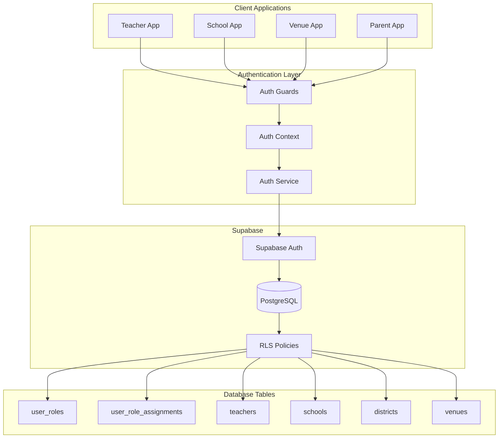
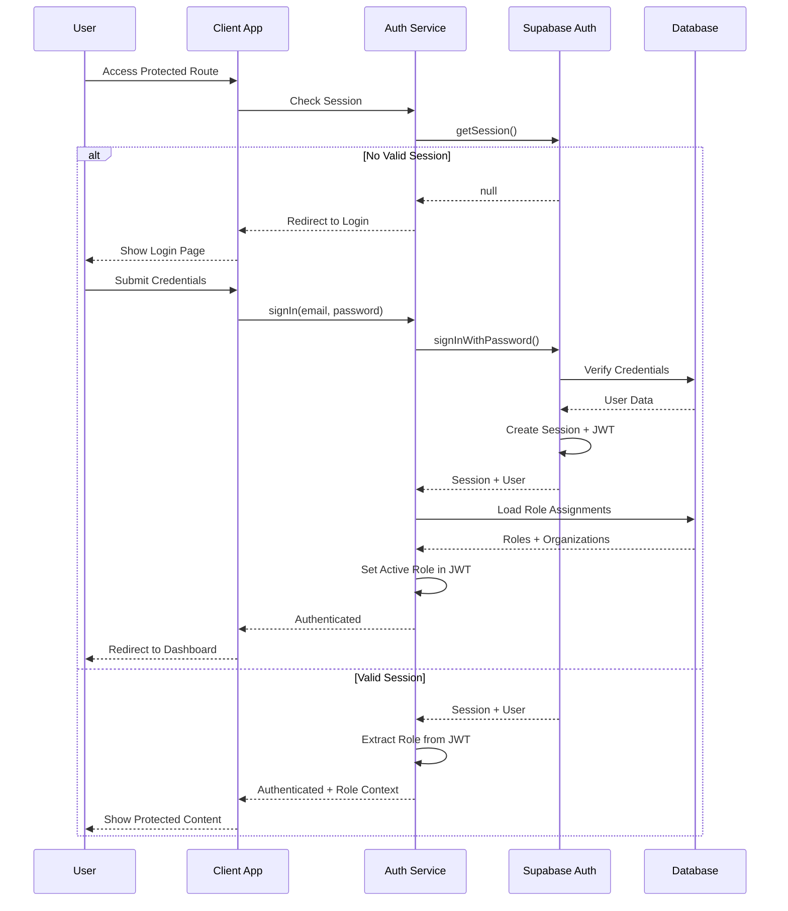
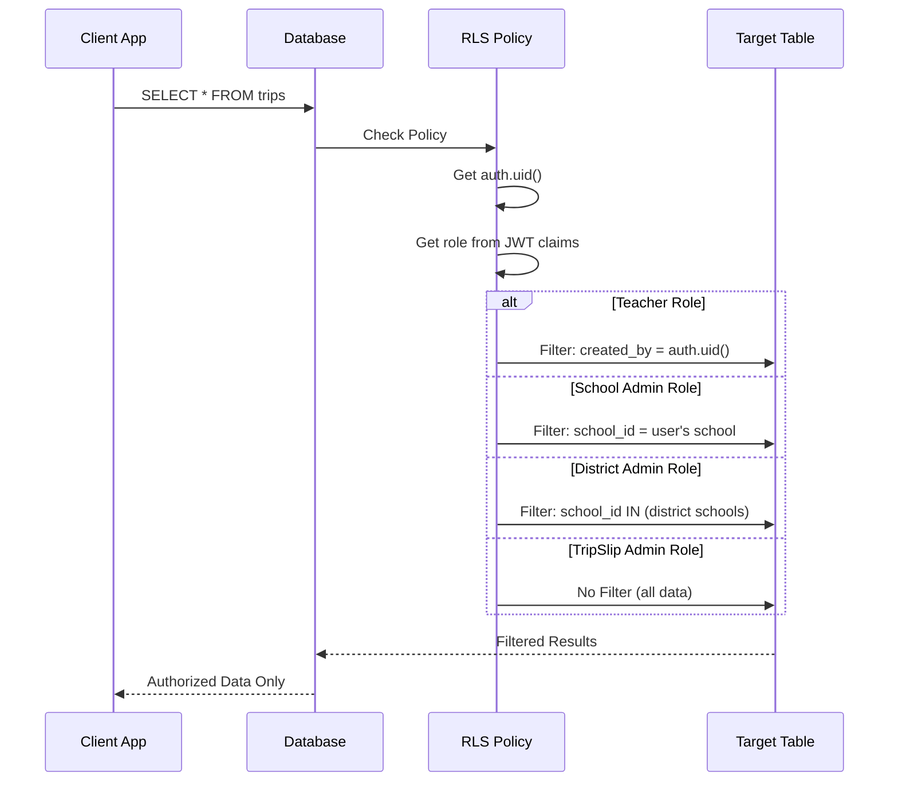

# Design Document: Authentication and Access Control Fixes

## Overview

This design establishes comprehensive authentication and role-based access control (RBAC) across the TripSlip platform. The system currently has critical security gaps: no signup capabilities, missing authentication on the school app, and no role-based access control for multi-tenancy. This design addresses these gaps by implementing:

1. **User Signup and Email Verification**: Complete signup flows for all user roles with email verification
2. **Role-Based Access Control (RBAC)**: Flexible role assignment system supporting multiple roles per user
3. **Database-Level Security**: Row-Level Security (RLS) policies enforcing data isolation
4. **Multi-Tenancy Support**: Proper data isolation across schools, districts, and venues
5. **Protected Routes**: Authentication guards on all sensitive application routes
6. **Session Management**: Secure session handling with configurable expiration

The design leverages Supabase Auth for authentication primitives and implements a custom RBAC layer on top. All data access is enforced at the database level using RLS policies, ensuring security even if application code has bugs.

### Key Design Decisions

- **Supabase Auth as Foundation**: Use Supabase's built-in authentication for user management, sessions, and email verification
- **Custom RBAC Layer**: Implement flexible role assignment system in application tables (user_roles, user_role_assignments)
- **Database-First Security**: Enforce all access control at the database level using RLS policies
- **JWT Claims for Performance**: Store active role context in JWT claims to avoid database lookups on every request
- **Separate Signup Pages**: Each role has its own signup page to ensure proper role assignment and organization selection

## Architecture

### System Components



### Authentication Flow



### Role-Based Data Access Flow



## Components and Interfaces

### Database Schema Extensions

#### user_roles Table
```sql
CREATE TABLE user_roles (
  id UUID PRIMARY KEY DEFAULT uuid_generate_v4(),
  name TEXT NOT NULL UNIQUE,
  description TEXT,
  created_at TIMESTAMPTZ NOT NULL DEFAULT NOW(),
  CHECK (name IN ('teacher', 'school_admin', 'district_admin', 'tripslip_admin', 'venue_admin', 'parent'))
);
```

#### user_role_assignments Table
```sql
CREATE TABLE user_role_assignments (
  id UUID PRIMARY KEY DEFAULT uuid_generate_v4(),
  user_id UUID NOT NULL REFERENCES auth.users(id) ON DELETE CASCADE,
  role_id UUID NOT NULL REFERENCES user_roles(id) ON DELETE CASCADE,
  organization_type TEXT NOT NULL,
  organization_id UUID NOT NULL,
  is_active BOOLEAN NOT NULL DEFAULT true,
  created_at TIMESTAMPTZ NOT NULL DEFAULT NOW(),
  updated_at TIMESTAMPTZ NOT NULL DEFAULT NOW(),
  UNIQUE(user_id, role_id, organization_type, organization_id),
  CHECK (organization_type IN ('school', 'district', 'venue', 'platform'))
);
```

#### active_role_context Table (Session State)
```sql
CREATE TABLE active_role_context (
  user_id UUID PRIMARY KEY REFERENCES auth.users(id) ON DELETE CASCADE,
  active_role_assignment_id UUID NOT NULL REFERENCES user_role_assignments(id) ON DELETE CASCADE,
  updated_at TIMESTAMPTZ NOT NULL DEFAULT NOW()
);
```

### TypeScript Interfaces

#### Role and Assignment Types
```typescript
export type UserRole = 
  | 'teacher' 
  | 'school_admin' 
  | 'district_admin' 
  | 'tripslip_admin' 
  | 'venue_admin' 
  | 'parent';

export type OrganizationType = 'school' | 'district' | 'venue' | 'platform';

export interface RoleAssignment {
  id: string;
  user_id: string;
  role_id: string;
  role_name: UserRole;
  organization_type: OrganizationType;
  organization_id: string;
  organization_name?: string;
  is_active: boolean;
  created_at: string;
  updated_at: string;
}

export interface ActiveRoleContext {
  user_id: string;
  active_role_assignment_id: string;
  role_name: UserRole;
  organization_type: OrganizationType;
  organization_id: string;
  organization_name?: string;
}
```

#### Auth Service Interface
```typescript
export interface AuthService {
  // Authentication
  signUp(params: SignUpParams): Promise<SignUpResult>;
  signIn(email: string, password: string): Promise<SignInResult>;
  signOut(): Promise<void>;
  resetPassword(email: string): Promise<void>;
  updatePassword(newPassword: string): Promise<void>;
  verifyEmail(token: string): Promise<void>;
  resendVerificationEmail(): Promise<void>;
  
  // Session Management
  getSession(): Promise<Session | null>;
  refreshSession(): Promise<Session | null>;
  
  // Role Management
  getRoleAssignments(userId: string): Promise<RoleAssignment[]>;
  getActiveRoleContext(userId: string): Promise<ActiveRoleContext | null>;
  switchRole(roleAssignmentId: string): Promise<void>;
  
  // Authorization Checks
  hasRole(userId: string, role: UserRole): Promise<boolean>;
  canAccessOrganization(userId: string, orgType: OrganizationType, orgId: string): Promise<boolean>;
}

export interface SignUpParams {
  email: string;
  password: string;
  role: UserRole;
  organization_type: OrganizationType;
  organization_id: string;
  metadata?: {
    first_name?: string;
    last_name?: string;
    phone?: string;
  };
}

export interface SignUpResult {
  user: User;
  session: Session | null;
  requiresEmailVerification: boolean;
}

export interface SignInResult {
  user: User;
  session: Session;
  roleAssignments: RoleAssignment[];
  activeRole: ActiveRoleContext;
}
```

#### Auth Context Interface
```typescript
export interface AuthContextType {
  user: User | null;
  session: Session | null;
  loading: boolean;
  activeRole: ActiveRoleContext | null;
  roleAssignments: RoleAssignment[];
  
  // Actions
  signIn: (email: string, password: string) => Promise<void>;
  signUp: (params: SignUpParams) => Promise<void>;
  signOut: () => Promise<void>;
  switchRole: (roleAssignmentId: string) => Promise<void>;
  
  // Authorization Helpers
  hasRole: (role: UserRole) => boolean;
  canAccessOrganization: (orgType: OrganizationType, orgId: string) => boolean;
  isAuthenticated: boolean;
  isEmailVerified: boolean;
}
```

#### Protected Route Component
```typescript
export interface ProtectedRouteProps {
  children: React.ReactNode;
  requiredRoles?: UserRole[];
  requireEmailVerification?: boolean;
  redirectTo?: string;
}

export function ProtectedRoute({
  children,
  requiredRoles,
  requireEmailVerification = false,
  redirectTo = '/login'
}: ProtectedRouteProps): JSX.Element;
```

### Component Structure

#### Auth Service (`packages/auth/src/service.ts`)
- Handles all authentication operations
- Manages role assignments and context switching
- Wraps Supabase Auth with RBAC logic

#### Auth Context (`packages/auth/src/context.tsx`)
- Provides authentication state to React components
- Manages session lifecycle
- Exposes role-based authorization helpers

#### Auth Guards (`packages/auth/src/guards.tsx`)
- `ProtectedRoute`: Requires authentication
- `RoleGuard`: Requires specific role(s)
- `OrganizationGuard`: Requires access to specific organization

#### Signup Pages (per app)
- `apps/teacher/src/pages/SignupPage.tsx`
- `apps/school/src/pages/SignupPage.tsx` (for school/district admins)
- `apps/venue/src/pages/SignupPage.tsx`

#### Login Pages (per app)
- Shared login component with role-specific redirects
- Remember originally requested URL for post-login redirect

#### Dashboard Pages
- `apps/school/src/pages/DistrictAdminDashboard.tsx`
- `apps/school/src/pages/TripSlipAdminDashboard.tsx`
- Enhanced existing dashboards with role-based filtering

## Data Models

### User Authentication (Supabase Auth)
```typescript
// Managed by Supabase Auth
interface AuthUser {
  id: string;
  email: string;
  email_confirmed_at: string | null;
  created_at: string;
  updated_at: string;
  user_metadata: {
    first_name?: string;
    last_name?: string;
    phone?: string;
  };
  app_metadata: {
    provider?: string;
    providers?: string[];
  };
}
```

### Role Assignment Model
```typescript
interface UserRoleAssignment {
  id: string;
  user_id: string;
  role_id: string;
  organization_type: 'school' | 'district' | 'venue' | 'platform';
  organization_id: string;
  is_active: boolean;
  created_at: string;
  updated_at: string;
}
```

### JWT Claims Structure
```typescript
interface JWTClaims {
  sub: string; // user_id
  email: string;
  role: string; // active role name
  app_metadata: {
    active_role_assignment_id: string;
    organization_type: string;
    organization_id: string;
  };
  aud: string;
  exp: number;
  iat: number;
}
```

### Organization Models

#### District
```typescript
interface District {
  id: string;
  name: string;
  code: string | null;
  address: Address | null;
  created_at: string;
  updated_at: string;
}
```

#### School (Enhanced)
```typescript
interface School {
  id: string;
  district_id: string | null;
  name: string;
  code: string | null;
  address: Address | null;
  created_at: string;
  updated_at: string;
}
```

#### Venue
```typescript
interface Venue {
  id: string;
  name: string;
  description: string | null;
  address: Address | null;
  contact_email: string;
  contact_phone: string | null;
  settings: Record<string, any>;
  created_at: string;
  updated_at: string;
}
```

### RLS Policy Helper Functions

```sql
-- Get user's active role name
CREATE OR REPLACE FUNCTION auth.user_role()
RETURNS TEXT AS $$
  SELECT COALESCE(
    current_setting('request.jwt.claims', true)::json->>'role',
    'anonymous'
  );
$$ LANGUAGE SQL STABLE;

-- Get user's active organization ID
CREATE OR REPLACE FUNCTION auth.user_organization_id()
RETURNS UUID AS $$
  SELECT COALESCE(
    (current_setting('request.jwt.claims', true)::json->'app_metadata'->>'organization_id')::uuid,
    NULL
  );
$$ LANGUAGE SQL STABLE;

-- Get user's active organization type
CREATE OR REPLACE FUNCTION auth.user_organization_type()
RETURNS TEXT AS $$
  SELECT COALESCE(
    current_setting('request.jwt.claims', true)::json->'app_metadata'->>'organization_type',
    NULL
  );
$$ LANGUAGE SQL STABLE;

-- Check if user has specific role
CREATE OR REPLACE FUNCTION auth.has_role(required_role TEXT)
RETURNS BOOLEAN AS $$
  SELECT auth.user_role() = required_role;
$$ LANGUAGE SQL STABLE;

-- Check if user is TripSlip admin
CREATE OR REPLACE FUNCTION auth.is_tripslip_admin()
RETURNS BOOLEAN AS $$
  SELECT auth.user_role() = 'tripslip_admin';
$$ LANGUAGE SQL STABLE;
```


### RLS Policy Examples

#### Trips Table Policy
```sql
-- Teachers see only their own trips
-- School admins see all trips from their school
-- District admins see all trips from schools in their district
-- TripSlip admins see all trips

CREATE POLICY "trips_select_policy" ON trips
FOR SELECT USING (
  CASE auth.user_role()
    WHEN 'teacher' THEN 
      created_by = auth.uid()
    WHEN 'school_admin' THEN 
      school_id = auth.user_organization_id()
    WHEN 'district_admin' THEN 
      school_id IN (
        SELECT id FROM schools 
        WHERE district_id = auth.user_organization_id()
      )
    WHEN 'tripslip_admin' THEN 
      true
    ELSE false
  END
);

CREATE POLICY "trips_insert_policy" ON trips
FOR INSERT WITH CHECK (
  auth.user_role() IN ('teacher', 'school_admin', 'district_admin', 'tripslip_admin')
  AND created_by = auth.uid()
);

CREATE POLICY "trips_update_policy" ON trips
FOR UPDATE USING (
  CASE auth.user_role()
    WHEN 'teacher' THEN 
      created_by = auth.uid()
    WHEN 'school_admin' THEN 
      school_id = auth.user_organization_id()
    WHEN 'district_admin' THEN 
      school_id IN (
        SELECT id FROM schools 
        WHERE district_id = auth.user_organization_id()
      )
    WHEN 'tripslip_admin' THEN 
      true
    ELSE false
  END
);
```

#### Students Table Policy
```sql
CREATE POLICY "students_select_policy" ON students
FOR SELECT USING (
  CASE auth.user_role()
    WHEN 'teacher' THEN 
      roster_id IN (
        SELECT id FROM rosters 
        WHERE teacher_id IN (
          SELECT id FROM teachers WHERE user_id = auth.uid()
        )
      )
    WHEN 'school_admin' THEN 
      roster_id IN (
        SELECT r.id FROM rosters r
        JOIN teachers t ON r.teacher_id = t.id
        WHERE t.school_id = auth.user_organization_id()
      )
    WHEN 'district_admin' THEN 
      roster_id IN (
        SELECT r.id FROM rosters r
        JOIN teachers t ON r.teacher_id = t.id
        JOIN schools s ON t.school_id = s.id
        WHERE s.district_id = auth.user_organization_id()
      )
    WHEN 'tripslip_admin' THEN 
      true
    WHEN 'parent' THEN
      id IN (
        SELECT student_id FROM student_parents
        WHERE parent_id IN (
          SELECT id FROM parents WHERE user_id = auth.uid()
        )
      )
    ELSE false
  END
);
```

#### Experiences Table Policy
```sql
-- Venue admins see only their venue's experiences
-- All authenticated users can view published experiences
-- Only venue admins can modify their venue's experiences

CREATE POLICY "experiences_select_policy" ON experiences
FOR SELECT USING (
  published = true
  OR (
    auth.user_role() = 'venue_admin' 
    AND venue_id = auth.user_organization_id()
  )
  OR auth.is_tripslip_admin()
);

CREATE POLICY "experiences_insert_policy" ON experiences
FOR INSERT WITH CHECK (
  auth.user_role() = 'venue_admin'
  AND venue_id = auth.user_organization_id()
);

CREATE POLICY "experiences_update_policy" ON experiences
FOR UPDATE USING (
  (auth.user_role() = 'venue_admin' AND venue_id = auth.user_organization_id())
  OR auth.is_tripslip_admin()
);
```

#### Schools Table Policy
```sql
CREATE POLICY "schools_select_policy" ON schools
FOR SELECT USING (
  CASE auth.user_role()
    WHEN 'school_admin' THEN 
      id = auth.user_organization_id()
    WHEN 'district_admin' THEN 
      district_id = auth.user_organization_id()
    WHEN 'tripslip_admin' THEN 
      true
    WHEN 'teacher' THEN
      id IN (
        SELECT school_id FROM teachers WHERE user_id = auth.uid()
      )
    ELSE false
  END
);
```

## Error Handling

### Authentication Errors

#### Invalid Credentials
```typescript
{
  code: 'INVALID_CREDENTIALS',
  message: 'Invalid email or password',
  statusCode: 401
}
```

#### Email Already Exists
```typescript
{
  code: 'EMAIL_EXISTS',
  message: 'An account with this email already exists',
  statusCode: 409
}
```

#### Email Not Verified
```typescript
{
  code: 'EMAIL_NOT_VERIFIED',
  message: 'Please verify your email address to continue',
  statusCode: 403,
  metadata: {
    canResendVerification: true
  }
}
```

#### Session Expired
```typescript
{
  code: 'SESSION_EXPIRED',
  message: 'Your session has expired. Please log in again.',
  statusCode: 401
}
```

#### Invalid Token
```typescript
{
  code: 'INVALID_TOKEN',
  message: 'The verification link is invalid or has expired',
  statusCode: 400
}
```

### Authorization Errors

#### Insufficient Permissions
```typescript
{
  code: 'INSUFFICIENT_PERMISSIONS',
  message: 'You do not have permission to access this resource',
  statusCode: 403,
  metadata: {
    requiredRole: 'school_admin',
    userRole: 'teacher'
  }
}
```

#### Organization Access Denied
```typescript
{
  code: 'ORGANIZATION_ACCESS_DENIED',
  message: 'You do not have access to this organization',
  statusCode: 403,
  metadata: {
    organizationType: 'school',
    organizationId: 'uuid'
  }
}
```

#### No Active Role
```typescript
{
  code: 'NO_ACTIVE_ROLE',
  message: 'No active role context found. Please select a role.',
  statusCode: 400
}
```

### Validation Errors

#### Invalid Email Format
```typescript
{
  code: 'INVALID_EMAIL',
  message: 'Please provide a valid email address',
  statusCode: 400
}
```

#### Weak Password
```typescript
{
  code: 'WEAK_PASSWORD',
  message: 'Password must be at least 8 characters long',
  statusCode: 400
}
```

#### Invalid Organization
```typescript
{
  code: 'INVALID_ORGANIZATION',
  message: 'The selected organization does not exist',
  statusCode: 400,
  metadata: {
    organizationType: 'school',
    organizationId: 'uuid'
  }
}
```

### Error Handling Strategy

1. **Client-Side Validation**: Validate inputs before submission (email format, password length)
2. **User-Friendly Messages**: Display clear, actionable error messages to users
3. **Security Considerations**: Don't reveal whether email exists during login (use generic "invalid credentials")
4. **Retry Logic**: Implement exponential backoff for transient errors
5. **Logging**: Log all authentication errors for security monitoring
6. **Audit Trail**: Record failed login attempts in audit_logs table

### Error Recovery Flows

#### Email Verification Reminder
- Display banner on protected pages if email not verified
- Provide "Resend Verification Email" button
- Show countdown timer to prevent spam (60 seconds between resends)

#### Session Expiration Handling
- Detect expired session on API calls
- Store originally requested URL
- Redirect to login page
- After successful login, redirect to originally requested URL

#### Role Switching Errors
- If role assignment becomes inactive, prompt user to select another role
- If user has no active roles, display contact support message
- Log role switching failures for audit


## Correctness Properties

*A property is a characteristic or behavior that should hold true across all valid executions of a system—essentially, a formal statement about what the system should do. Properties serve as the bridge between human-readable specifications and machine-verifiable correctness guarantees.*

### Property Reflection

After analyzing all acceptance criteria, I identified the following redundancies and consolidations:

**Data Access Filtering Consolidation:**
- Properties 6.1, 6.2, 7.1-7.4, 8.1-8.4, 10.1-10.2 all test role-based data filtering
- These can be consolidated into comprehensive properties that test filtering across all roles and entity types
- Consolidated into Properties 1-5 covering trips, students, schools, teachers, and experiences

**Unauthorized Access Consolidation:**
- Properties 6.4, 7.6, 8.6, 10.4, 12.6 all test that unauthorized access is denied
- These can be consolidated into a single property about RLS enforcement
- Consolidated into Property 6

**Dashboard Metrics Consolidation:**
- Properties 15.2-15.4 and 16.2-16.6 all test dashboard metric calculations
- These can be consolidated into properties about correct metric aggregation
- Consolidated into Properties 7-8

**Role Assignment Consolidation:**
- Properties 1.7, 5.5, 19.1 all test correct role assignment during signup
- Consolidated into Property 9

**Session Management Consolidation:**
- Properties 3.2, 13.5, 18.2, 18.4 all test session validation and invalidation
- Consolidated into Properties 10-11

**Token Expiration Consolidation:**
- Properties 2.4 and 4.5 both test token expiration
- Consolidated into Property 12

### Property 1: Role-Based Trip Filtering

*For any* user with an active role context, when querying trips, the results SHALL only include trips that the user is authorized to access based on their role: teachers see only their own trips, school admins see trips from their school, district admins see trips from schools in their district, TripSlip admins see all trips, and other roles see no trips.

**Validates: Requirements 6.1, 7.3, 8.3, 9.1**

### Property 2: Role-Based Student Filtering

*For any* user with an active role context, when querying students, the results SHALL only include students that the user is authorized to access based on their role: teachers see students in their rosters, school admins see students from their school, district admins see students from schools in their district, TripSlip admins see all students, parents see their own children, and other roles see no students.

**Validates: Requirements 6.2, 7.4, 8.4, 9.1**

### Property 3: Role-Based School Filtering

*For any* user with an active role context, when querying schools, the results SHALL only include schools that the user is authorized to access based on their role: school admins see only their school, district admins see schools in their district, TripSlip admins see all schools, teachers see their assigned school, and other roles see no schools.

**Validates: Requirements 7.1, 8.2, 9.1**

### Property 4: Role-Based Teacher Filtering

*For any* user with an active role context, when querying teachers, the results SHALL only include teachers that the user is authorized to access based on their role: school admins see teachers from their school, district admins see teachers from schools in their district, TripSlip admins see all teachers, and other roles see no teachers.

**Validates: Requirements 7.2, 8.4, 9.1**

### Property 5: Role-Based Experience Filtering

*For any* user with an active role context, when querying experiences, the results SHALL include all published experiences for authenticated users, plus unpublished experiences for venue admins viewing their own venue's experiences, and all experiences for TripSlip admins.

**Validates: Requirements 6.5, 10.1, 9.2**

### Property 6: Unauthorized Data Access Denial

*For any* database query attempting to access data outside the user's authorized scope (based on role and organization), the RLS policies SHALL return zero rows, effectively denying access without raising an error.

**Validates: Requirements 6.4, 7.6, 8.6, 10.4, 12.6**

### Property 7: District Admin Dashboard Metrics

*For any* district admin, the dashboard metrics SHALL accurately reflect: (1) the count of schools in their district, (2) the count of trips from schools in their district, and (3) the count of students from schools in their district, with all counts matching the actual filtered data the admin can access.

**Validates: Requirements 15.2, 15.3, 15.4**

### Property 8: TripSlip Admin Dashboard Metrics

*For any* TripSlip admin, the dashboard metrics SHALL accurately reflect platform-wide counts: (1) total districts, (2) total schools, (3) total trips, (4) total users by role, and (5) total venues, with all counts matching the actual data in the system.

**Validates: Requirements 16.2, 16.3, 16.4, 16.5, 16.6**

### Property 9: Signup Role Assignment

*For any* valid signup request, the system SHALL create a user account and assign exactly one role assignment matching the signup page used (teacher, school_admin, district_admin, venue_admin) with the specified organization, and this assignment SHALL be stored in the user_role_assignments table.

**Validates: Requirements 1.2, 1.7, 5.5**

### Property 10: Valid Credentials Authentication

*For any* user with valid credentials (correct email and password), the login operation SHALL succeed, create a valid session, load the user's role assignments, and set an active role context.

**Validates: Requirements 3.2**

### Property 11: Session Invalidation on Logout

*For any* authenticated user, when they log out, the system SHALL invalidate their session such that subsequent requests using that session are rejected and cannot access protected resources.

**Validates: Requirements 18.2, 18.4**

### Property 12: Token Expiration Enforcement

*For any* verification or password reset token, if the token has expired (24 hours for verification, 1 hour for password reset), the system SHALL reject the token and require the user to request a new one.

**Validates: Requirements 2.4, 4.5**

### Property 13: Duplicate Email Rejection

*For any* signup attempt using an email address that already exists in the system, the signup SHALL fail with an appropriate error message indicating the email is already registered.

**Validates: Requirements 1.3**

### Property 14: Email Verification State Transition

*For any* user with an unverified email, when they use a valid verification token, the system SHALL mark their email as verified and grant access to role-appropriate features.

**Validates: Requirements 2.1, 2.5**

### Property 15: Password Validation Consistency

*For any* password input (during signup or password reset), the system SHALL apply the same validation rules: minimum 8 characters length, and reject passwords that don't meet these requirements.

**Validates: Requirements 1.5, 4.6**

### Property 16: Email Format Validation

*For any* email input during signup or login, the system SHALL validate the email format using standard email validation rules and reject invalid formats.

**Validates: Requirements 1.6**

### Property 17: Invalid Credentials Rejection

*For any* login attempt with invalid credentials (wrong email or wrong password), the system SHALL reject the login with a generic error message that doesn't reveal whether the email or password was incorrect.

**Validates: Requirements 3.3**

### Property 18: Password Reset Token Single Use

*For any* valid password reset token, after it is used to successfully reset a password, the token SHALL be invalidated and cannot be reused for another password reset.

**Validates: Requirements 4.2, 4.4**

### Property 19: Verification Email Creation

*For any* successful signup, the system SHALL create an email verification record with a valid token that can be used to verify the user's email address.

**Validates: Requirements 1.4**

### Property 20: Multiple Role Support

*For any* user, the system SHALL support assignment of multiple roles across different organizations, storing each assignment as a separate record in user_role_assignments.

**Validates: Requirements 11.3**

### Property 21: Role Context Switching

*For any* user with multiple role assignments, when they switch to a different role, the system SHALL update their active role context to the selected role without requiring re-authentication, and subsequent data access SHALL be filtered according to the new role.

**Validates: Requirements 11.4, 20.2, 20.4**

### Property 22: Active Role Persistence

*For any* user who switches roles, the system SHALL persist their active role selection such that when they log in again in a future session, their previously selected role remains active.

**Validates: Requirements 20.5**

### Property 23: Venue Admin Write Access Restriction

*For any* venue admin, when creating or modifying experiences, the system SHALL only allow operations on experiences belonging to their assigned venue and reject attempts to modify other venues' experiences.

**Validates: Requirements 10.5**

### Property 24: TripSlip Admin Unrestricted Access

*For any* TripSlip admin, the system SHALL allow read and write access to all data across all organizations without filtering, and all database queries SHALL return complete unfiltered results.

**Validates: Requirements 9.2**

### Property 25: Admin Action Audit Logging

*For any* action performed by a TripSlip admin (create, update, delete operations), the system SHALL create an audit log entry recording the action, affected table, record ID, user ID, and timestamp.

**Validates: Requirements 9.5, 19.5**

### Property 26: School App Role Authorization

*For any* user attempting to access the school app, the system SHALL verify they have one of the authorized roles (school_admin, district_admin, or tripslip_admin) and deny access to users with other roles.

**Validates: Requirements 17.3, 17.4**

### Property 27: Session Validity Check

*For any* request to a protected route, the system SHALL verify the session is valid (not expired, not invalidated) before granting access, and reject requests with invalid sessions.

**Validates: Requirements 13.5**

### Property 28: Client Token Cleanup

*For any* logout operation, the system SHALL clear all authentication tokens from the client storage (localStorage, sessionStorage, cookies) to prevent token reuse.

**Validates: Requirements 18.5**

### Property 29: Self-Role-Modification Prevention

*For any* user, the system SHALL prevent them from modifying their own role assignments (adding, removing, or changing roles) and only allow TripSlip admins to modify role assignments.

**Validates: Requirements 19.2**

### Property 30: Role Assignment Validation

*For any* role assignment operation by a TripSlip admin, the system SHALL validate that: (1) the role exists in the user_roles table, and (2) the organization exists and is valid for the specified organization type, rejecting invalid assignments.

**Validates: Requirements 19.3, 19.4**


## Testing Strategy

### Dual Testing Approach

This feature requires both unit tests and property-based tests to ensure comprehensive coverage:

- **Unit Tests**: Verify specific examples, edge cases, error conditions, and integration points
- **Property-Based Tests**: Verify universal properties across all inputs using randomized test data

Both testing approaches are complementary and necessary. Unit tests catch concrete bugs in specific scenarios, while property-based tests verify general correctness across a wide range of inputs.

### Property-Based Testing Configuration

**Library Selection**: Use `fast-check` for TypeScript/JavaScript property-based testing

**Test Configuration**:
- Minimum 100 iterations per property test (due to randomization)
- Each property test must reference its design document property using a comment tag
- Tag format: `// Feature: authentication-and-access-control-fixes, Property {number}: {property_text}`

**Example Property Test Structure**:
```typescript
import fc from 'fast-check';
import { describe, it, expect } from 'vitest';

describe('Authentication and Access Control', () => {
  it('Property 1: Role-Based Trip Filtering', async () => {
    // Feature: authentication-and-access-control-fixes, Property 1: Role-Based Trip Filtering
    
    await fc.assert(
      fc.asyncProperty(
        fc.record({
          role: fc.constantFrom('teacher', 'school_admin', 'district_admin', 'tripslip_admin'),
          userId: fc.uuid(),
          organizationId: fc.uuid(),
          trips: fc.array(fc.record({
            id: fc.uuid(),
            created_by: fc.uuid(),
            school_id: fc.uuid()
          }))
        }),
        async ({ role, userId, organizationId, trips }) => {
          // Setup: Create user with role and organization
          // Execute: Query trips with user context
          // Assert: Results match expected filtering for role
        }
      ),
      { numRuns: 100 }
    );
  });
});
```

### Unit Testing Strategy

#### Authentication Tests

**Signup Flow**:
- Test successful signup with valid credentials
- Test signup rejection with duplicate email
- Test signup rejection with invalid email format
- Test signup rejection with weak password (< 8 characters)
- Test email verification record creation
- Test role assignment creation during signup

**Login Flow**:
- Test successful login with valid credentials
- Test login rejection with invalid email
- Test login rejection with invalid password
- Test session creation on successful login
- Test role assignments loaded on login
- Test active role context set on login

**Email Verification**:
- Test email verification with valid token
- Test email verification rejection with expired token
- Test email verification rejection with invalid token
- Test verified status grants access to features
- Test resend verification email functionality

**Password Reset**:
- Test password reset request creates reset token
- Test password reset with valid token
- Test password reset rejection with expired token
- Test password reset token invalidation after use
- Test password validation during reset

**Session Management**:
- Test session validity check
- Test session invalidation on logout
- Test expired session rejection
- Test client token cleanup on logout

#### Authorization Tests

**Role-Based Data Access**:
- Test teacher sees only own trips
- Test school admin sees only school data
- Test district admin sees only district data
- Test TripSlip admin sees all data
- Test venue admin sees only venue data
- Test unauthorized access returns empty results

**Role Switching**:
- Test user with multiple roles can switch
- Test role switch updates active context
- Test role switch changes data access
- Test active role persists across sessions

**Protected Routes**:
- Test unauthenticated access redirects to login
- Test authenticated access with valid session succeeds
- Test authenticated access with invalid session fails
- Test role-based route access (school app)

#### Database Tests

**RLS Policy Tests**:
- Test RLS policies on trips table
- Test RLS policies on students table
- Test RLS policies on schools table
- Test RLS policies on experiences table
- Test RLS policies on bookings table
- Test unauthorized queries return zero rows

**Schema Tests**:
- Test user_roles table structure
- Test user_role_assignments table structure
- Test active_role_context table structure
- Test foreign key constraints
- Test unique constraints

#### Integration Tests

**End-to-End Flows**:
- Test complete signup → verify email → login flow
- Test login → switch role → access data flow
- Test forgot password → reset → login flow
- Test multi-role user workflow

**Dashboard Tests**:
- Test district admin dashboard metrics accuracy
- Test TripSlip admin dashboard metrics accuracy
- Test dashboard data filtering by role

**Audit Logging Tests**:
- Test admin actions create audit logs
- Test role assignment changes create audit logs
- Test audit log contains required fields

### Test Data Generation

**Generators for Property Tests**:
```typescript
// User generator
const userGen = fc.record({
  id: fc.uuid(),
  email: fc.emailAddress(),
  password: fc.string({ minLength: 8, maxLength: 20 })
});

// Role generator
const roleGen = fc.constantFrom(
  'teacher', 'school_admin', 'district_admin', 
  'tripslip_admin', 'venue_admin', 'parent'
);

// Organization generator
const organizationGen = fc.record({
  type: fc.constantFrom('school', 'district', 'venue', 'platform'),
  id: fc.uuid()
});

// Role assignment generator
const roleAssignmentGen = fc.record({
  user_id: fc.uuid(),
  role: roleGen,
  organization: organizationGen,
  is_active: fc.boolean()
});

// Trip generator
const tripGen = fc.record({
  id: fc.uuid(),
  created_by: fc.uuid(),
  school_id: fc.uuid(),
  title: fc.string({ minLength: 1, maxLength: 100 }),
  date: fc.date()
});

// Student generator
const studentGen = fc.record({
  id: fc.uuid(),
  roster_id: fc.uuid(),
  first_name: fc.string({ minLength: 1, maxLength: 50 }),
  last_name: fc.string({ minLength: 1, maxLength: 50 }),
  grade: fc.constantFrom('K', '1', '2', '3', '4', '5', '6', '7', '8', '9', '10', '11', '12')
});
```

### Test Coverage Goals

- **Line Coverage**: Minimum 80% for authentication and authorization code
- **Branch Coverage**: Minimum 75% for conditional logic
- **Property Coverage**: 100% of correctness properties must have corresponding property tests
- **RLS Policy Coverage**: 100% of RLS policies must have tests verifying correct filtering

### Testing Tools and Infrastructure

**Testing Framework**: Vitest
**Property Testing**: fast-check
**Database Testing**: Supabase local development with test database
**Mocking**: vi.mock for external dependencies
**Test Database**: Separate test database with RLS policies enabled

### Continuous Integration

- Run all tests on every pull request
- Run property tests with 100 iterations in CI
- Run extended property tests (1000 iterations) nightly
- Fail build if any property test fails
- Generate coverage reports and enforce minimums

### Security Testing Considerations

- Test SQL injection prevention in RLS policies
- Test JWT token tampering detection
- Test session fixation prevention
- Test CSRF protection on authentication endpoints
- Test rate limiting on login and signup endpoints
- Test password strength requirements
- Test email verification bypass attempts

