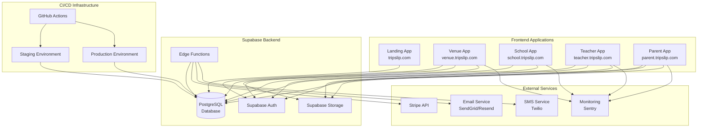
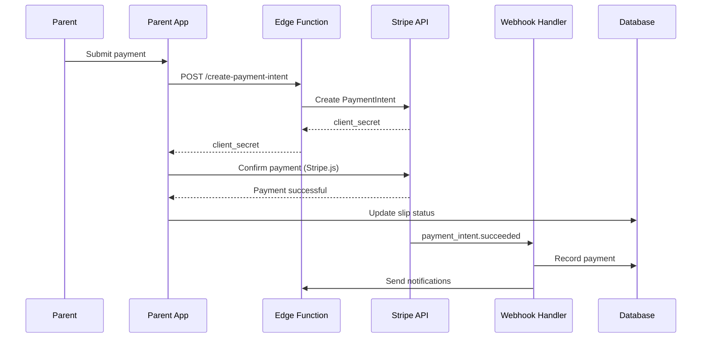
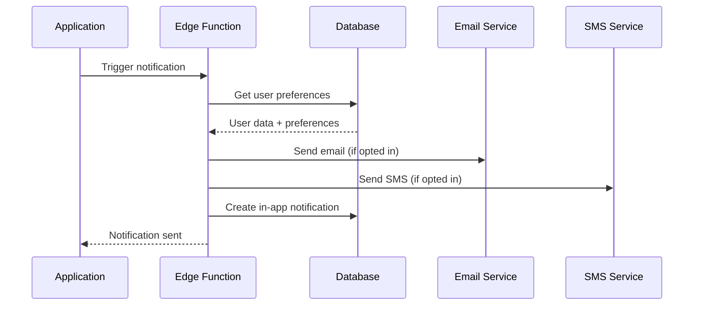
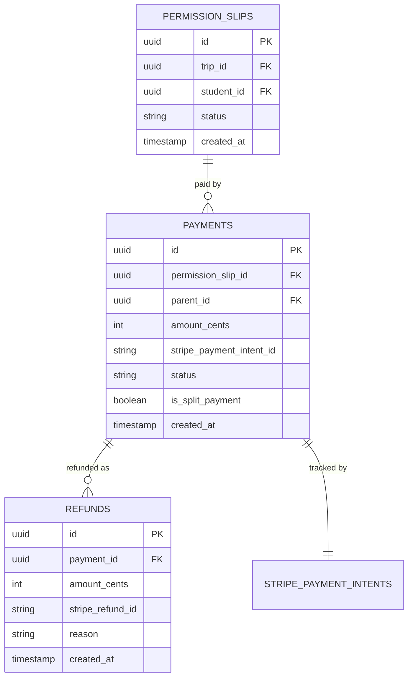
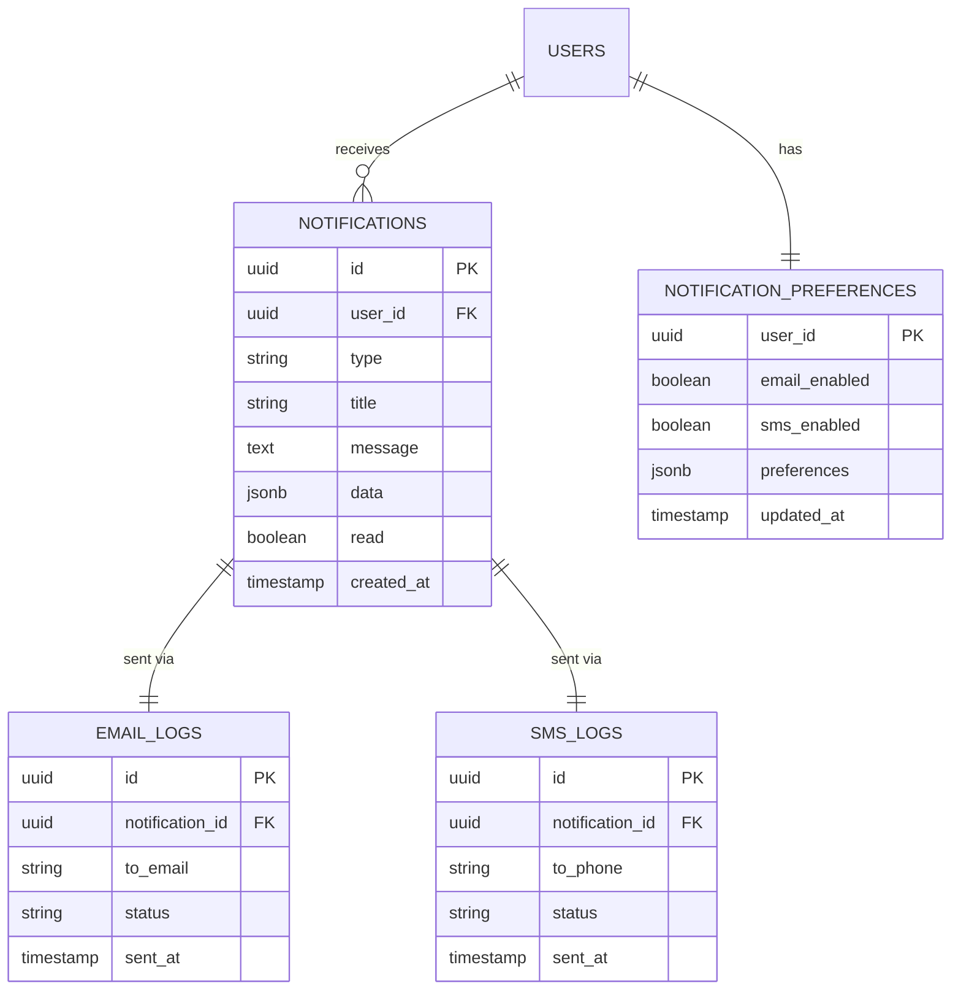

# Technical Design Document: TripSlip Complete and Launch

## Overview

This document specifies the technical design for completing and launching the TripSlip platform to production. The platform consists of five web applications (Landing, Venue, School, Teacher, Parent) sharing a unified Supabase backend. This design addresses critical gaps in third-party integrations, testing infrastructure, CI/CD pipelines, security hardening, and production deployment while maintaining strict adherence to the TripSlip design system.

### System Goals

- **Complete Third-Party Integrations**: Stripe payments, email/SMS notifications fully operational
- **Comprehensive Testing**: Unit, integration, property-based, and E2E tests with 70%+ coverage
- **Production-Ready Infrastructure**: Staging and production environments with monitoring
- **Security & Compliance**: FERPA compliance, security hardening, accessibility (WCAG 2.1 AA)
- **Automated Deployment**: CI/CD pipeline with automated testing and deployment
- **Performance Optimization**: Sub-3s page loads, optimized queries, responsive design
- **Launch Readiness**: Complete checklist verification before production launch

### Current State Assessment

**Infrastructure (95% Complete)**:
- ✅ Supabase backend with PostgreSQL, Auth, Storage, Edge Functions
- ✅ Database schema with RLS policies
- ✅ Monorepo structure with Turborepo
- ✅ Shared packages (ui, database, auth, i18n, utils)
- ⚠️ Third-party integrations partially configured

**Applications (20-40% Complete)**:
- ⚠️ Landing App: 40% - Basic structure, needs content and SEO
- ⚠️ Venue App: 35% - Experience management exists, booking flow incomplete
- ⚠️ School App: 20% - Basic structure, most features missing
- ⚠️ Teacher App: 30% - Trip creation exists, roster management incomplete
- ⚠️ Parent App: 25% - Permission slip view exists, payment integration missing

**Critical Gaps**:
- ❌ Stripe payment integration not fully implemented
- ❌ Email/SMS notification services not configured
- ❌ CI/CD pipeline not set up
- ❌ Production environment not configured
- ❌ Monitoring and error tracking not implemented
- ❌ Comprehensive test suite incomplete
- ❌ Security audit not performed
- ❌ Accessibility compliance not verified

### Technology Stack

All implementations MUST use the existing TripSlip technology stack:

- **Frontend**: React 19 with TypeScript, Vite 7
- **UI Framework**: Radix UI components, Tailwind CSS 4
- **Backend**: Supabase (PostgreSQL, Auth, Storage, Edge Functions)
- **State Management**: Zustand
- **Routing**: React Router 7
- **Internationalization**: i18next with react-i18next
- **Payments**: Stripe API with webhooks
- **Testing**: Vitest with fast-check for property-based testing
- **Deployment**: Vercel/Netlify for frontend, Supabase for backend
- **Monitoring**: Sentry or similar for error tracking
- **CI/CD**: GitHub Actions

### Design System Compliance

ALL user-facing implementations MUST strictly adhere to the TripSlip design system documented in `.kiro/specs/tripslip-platform-architecture/design.md`:

**Brand Colors**:
- Primary Yellow: #F5C518 (60/20/20 rule: 60% White, 20% Black, 20% Yellow)
- Black: #0A0A0A for text, borders, shadows
- White: #FFFFFF for backgrounds

**Typography**:
- Display: Fraunces (700, 900) for headlines
- Body: Plus Jakarta Sans (300-700) for UI and body text
- Mono: Space Mono (400, 700) for labels and data

**Component Patterns**:
- Offset shadow interaction (4px/8px shadows with bounce animation)
- 2px solid black borders
- Claymorphic 3D icons
- Bounce animations: cubic-bezier(0.34, 1.56, 0.64, 1)

**Voice & Tone**:
- Direct, warm, action-oriented
- Audience-specific messaging (venues: ROI-focused, teachers: time-saving, parents: simple)
- No jargon, use contractions, active voice

## Architecture

### High-Level System Architecture



### Deployment Architecture

**Frontend Deployment**:
- Each application deployed independently to Vercel or Netlify
- Custom domains configured for each app
- CDN caching for static assets
- Environment-specific configuration

**Backend Deployment**:
- Single Supabase project (yvzpgbhinxibebgeevcu)
- Edge Functions deployed to Supabase Edge Runtime
- Database migrations applied via Supabase CLI
- Secrets managed via Supabase secrets

**Environment Strategy**:
- **Development**: Local development with Supabase local instance
- **Staging**: Automated deployment from main branch, test mode for third-party services
- **Production**: Manual promotion from staging, production mode for all services

### Third-Party Integration Architecture

**Stripe Payment Flow**:


**Notification Flow**:


## Components and Interfaces

### Stripe Payment Integration

**Edge Function: create-payment-intent**
```typescript
// supabase/functions/create-payment-intent/index.ts
import { serve } from 'https://deno.land/std@0.168.0/http/server.ts';
import Stripe from 'https://esm.sh/stripe@12.0.0';

const stripe = new Stripe(Deno.env.get('STRIPE_SECRET_KEY')!, {
  apiVersion: '2023-10-16',
});

interface PaymentIntentRequest {
  permissionSlipId: string;
  amountCents: number;
  parentId: string;
  isSplitPayment?: boolean;
}

serve(async (req) => {
  try {
    const { permissionSlipId, amountCents, parentId, isSplitPayment } = 
      await req.json() as PaymentIntentRequest;
    
    // Create payment intent
    const paymentIntent = await stripe.paymentIntents.create({
      amount: amountCents,
      currency: 'usd',
      metadata: {
        permission_slip_id: permissionSlipId,
        parent_id: parentId,
        is_split_payment: isSplitPayment ? 'true' : 'false',
      },
      automatic_payment_methods: {
        enabled: true,
      },
    });
    
    // Store payment record
    const { error } = await supabase
      .from('payments')
      .insert({
        permission_slip_id: permissionSlipId,
        parent_id: parentId,
        amount_cents: amountCents,
        stripe_payment_intent_id: paymentIntent.id,
        status: 'pending',
        is_split_payment: isSplitPayment || false,
      });
    
    if (error) throw error;
    
    return new Response(
      JSON.stringify({ clientSecret: paymentIntent.client_secret }),
      { headers: { 'Content-Type': 'application/json' } }
    );
  } catch (error) {
    return new Response(
      JSON.stringify({ error: error.message }),
      { status: 400, headers: { 'Content-Type': 'application/json' } }
    );
  }
});
```

**Edge Function: stripe-webhook**
```typescript
// supabase/functions/stripe-webhook/index.ts
import { serve } from 'https://deno.land/std@0.168.0/http/server.ts';
import Stripe from 'https://esm.sh/stripe@12.0.0';

const stripe = new Stripe(Deno.env.get('STRIPE_SECRET_KEY')!, {
  apiVersion: '2023-10-16',
});

serve(async (req) => {
  const signature = req.headers.get('stripe-signature');
  const body = await req.text();
  
  try {
    const event = stripe.webhooks.constructEvent(
      body,
      signature!,
      Deno.env.get('STRIPE_WEBHOOK_SECRET')!
    );
    
    switch (event.type) {
      case 'payment_intent.succeeded':
        await handlePaymentSuccess(event.data.object);
        break;
      case 'payment_intent.payment_failed':
        await handlePaymentFailure(event.data.object);
        break;
      case 'refund.created':
        await handleRefundCreated(event.data.object);
        break;
    }
    
    return new Response(JSON.stringify({ received: true }), {
      headers: { 'Content-Type': 'application/json' },
    });
  } catch (error) {
    return new Response(
      JSON.stringify({ error: error.message }),
      { status: 400, headers: { 'Content-Type': 'application/json' } }
    );
  }
});

async function handlePaymentSuccess(paymentIntent: Stripe.PaymentIntent) {
  const { permission_slip_id, parent_id } = paymentIntent.metadata;
  
  // Update payment status
  await supabase
    .from('payments')
    .update({ status: 'succeeded' })
    .eq('stripe_payment_intent_id', paymentIntent.id);
  
  // Check if all payments complete for slip
  const { data: payments } = await supabase
    .from('payments')
    .select('status')
    .eq('permission_slip_id', permission_slip_id);
  
  const allPaid = payments?.every(p => p.status === 'succeeded');
  
  if (allPaid) {
    // Update slip status
    await supabase
      .from('permission_slips')
      .update({ status: 'paid' })
      .eq('id', permission_slip_id);
    
    // Send notifications
    await fetch(`${Deno.env.get('SUPABASE_URL')}/functions/v1/send-notification`, {
      method: 'POST',
      headers: {
        'Content-Type': 'application/json',
        'Authorization': `Bearer ${Deno.env.get('SUPABASE_SERVICE_ROLE_KEY')}`,
      },
      body: JSON.stringify({
        type: 'payment_confirmed',
        permissionSlipId: permission_slip_id,
      }),
    });
  }
}
```

**Parent App Payment Component**
```typescript
// apps/parent/src/components/PaymentForm.tsx
import { useState } from 'react';
import { useStripe, useElements, PaymentElement } from '@stripe/react-stripe-js';
import { Button } from '@tripslip/ui';
import { createPaymentIntent } from '../services/payment-service';

interface PaymentFormProps {
  permissionSlipId: string;
  amountCents: number;
  onSuccess: () => void;
}

export function PaymentForm({ permissionSlipId, amountCents, onSuccess }: PaymentFormProps) {
  const stripe = useStripe();
  const elements = useElements();
  const [isProcessing, setIsProcessing] = useState(false);
  const [error, setError] = useState<string | null>(null);
  
  const handleSubmit = async (e: React.FormEvent) => {
    e.preventDefault();
    
    if (!stripe || !elements) return;
    
    setIsProcessing(true);
    setError(null);
    
    try {
      // Create payment intent
      const { clientSecret } = await createPaymentIntent({
        permissionSlipId,
        amountCents,
      });
      
      // Confirm payment
      const { error: stripeError } = await stripe.confirmPayment({
        elements,
        clientSecret,
        confirmParams: {
          return_url: `${window.location.origin}/payment-success`,
        },
      });
      
      if (stripeError) {
        setError(stripeError.message || 'Payment failed. Please try again.');
      } else {
        onSuccess();
      }
    } catch (err) {
      setError('An error occurred. Please try again.');
    } finally {
      setIsProcessing(false);
    }
  };
  
  return (
    <form onSubmit={handleSubmit} className="space-y-6">
      <PaymentElement />
      
      {error && (
        <div className="p-4 bg-red-50 border-2 border-black rounded-md">
          <p className="text-sm text-red-900">{error}</p>
        </div>
      )}
      
      <Button
        type="submit"
        disabled={!stripe || isProcessing}
        className="w-full"
      >
        {isProcessing ? 'Processing...' : `Pay $${(amountCents / 100).toFixed(2)}`}
      </Button>
    </form>
  );
}
```

### Email Notification Service

**Edge Function: send-email**
```typescript
// supabase/functions/send-email/index.ts
import { serve } from 'https://deno.land/std@0.168.0/http/server.ts';

interface EmailRequest {
  to: string;
  templateId: string;
  templateData: Record<string, any>;
  language?: 'en' | 'es' | 'ar';
}

const EMAIL_TEMPLATES = {
  permission_slip_created: {
    en: {
      subject: 'Permission Slip Required for {{tripName}}',
      html: `
        <div style="font-family: 'Plus Jakarta Sans', sans-serif; max-width: 600px; margin: 0 auto;">
          <div style="background: #F5C518; padding: 24px; border: 2px solid #0A0A0A;">
            <h1 style="font-family: 'Fraunces', serif; font-size: 32px; margin: 0; color: #0A0A0A;">
              TripSlip
            </h1>
          </div>
          <div style="padding: 24px; border: 2px solid #0A0A0A; border-top: none;">
            <h2 style="font-family: 'Fraunces', serif; font-size: 24px; color: #0A0A0A;">
              Permission Slip Required
            </h2>
            <p style="font-size: 16px; line-height: 1.5; color: #0A0A0A;">
              Hello {{parentName}},
            </p>
            <p style="font-size: 16px; line-height: 1.5; color: #0A0A0A;">
              {{teacherName}} has created a permission slip for {{studentName}} 
              for the upcoming field trip to {{venueName}} on {{tripDate}}.
            </p>
            <a href="{{magicLink}}" style="
              display: inline-block;
              background: #F5C518;
              color: #0A0A0A;
              padding: 12px 24px;
              text-decoration: none;
              font-weight: 600;
              border: 2px solid #0A0A0A;
              box-shadow: 4px 4px 0px #0A0A0A;
              margin: 16px 0;
            ">
              Sign Permission Slip
            </a>
            <p style="font-size: 14px; color: #6B7280;">
              This link expires in 7 days.
            </p>
          </div>
        </div>
      `,
    },
    es: {
      subject: 'Se Requiere Permiso para {{tripName}}',
      html: `<!-- Spanish template -->`,
    },
    ar: {
      subject: 'مطلوب إذن للرحلة {{tripName}}',
      html: `<!-- Arabic template with RTL -->`,
    },
  },
  payment_confirmed: {
    en: {
      subject: 'Payment Confirmed for {{tripName}}',
      html: `<!-- Payment confirmation template -->`,
    },
    es: {
      subject: 'Pago Confirmado para {{tripName}}',
      html: `<!-- Spanish payment template -->`,
    },
    ar: {
      subject: 'تم تأكيد الدفع لـ {{tripName}}',
      html: `<!-- Arabic payment template -->`,
    },
  },
};

serve(async (req) => {
  try {
    const { to, templateId, templateData, language = 'en' } = 
      await req.json() as EmailRequest;
    
    const template = EMAIL_TEMPLATES[templateId]?.[language];
    if (!template) {
      throw new Error(`Template ${templateId} not found for language ${language}`);
    }
    
    // Interpolate template
    const subject = interpolate(template.subject, templateData);
    const html = interpolate(template.html, templateData);
    
    // Send via email service (SendGrid or Resend)
    const response = await fetch('https://api.sendgrid.com/v3/mail/send', {
      method: 'POST',
      headers: {
        'Authorization': `Bearer ${Deno.env.get('SENDGRID_API_KEY')}`,
        'Content-Type': 'application/json',
      },
      body: JSON.stringify({
        personalizations: [{ to: [{ email: to }] }],
        from: { email: 'notifications@tripslip.com', name: 'TripSlip' },
        subject,
        content: [{ type: 'text/html', value: html }],
      }),
    });
    
    if (!response.ok) {
      throw new Error('Failed to send email');
    }
    
    return new Response(JSON.stringify({ success: true }), {
      headers: { 'Content-Type': 'application/json' },
    });
  } catch (error) {
    return new Response(
      JSON.stringify({ error: error.message }),
      { status: 400, headers: { 'Content-Type': 'application/json' } }
    );
  }
});

function interpolate(template: string, data: Record<string, any>): string {
  return template.replace(/\{\{(\w+)\}\}/g, (_, key) => data[key] || '');
}
```

### SMS Notification Service

**Edge Function: send-sms**
```typescript
// supabase/functions/send-sms/index.ts
import { serve } from 'https://deno.land/std@0.168.0/http/server.ts';

interface SMSRequest {
  to: string;
  message: string;
  language?: 'en' | 'es' | 'ar';
}

serve(async (req) => {
  try {
    const { to, message, language = 'en' } = await req.json() as SMSRequest;
    
    // Add opt-out instructions
    const optOutText = {
      en: 'Reply STOP to unsubscribe',
      es: 'Responda STOP para cancelar',
      ar: 'رد STOP لإلغاء الاشتراك',
    };
    
    const fullMessage = `${message}\n\n${optOutText[language]}`;
    
    // Send via Twilio
    const response = await fetch(
      `https://api.twilio.com/2010-04-01/Accounts/${Deno.env.get('TWILIO_ACCOUNT_SID')}/Messages.json`,
      {
        method: 'POST',
        headers: {
          'Authorization': `Basic ${btoa(`${Deno.env.get('TWILIO_ACCOUNT_SID')}:${Deno.env.get('TWILIO_AUTH_TOKEN')}`)}`,
          'Content-Type': 'application/x-www-form-urlencoded',
        },
        body: new URLSearchParams({
          To: to,
          From: Deno.env.get('TWILIO_PHONE_NUMBER')!,
          Body: fullMessage,
        }),
      }
    );
    
    if (!response.ok) {
      throw new Error('Failed to send SMS');
    }
    
    return new Response(JSON.stringify({ success: true }), {
      headers: { 'Content-Type': 'application/json' },
    });
  } catch (error) {
    return new Response(
      JSON.stringify({ error: error.message }),
      { status: 400, headers: { 'Content-Type': 'application/json' } }
    );
  }
});
```

### CI/CD Pipeline Configuration

**GitHub Actions Workflow**
```yaml
# .github/workflows/ci-cd.yml
name: CI/CD Pipeline

on:
  pull_request:
    branches: [main]
  push:
    branches: [main]

env:
  NODE_VERSION: '18'

jobs:
  test:
    name: Run Tests
    runs-on: ubuntu-latest
    steps:
      - uses: actions/checkout@v3
      
      - name: Setup Node.js
        uses: actions/setup-node@v3
        with:
          node-version: ${{ env.NODE_VERSION }}
          cache: 'npm'
      
      - name: Install dependencies
        run: npm ci
      
      - name: Lint
        run: npm run lint
      
      - name: Type check
        run: npm run type-check
      
      - name: Run unit tests
        run: npm run test:unit
      
      - name: Run property-based tests
        run: npm run test:property
      
      - name: Run integration tests
        run: npm run test:integration
      
      - name: Upload coverage
        uses: codecov/codecov-action@v3
        with:
          files: ./coverage/coverage-final.json
  
  deploy-staging:
    name: Deploy to Staging
    needs: test
    if: github.ref == 'refs/heads/main'
    runs-on: ubuntu-latest
    strategy:
      matrix:
        app: [landing, venue, school, teacher, parent]
    steps:
      - uses: actions/checkout@v3
      
      - name: Setup Node.js
        uses: actions/setup-node@v3
        with:
          node-version: ${{ env.NODE_VERSION }}
          cache: 'npm'
      
      - name: Install dependencies
        run: npm ci
      
      - name: Build ${{ matrix.app }}
        run: npx turbo run build --filter=${{ matrix.app }}
      
      - name: Deploy to Vercel (Staging)
        uses: amondnet/vercel-action@v20
        with:
          vercel-token: ${{ secrets.VERCEL_TOKEN }}
          vercel-org-id: ${{ secrets.VERCEL_ORG_ID }}
          vercel-project-id: ${{ secrets[format('VERCEL_PROJECT_ID_{0}', matrix.app)] }}
          working-directory: apps/${{ matrix.app }}
          scope: ${{ secrets.VERCEL_ORG_ID }}
  
  smoke-tests:
    name: Run Smoke Tests
    needs: deploy-staging
    runs-on: ubuntu-latest
    steps:
      - uses: actions/checkout@v3
      
      - name: Setup Node.js
        uses: actions/setup-node@v3
        with:
          node-version: ${{ env.NODE_VERSION }}
          cache: 'npm'
      
      - name: Install dependencies
        run: npm ci
      
      - name: Run smoke tests
        run: npm run test:smoke
        env:
          STAGING_URL: ${{ secrets.STAGING_URL }}
  
  deploy-production:
    name: Deploy to Production
    needs: smoke-tests
    if: github.ref == 'refs/heads/main'
    runs-on: ubuntu-latest
    environment: production
    strategy:
      matrix:
        app: [landing, venue, school, teacher, parent]
    steps:
      - uses: actions/checkout@v3
      
      - name: Setup Node.js
        uses: actions/setup-node@v3
        with:
          node-version: ${{ env.NODE_VERSION }}
          cache: 'npm'
      
      - name: Install dependencies
        run: npm ci
      
      - name: Build ${{ matrix.app }}
        run: npx turbo run build --filter=${{ matrix.app }}
      
      - name: Deploy to Vercel (Production)
        uses: amondnet/vercel-action@v20
        with:
          vercel-token: ${{ secrets.VERCEL_TOKEN }}
          vercel-org-id: ${{ secrets.VERCEL_ORG_ID }}
          vercel-project-id: ${{ secrets[format('VERCEL_PROJECT_ID_{0}', matrix.app)] }}
          working-directory: apps/${{ matrix.app }}
          scope: ${{ secrets.VERCEL_ORG_ID }}
          vercel-args: '--prod'
      
      - name: Notify deployment
        uses: 8398a7/action-slack@v3
        with:
          status: ${{ job.status }}
          text: 'Deployed ${{ matrix.app }} to production'
          webhook_url: ${{ secrets.SLACK_WEBHOOK }}
```

### Monitoring and Error Tracking

**Sentry Configuration**
```typescript
// packages/utils/src/monitoring.ts
import * as Sentry from '@sentry/react';
import { BrowserTracing } from '@sentry/tracing';

export function initMonitoring(appName: string) {
  if (import.meta.env.PROD) {
    Sentry.init({
      dsn: import.meta.env.VITE_SENTRY_DSN,
      environment: import.meta.env.MODE,
      integrations: [
        new BrowserTracing(),
        new Sentry.Replay({
          maskAllText: true,
          blockAllMedia: true,
        }),
      ],
      tracesSampleRate: 0.1,
      replaysSessionSampleRate: 0.1,
      replaysOnErrorSampleRate: 1.0,
      beforeSend(event) {
        // Add custom context
        event.tags = {
          ...event.tags,
          app: appName,
        };
        return event;
      },
    });
  }
}

export function captureError(error: Error, context?: Record<string, any>) {
  Sentry.captureException(error, {
    extra: context,
  });
}

export function captureMessage(message: string, level: Sentry.SeverityLevel = 'info') {
  Sentry.captureMessage(message, level);
}
```

## Data Models

The data models are already defined in the existing platform architecture. This spec focuses on completing the implementation of services that interact with these models.

### Payment Data Flow



### Notification Data Flow




## Correctness Properties

A property is a characteristic or behavior that should hold true across all valid executions of a system—essentially, a formal statement about what the system should do. Properties serve as the bridge between human-readable specifications and machine-verifiable correctness guarantees.

### Property Reflection

After analyzing all 200+ acceptance criteria across 20 requirements, I identified the following consolidations to eliminate redundancy:

**Consolidated Authentication Properties**:
- Multiple token validation requirements (magic links, direct links, session tokens) all test the same underlying pattern: valid token grants access, invalid/expired token denies access
- Consolidated into single authentication token property pattern

**Consolidated Notification Properties**:
- Email and SMS notification requirements follow identical patterns: trigger event → check preferences → send notification
- Consolidated into unified notification delivery property

**Consolidated Data Consistency Properties**:
- Multiple requirements test round-trip data preservation (CSV import/export, payment creation/retrieval, trip creation/retrieval)
- Consolidated into single round-trip property pattern per data type

**Consolidated Payment Properties**:
- Payment intent creation, confirmation, and webhook handling all test payment lifecycle
- Consolidated into payment workflow property

**Consolidated Display Properties**:
- Multiple requirements test that displayed data matches database data (counts, statuses, analytics)
- Consolidated into data display consistency property per entity type

**Eliminated Configuration Requirements**:
- Requirements 1.1, 1.2, 2.1, 3.1, 11.1-11.10, 12.1-12.10 are infrastructure configuration, not testable properties
- These become deployment checklist items, not automated tests

**Eliminated Test Coverage Requirements**:
- Requirements 9.1-9.10 specify test coverage goals, not functional properties to test
- These become testing strategy guidelines, not properties themselves

**Eliminated Documentation Requirements**:
- Requirements 19.1-19.10 specify documentation needs, not functional behavior
- These become documentation tasks, not testable properties

After consolidation, 42 unique testable properties remain from the original 200+ acceptance criteria.


### Property 1: Payment Intent Round Trip

For any valid payment data, creating a payment intent then retrieving the payment record should return equivalent data with matching amount, slip ID, and parent ID.

**Validates: Requirements 1.3, 1.4, 1.10**

### Property 2: Payment Webhook Processing

For any payment intent succeeded webhook event, the system should update the payment status to 'succeeded' and if all payments for a slip are complete, update the slip status to 'paid'.

**Validates: Requirements 1.6**

### Property 3: Refund Initiation Completeness

For any cancelled trip with N paid permission slips, initiating refunds should create exactly N refund records with amounts matching the original payments.

**Validates: Requirements 1.7**

### Property 4: Split Payment Sum Equals Total

For any permission slip with split payments enabled, the sum of all payment amounts should equal the total trip cost for that student.

**Validates: Requirements 1.8**

### Property 5: Payment Audit Trail

For any payment created, an audit log entry should exist with the payment ID, amount, timestamp, and user who initiated the payment.

**Validates: Requirements 1.9**

### Property 6: Email Notification Delivery

For any permission slip created with N parent contacts, N email notifications should be queued for delivery.

**Validates: Requirements 2.2**

### Property 7: Email Template Completeness

For any email notification type and any supported language (en, es, ar), a template should exist and render without errors.

**Validates: Requirements 2.5**

### Property 8: Email Retry Logic

For any email that fails to send, the system should retry exactly 3 times before marking as permanently failed.

**Validates: Requirements 2.7**

### Property 9: Notification Preference Respect

For any user with email notifications disabled for a non-critical notification type, no email should be sent for that notification type.

**Validates: Requirements 2.9**


### Property 10: SMS Opt-In Enforcement

For any SMS notification, the message should only be sent to users who have explicitly opted in to SMS notifications.

**Validates: Requirements 3.2**

### Property 11: SMS Opt-Out Instructions

For any SMS message sent, the message body should contain opt-out instructions in the appropriate language.

**Validates: Requirements 3.6**

### Property 12: SMS Rate Limiting

For any user attempting to send more than 10 SMS messages within a 60-second window, subsequent requests should be rejected with a rate limit error.

**Validates: Requirements 3.8**

### Property 13: Add-On Cost Calculation

For any permission slip with selected add-ons, the displayed total cost should equal the base trip cost plus the sum of all selected add-on costs.

**Validates: Requirements 4.1, 4.2**

### Property 14: Partial Payment Balance

For any permission slip with partial payments, the remaining balance should equal the total cost minus the sum of all completed payments.

**Validates: Requirements 4.8**

### Property 15: Trip Creation Round Trip

For any trip data, creating a trip then retrieving it should return equivalent data with all required fields preserved.

**Validates: Requirements 5.1**

### Property 16: Permission Slip Generation Completeness

For any trip with N students, generating permission slips should create exactly N slips, and each student should have exactly one slip for that trip.

**Validates: Requirements 5.2**

### Property 17: CSV Roster Round Trip

For any valid CSV roster data, importing then exporting should produce equivalent data (modulo formatting differences like date formats).

**Validates: Requirements 5.3, 5.8**


### Property 18: Permission Slip Status Display Consistency

For any student on a trip, the displayed permission slip status should match the actual status in the database.

**Validates: Requirements 5.5**

### Property 19: Trip Statistics Accuracy

For any trip, the displayed counts of signed slips and payments received should match the actual counts from database queries.

**Validates: Requirements 5.6**

### Property 20: Experience Creation Round Trip

For any experience data, creating an experience then retrieving it should return equivalent data with all pricing tiers and availability preserved.

**Validates: Requirements 6.1**

### Property 21: Availability Real-Time Update

For any experience availability update, searches performed immediately after the update should reflect the new availability.

**Validates: Requirements 6.2**

### Property 22: Capacity Calculation

For any experience on a specific date, the available slots should equal total capacity minus the sum of confirmed booking student counts.

**Validates: Requirements 6.9**

### Property 23: Blocked Date Enforcement

For any date marked as blocked for an experience, attempting to create a booking for that date should be rejected.

**Validates: Requirements 6.10**

### Property 24: Teacher Invitation Association

For any teacher who registers via an invitation link, the teacher's school_id should match the school_id from the invitation.

**Validates: Requirements 7.2**

### Property 25: School Trip Display Completeness

For any school, the displayed trips should include all trips created by teachers associated with that school.

**Validates: Requirements 7.3**


### Property 26: Budget Calculation Accuracy

For any school, the displayed total budget spent should equal the sum of all trip costs for trips created by teachers in that school.

**Validates: Requirements 7.7**

### Property 27: Contact Form Delivery

For any valid contact form submission on the landing app, an email should be sent to the TripSlip team with the form data.

**Validates: Requirements 8.4, 8.5**

### Property 28: Responsive Layout Integrity

For any screen width between 320px and 2560px, the layout should not have horizontal scrollbars or overlapping elements.

**Validates: Requirements 8.8, 17.1**

### Property 29: Landing Page Performance

For any page load of the landing app, the page should be fully loaded and interactive within 3 seconds on a standard broadband connection (measured via Lighthouse).

**Validates: Requirements 8.9**

### Property 30: SEO Meta Tag Completeness

For any page in the landing app, the HTML should include title, description, og:title, og:description, and og:image meta tags.

**Validates: Requirements 8.10**

### Property 31: Test Suite Execution Time

For any test suite run, the total execution time should be less than 10 minutes.

**Validates: Requirements 9.11**

### Property 32: Error Capture with Stack Trace

For any error thrown in production, the monitoring system should capture the error with a complete stack trace and contextual information.

**Validates: Requirements 13.2**

### Property 33: Error Log Retention

For any error logged, the error record should be retrievable from the monitoring system for at least 90 days.

**Validates: Requirements 13.9**


### Property 34: Input Validation Against Injection

For any user input field, submitting SQL injection patterns (e.g., "'; DROP TABLE users; --") should be rejected or sanitized before database insertion.

**Validates: Requirements 14.2**

### Property 35: CSRF Token Validation

For any state-changing request (POST, PUT, DELETE), the request should be rejected if it lacks a valid CSRF token.

**Validates: Requirements 14.3**

### Property 36: Authentication Rate Limiting

For any user making more than 10 authentication attempts within 15 minutes, subsequent attempts should be rejected with a 429 status code.

**Validates: Requirements 14.4**

### Property 37: Password Hashing

For any password stored in the database, the stored value should be a bcrypt hash, not plaintext.

**Validates: Requirements 14.5**

### Property 38: Session Timeout

For any user session inactive for 30 minutes, the session should be invalidated and the user should be required to re-authenticate.

**Validates: Requirements 14.6**

### Property 39: File Upload Validation

For any file upload, the system should validate the file type against an allowlist and reject files with executable extensions (.exe, .sh, .bat).

**Validates: Requirements 14.8**

### Property 40: XSS Prevention

For any user-generated content displayed in the UI, HTML special characters should be escaped to prevent script execution.

**Validates: Requirements 14.9**

### Property 41: Sensitive Data Encryption

For any medical information or sensitive document stored, the data should be encrypted at rest using AES-256 encryption.

**Validates: Requirements 14.11**


### Property 42: Security Headers Presence

For any HTTP response from the platform, the response should include security headers: X-Frame-Options, X-Content-Type-Options, Content-Security-Policy, and Strict-Transport-Security.

**Validates: Requirements 14.12**

### Property 43: Student Data Access Audit

For any access to student data, an audit log entry should be created with the user ID, action, timestamp, and data accessed.

**Validates: Requirements 15.1**

### Property 44: RLS Policy Enforcement

For any student record, querying as a user without authorization (not the student's teacher or parent) should return zero rows.

**Validates: Requirements 15.2**

### Property 45: Data Export Completeness

For any parent requesting data export, the export should include all permission slips, payments, and documents associated with their children.

**Validates: Requirements 15.3**

### Property 46: Data Retention Policy

For any data past its retention period (e.g., 7 years for audit logs), the data should be automatically deleted.

**Validates: Requirements 15.5**

### Property 47: Parental Consent for Minors

For any student under 13 years old, data collection should be blocked until parental consent is recorded in the database.

**Validates: Requirements 15.8**

### Property 48: Data Deletion Audit

For any data deletion request, an audit log entry should be created recording what was deleted, when, and by whom.

**Validates: Requirements 15.11**


### Property 49: Keyboard Navigation Support

For any interactive element (button, link, input), the element should be reachable and operable using only keyboard navigation (Tab, Enter, Space).

**Validates: Requirements 16.2**

### Property 50: ARIA Label Completeness

For any form input or button without visible text, an aria-label or aria-labelledby attribute should be present.

**Validates: Requirements 16.3**

### Property 51: Color Contrast Compliance

For any text element, the contrast ratio between text color and background color should be at least 4.5:1 for normal text or 3:1 for large text (18px+).

**Validates: Requirements 16.4**

### Property 52: Image Alt Text

For any image or icon element, an alt attribute should be present with descriptive text (or empty string for decorative images).

**Validates: Requirements 16.5**

### Property 53: Skip Navigation Links

For any page, a skip navigation link should be present as the first focusable element, allowing users to skip to main content.

**Validates: Requirements 16.7**

### Property 54: Form Error Announcement

For any form validation error, the error message should be placed in an ARIA live region so screen readers announce it.

**Validates: Requirements 16.8**

### Property 55: Zoom Layout Integrity

For any page at 200% browser zoom, the layout should remain functional without horizontal scrolling or overlapping content.

**Validates: Requirements 16.9**


### Property 56: Touch Target Size

For any interactive element on mobile devices, the element should have minimum dimensions of 44x44 pixels for touch accessibility.

**Validates: Requirements 17.3**

### Property 57: Mobile Input Optimization

For any input field, the appropriate inputMode attribute should be set (e.g., "tel" for phone, "email" for email, "numeric" for numbers).

**Validates: Requirements 17.6**

### Property 58: Mobile Performance

For any page load on a simulated 3G connection, the page should be fully loaded and interactive within 5 seconds.

**Validates: Requirements 17.8**

### Property 59: Lighthouse Performance Score

For any application page, the Lighthouse performance score should be at least 90.

**Validates: Requirements 18.1**

### Property 60: Cache Header Presence

For any static asset (images, CSS, JS), the HTTP response should include appropriate cache-control headers with max-age of at least 1 year.

**Validates: Requirements 18.4**

### Property 61: Database Query Performance

For any common database query (e.g., fetching trips for a teacher, permission slips for a trip), the query execution time should be less than 100ms.

**Validates: Requirements 18.5**

### Property 62: Pagination Implementation

For any query returning more than 50 records, the results should be paginated with a maximum of 50 records per page.

**Validates: Requirements 18.6**


## Error Handling

### Error Categories and Recovery Strategies

**Payment Errors**:
- **Card Declined**: Display Stripe's error message with option to try different payment method
- **Insufficient Funds**: Suggest alternative payment methods or split payment option
- **Payment Processing Timeout**: Preserve form state, offer retry with exponential backoff
- **Webhook Failure**: Automatic retry with exponential backoff (3 attempts: 1s, 2s, 4s delays)

**Notification Errors**:
- **Email Delivery Failure**: Retry 3 times with exponential backoff, then mark as failed and log
- **SMS Delivery Failure**: Log error immediately, mark as failed (no retry due to cost)
- **Template Not Found**: Fall back to English template, log error for investigation
- **Rate Limit Exceeded**: Queue notification for later delivery, notify user of delay

**Authentication Errors**:
- **Invalid Credentials**: Clear message "Email or password is incorrect. Try again?"
- **Expired Session**: Redirect to login with message "Your session expired. Please sign in again."
- **Expired Magic Link**: Offer to resend new magic link
- **Rate Limit Exceeded**: Display countdown timer until next attempt allowed

**Validation Errors**:
- **Missing Required Fields**: Highlight fields in red, show inline error messages
- **Invalid Data Format**: Show format requirements (e.g., "Phone number must be 10 digits")
- **Business Rule Violations**: Explain the rule (e.g., "Trip date must be at least 2 weeks in the future")
- **Capacity Exceeded**: Offer waitlist enrollment option

**System Errors**:
- **Database Connection Failure**: Display maintenance message, retry connection automatically
- **External Service Timeout**: Graceful degradation with cached data if available
- **File Upload Failure**: Preserve file in memory, offer retry
- **PDF Generation Failure**: Offer alternative formats (HTML view, plain text)

### Error Recovery Patterns

**Retry with Exponential Backoff**:
```typescript
// packages/utils/src/retry.ts
export async function retryWithBackoff<T>(
  fn: () => Promise<T>,
  options: {
    maxAttempts?: number;
    baseDelay?: number;
    maxDelay?: number;
  } = {}
): Promise<T> {
  const { maxAttempts = 3, baseDelay = 1000, maxDelay = 10000 } = options;
  
  for (let attempt = 0; attempt < maxAttempts; attempt++) {
    try {
      return await fn();
    } catch (error) {
      if (attempt === maxAttempts - 1) throw error;
      
      const delay = Math.min(baseDelay * Math.pow(2, attempt), maxDelay);
      await new Promise(resolve => setTimeout(resolve, delay));
    }
  }
  throw new Error('Max attempts reached');
}
```

**Form State Preservation**:
```typescript
// packages/utils/src/form-recovery.ts
export function useFormWithErrorRecovery<T>(initialValues: T) {
  const [values, setValues] = useState<T>(initialValues);
  const [errors, setErrors] = useState<Record<string, string>>({});
  const [isSubmitting, setIsSubmitting] = useState(false);
  
  const handleSubmit = async (onSubmit: (values: T) => Promise<void>) => {
    setIsSubmitting(true);
    setErrors({});
    
    try {
      await onSubmit(values);
    } catch (error) {
      // Preserve form values on error
      if (error instanceof ValidationError) {
        setErrors(error.fieldErrors);
      } else {
        toast.error('An error occurred. Your changes have been preserved.');
      }
    } finally {
      setIsSubmitting(false);
    }
  };
  
  return { values, setValues, errors, handleSubmit, isSubmitting };
}
```


**Graceful Degradation**:
```typescript
// packages/utils/src/graceful-degradation.ts
export async function fetchWithFallback<T>(
  primary: () => Promise<T>,
  fallback: () => Promise<T>,
  options: { timeout?: number } = {}
): Promise<T> {
  const { timeout = 5000 } = options;
  
  try {
    const result = await Promise.race([
      primary(),
      new Promise<never>((_, reject) =>
        setTimeout(() => reject(new Error('Timeout')), timeout)
      ),
    ]);
    return result;
  } catch (error) {
    console.warn('Primary fetch failed, using fallback', error);
    return await fallback();
  }
}
```

### User-Facing Error Messages

All error messages MUST follow the TripSlip voice and tone guidelines: direct, warm, and action-oriented.

**Authentication Errors**:
```typescript
const AUTH_ERRORS = {
  en: {
    invalid_credentials: "Email or password is incorrect. Try again?",
    session_expired: "Your session expired. Please sign in again.",
    magic_link_expired: "This link expired. Want us to send a new one?",
    rate_limit: "Too many attempts. Please wait {{minutes}} minutes.",
  },
  es: {
    invalid_credentials: "El correo o la contraseña son incorrectos. ¿Intentar de nuevo?",
    session_expired: "Su sesión expiró. Por favor, inicie sesión nuevamente.",
    magic_link_expired: "Este enlace expiró. ¿Quiere que enviemos uno nuevo?",
    rate_limit: "Demasiados intentos. Espere {{minutes}} minutos.",
  },
  ar: {
    invalid_credentials: "البريد الإلكتروني أو كلمة المرور غير صحيحة. حاول مرة أخرى؟",
    session_expired: "انتهت صلاحية جلستك. يرجى تسجيل الدخول مرة أخرى.",
    magic_link_expired: "انتهت صلاحية هذا الرابط. هل تريد منا إرسال رابط جديد؟",
    rate_limit: "محاولات كثيرة جدًا. يرجى الانتظار {{minutes}} دقائق.",
  },
};
```

**Payment Errors**:
```typescript
const PAYMENT_ERRORS = {
  en: {
    card_declined: "Your card was declined. Try a different payment method?",
    insufficient_funds: "Insufficient funds. Try a different card?",
    processing_error: "Payment didn't go through. Want to try again?",
    network_error: "Connection lost. Check your internet and try again.",
  },
  es: {
    card_declined: "Su tarjeta fue rechazada. ¿Probar otro método de pago?",
    insufficient_funds: "Fondos insuficientes. ¿Probar otra tarjeta?",
    processing_error: "El pago no se procesó. ¿Quiere intentar de nuevo?",
    network_error: "Conexión perdida. Verifique su internet e intente de nuevo.",
  },
  ar: {
    card_declined: "تم رفض بطاقتك. جرب طريقة دفع أخرى؟",
    insufficient_funds: "أموال غير كافية. جرب بطاقة أخرى؟",
    processing_error: "لم يتم الدفع. هل تريد المحاولة مرة أخرى؟",
    network_error: "فقدت الاتصال. تحقق من الإنترنت وحاول مرة أخرى.",
  },
};
```

**System Errors**:
```typescript
const SYSTEM_ERRORS = {
  en: {
    maintenance: "TripSlip is getting a quick tune-up. Back in a few minutes.",
    server_error: "Something went wrong on our end. Our team's on it.",
    not_found: "We couldn't find that page. Want to head back home?",
  },
  es: {
    maintenance: "TripSlip está recibiendo un ajuste rápido. Volvemos en unos minutos.",
    server_error: "Algo salió mal de nuestro lado. Nuestro equipo está trabajando en ello.",
    not_found: "No pudimos encontrar esa página. ¿Quiere volver al inicio?",
  },
  ar: {
    maintenance: "TripSlip يخضع لصيانة سريعة. سنعود في بضع دقائق.",
    server_error: "حدث خطأ من جانبنا. فريقنا يعمل على حله.",
    not_found: "لم نتمكن من العثور على تلك الصفحة. هل تريد العودة إلى الصفحة الرئيسية؟",
  },
};
```


## Testing Strategy

### Dual Testing Approach

The TripSlip platform requires both unit testing and property-based testing for comprehensive coverage. These approaches are complementary and both are necessary:

**Unit Tests** verify specific examples, edge cases, and error conditions:
- Authentication flows with valid/invalid credentials
- Payment processing with various card scenarios (success, decline, timeout)
- CSV import with malformed data (missing columns, invalid formats)
- PDF generation with missing fields
- Notification delivery failures and retry logic
- Integration points between services
- Component rendering with various props
- Error boundary behavior

**Property-Based Tests** verify universal properties across all inputs:
- Data consistency across applications (Property 1, 15, 20)
- RLS policy enforcement with random user contexts (Property 44)
- Token generation and validation with random data (Properties 2, 5)
- Pricing calculations with random student counts (Property 13, 14)
- Search functionality with random queries
- Form validation with random inputs
- Pagination with random dataset sizes

Together, these approaches provide comprehensive coverage where unit tests catch concrete bugs and property tests verify general correctness.

### Property-Based Testing Configuration

**Library**: fast-check (already installed in the project)

**Configuration**:
- Minimum 100 iterations per property test
- Each test tagged with design document property reference
- Tag format: `Feature: tripslip-complete-and-launch, Property {number}: {property_text}`

**Example Property Test**:
```typescript
// packages/database/src/__tests__/property/payment-round-trip.property.test.ts
import fc from 'fast-check';
import { describe, it, expect } from 'vitest';
import { createPaymentIntent, getPayment } from '../../services/payment-service';

describe('Feature: tripslip-complete-and-launch, Property 1: Payment Intent Round Trip', () => {
  it('should preserve payment data through create and retrieve', async () => {
    await fc.assert(
      fc.asyncProperty(
        fc.record({
          permissionSlipId: fc.uuid(),
          amountCents: fc.integer({ min: 100, max: 100000 }),
          parentId: fc.uuid(),
        }),
        async (paymentData) => {
          // Create payment intent
          const { clientSecret, paymentId } = await createPaymentIntent(paymentData);
          
          expect(clientSecret).toBeDefined();
          expect(paymentId).toBeDefined();
          
          // Retrieve payment
          const payment = await getPayment(paymentId);
          
          // Verify data matches
          expect(payment.permission_slip_id).toBe(paymentData.permissionSlipId);
          expect(payment.amount_cents).toBe(paymentData.amountCents);
          expect(payment.parent_id).toBe(paymentData.parentId);
          expect(payment.status).toBe('pending');
        }
      ),
      { numRuns: 100 }
    );
  });
});
```

**Example Unit Test**:
```typescript
// packages/database/src/__tests__/unit/payment-service.test.ts
import { describe, it, expect, beforeEach } from 'vitest';
import { createPaymentIntent } from '../../services/payment-service';

describe('Payment Service', () => {
  beforeEach(async () => {
    await cleanupTestData();
  });
  
  it('should reject payment with zero amount', async () => {
    await expect(
      createPaymentIntent({
        permissionSlipId: 'test-slip-id',
        amountCents: 0,
        parentId: 'test-parent-id',
      })
    ).rejects.toThrow('Amount must be greater than zero');
  });
  
  it('should reject payment with negative amount', async () => {
    await expect(
      createPaymentIntent({
        permissionSlipId: 'test-slip-id',
        amountCents: -100,
        parentId: 'test-parent-id',
      })
    ).rejects.toThrow('Amount must be greater than zero');
  });
  
  it('should include metadata in Stripe payment intent', async () => {
    const { stripePaymentIntent } = await createPaymentIntent({
      permissionSlipId: 'test-slip-id',
      amountCents: 5000,
      parentId: 'test-parent-id',
    });
    
    expect(stripePaymentIntent.metadata.permission_slip_id).toBe('test-slip-id');
    expect(stripePaymentIntent.metadata.parent_id).toBe('test-parent-id');
  });
});
```


### Test Coverage Goals

**Unit Test Coverage**:
- Minimum 70% code coverage for application code
- 80%+ coverage for critical paths (payment, authentication, data access)
- 100% coverage for security-critical functions (input validation, encryption)

**Property Test Coverage**:
- All 62 correctness properties implemented as property-based tests
- Each property test runs minimum 100 iterations
- Properties cover all critical business logic and data transformations

**Integration Test Coverage**:
- All API endpoints tested with valid and invalid inputs
- All Edge Functions tested with mock external services
- Database RLS policies tested with various user contexts
- Authentication flows tested end-to-end

**E2E Test Coverage**:
- Critical user workflows for each application:
  - **Parent App**: View slip → Sign → Pay → Receive confirmation
  - **Teacher App**: Create trip → Add students → Generate slips → Track status
  - **Venue App**: Create experience → Receive booking → Confirm → Track payment
  - **School App**: Invite teacher → Approve trip → Track budget
  - **Landing App**: Navigate pages → Submit contact form

**Performance Test Coverage**:
- All pages tested with Lighthouse (target: 90+ score)
- Database queries benchmarked (target: <100ms for common queries)
- API endpoints load tested (target: handle 100 concurrent requests)

**Security Test Coverage**:
- All authentication flows tested with invalid credentials
- All endpoints tested for SQL injection, XSS, CSRF
- File uploads tested with malicious files
- Rate limiting tested with excessive requests

### Testing Infrastructure

**Test Utilities**:
```typescript
// packages/database/src/__tests__/utils/test-helpers.ts
export async function createTestVenue() {
  const { data } = await supabase.from('venues').insert({
    name: `Test Venue ${Date.now()}`,
    description: 'Test venue for automated tests',
    contact_email: `venue-${Date.now()}@test.com`,
  }).select().single();
  return data;
}

export async function createTestTeacher(schoolId?: string) {
  const email = `teacher-${Date.now()}@test.com`;
  const { data: { user } } = await supabase.auth.signUp({
    email,
    password: 'test-password-123',
  });
  
  const { data } = await supabase.from('teachers').insert({
    user_id: user!.id,
    school_id: schoolId,
    first_name: 'Test',
    last_name: 'Teacher',
    email,
    independent: !schoolId,
  }).select().single();
  
  return { user, teacher: data };
}

export async function createTestTrip(teacherId: string, experienceId: string) {
  const { data } = await supabase.from('trips').insert({
    teacher_id: teacherId,
    experience_id: experienceId,
    trip_date: new Date(Date.now() + 30 * 24 * 60 * 60 * 1000).toISOString(),
    status: 'draft',
  }).select().single();
  return data;
}

export async function cleanupTestData() {
  // Clean up in reverse dependency order
  await supabase.from('payments').delete().like('id', '%');
  await supabase.from('permission_slips').delete().like('id', '%');
  await supabase.from('trips').delete().like('id', '%');
  await supabase.from('students').delete().like('id', '%');
  await supabase.from('teachers').delete().like('id', '%');
  await supabase.from('experiences').delete().like('id', '%');
  await supabase.from('venues').delete().like('id', '%');
}
```

**Mock Services**:
```typescript
// packages/utils/src/__tests__/mocks/stripe-mock.ts
export const mockStripe = {
  paymentIntents: {
    create: vi.fn().mockResolvedValue({
      id: 'pi_test_123',
      client_secret: 'pi_test_123_secret',
      amount: 5000,
      currency: 'usd',
      status: 'requires_payment_method',
    }),
    retrieve: vi.fn().mockResolvedValue({
      id: 'pi_test_123',
      status: 'succeeded',
    }),
  },
  refunds: {
    create: vi.fn().mockResolvedValue({
      id: 're_test_123',
      amount: 5000,
      status: 'succeeded',
    }),
  },
};

// packages/utils/src/__tests__/mocks/email-mock.ts
export const mockEmailService = {
  send: vi.fn().mockResolvedValue({ success: true }),
  sendBatch: vi.fn().mockResolvedValue({ success: true, sent: 10 }),
};

// packages/utils/src/__tests__/mocks/sms-mock.ts
export const mockSMSService = {
  send: vi.fn().mockResolvedValue({ success: true, messageId: 'msg_123' }),
};
```


### Continuous Integration

**GitHub Actions Test Workflow**:
```yaml
# .github/workflows/test.yml
name: Test Suite

on:
  pull_request:
    branches: [main]
  push:
    branches: [main]

jobs:
  test:
    name: Run Tests
    runs-on: ubuntu-latest
    timeout-minutes: 15
    
    steps:
      - uses: actions/checkout@v3
      
      - name: Setup Node.js
        uses: actions/setup-node@v3
        with:
          node-version: '18'
          cache: 'npm'
      
      - name: Install dependencies
        run: npm ci
      
      - name: Lint
        run: npm run lint
      
      - name: Type check
        run: npm run type-check
      
      - name: Run unit tests
        run: npm run test:unit -- --coverage
      
      - name: Run property-based tests
        run: npm run test:property
      
      - name: Run integration tests
        run: npm run test:integration
        env:
          SUPABASE_URL: ${{ secrets.TEST_SUPABASE_URL }}
          SUPABASE_ANON_KEY: ${{ secrets.TEST_SUPABASE_ANON_KEY }}
      
      - name: Upload coverage to Codecov
        uses: codecov/codecov-action@v3
        with:
          files: ./coverage/coverage-final.json
          fail_ci_if_error: true
      
      - name: Check coverage threshold
        run: |
          COVERAGE=$(cat coverage/coverage-summary.json | jq '.total.lines.pct')
          if (( $(echo "$COVERAGE < 70" | bc -l) )); then
            echo "Coverage $COVERAGE% is below 70% threshold"
            exit 1
          fi
```

### Test Execution Strategy

**Local Development**:
```bash
# Run all tests
npm run test

# Run tests in watch mode
npm run test:watch

# Run specific test file
npm run test packages/database/src/__tests__/property/payment-round-trip.property.test.ts

# Run tests with coverage
npm run test:coverage
```

**Pre-commit Hooks**:
```json
// package.json
{
  "husky": {
    "hooks": {
      "pre-commit": "npm run lint && npm run type-check",
      "pre-push": "npm run test:unit"
    }
  }
}
```

**CI/CD Integration**:
- All tests run on every pull request
- Tests must pass before merge is allowed
- Coverage reports uploaded to Codecov
- Failed tests block deployment to staging
- Property tests run with increased iterations (500) in CI for thorough validation


## Security Considerations

### Authentication Security

**Password Security**:
- All passwords hashed with bcrypt (handled by Supabase Auth)
- Minimum password length: 8 characters
- Password complexity requirements enforced
- Password reset via secure email links with 1-hour expiration

**Token Security**:
- Magic links use cryptographically secure random tokens (32+ characters)
- Direct links use UUID v4 for unpredictability
- All tokens have expiration timestamps (7 days for magic links)
- Expired tokens automatically rejected

**Session Security**:
- Session tokens stored in httpOnly cookies
- CSRF protection via SameSite cookie attribute
- Session timeout after 30 minutes of inactivity
- Automatic session refresh on activity

**Rate Limiting**:
- Authentication endpoints: 10 attempts per 15 minutes per IP
- Password reset: 3 requests per hour per email
- Magic link generation: 5 requests per hour per email
- API endpoints: 100 requests per minute per user

### Authorization Security

**Row-Level Security (RLS)**:
- All database queries automatically filtered by RLS policies
- No direct database access from frontend applications
- RLS policies tested with property-based tests (Property 44)
- Regular security audits of RLS policy effectiveness

**API Security**:
- All API endpoints validate user permissions before operations
- Service role key never exposed to frontend
- Edge Functions use Supabase Auth for user context
- Audit logs track all access to sensitive data

### Data Security

**Encryption**:
- All connections use HTTPS/TLS 1.3
- Medical information encrypted at rest using AES-256
- Sensitive documents stored in encrypted Supabase Storage buckets
- Database backups encrypted
- Encryption keys rotated quarterly

**PCI Compliance**:
- No payment card data stored in TripSlip database
- All payment processing handled by Stripe (PCI DSS Level 1 certified)
- Only Stripe payment intent IDs stored for reference
- Stripe webhooks verified with signature validation

**Data Minimization**:
- Only collect data necessary for platform functionality
- No tracking of user behavior beyond platform usage
- No third-party analytics or advertising trackers
- User data deleted within 30 days of deletion request


### Input Validation

**SQL Injection Prevention**:
- All queries use parameterized statements (Supabase client handles this)
- No raw SQL queries from user input
- Input validation on all user-facing forms
- Property test validates injection patterns are rejected (Property 34)

**XSS Prevention**:
- React automatically escapes all rendered content
- User-generated content sanitized with DOMPurify before storage
- Content Security Policy headers prevent inline script execution
- Property test validates HTML special characters are escaped (Property 40)

**File Upload Validation**:
- File type validation against allowlist (PDF, PNG, JPG only)
- File size limits enforced (10MB max)
- Malicious file extensions rejected (.exe, .sh, .bat, .js)
- Files scanned for malware before storage
- Property test validates malicious files are rejected (Property 39)

**Form Validation**:
- Email addresses validated with regex and DNS check
- Phone numbers validated with libphonenumber-js
- Dates validated for reasonable ranges
- Currency amounts validated for positive values
- All validation errors displayed in user's language

### FERPA Compliance

**Data Access Controls**:
- Student data access restricted to authorized users only (teachers, parents, school admins)
- RLS policies enforce access restrictions at database level
- Audit logs track all access to student data (Property 43)
- Parents can view and export all data associated with their children (Property 45)

**Consent Management**:
- Parental consent required before collecting data from students under 13 (Property 47)
- Consent records stored with timestamp and IP address
- Consent can be withdrawn at any time
- Data collection blocked until consent obtained

**Data Retention**:
- Audit logs retained for 7 years per FERPA requirements
- Student data deleted 1 year after graduation or withdrawal
- Automated deletion process runs monthly (Property 46)
- Manual deletion requests processed within 30 days

**Breach Notification**:
- Incident response plan documented
- Security team notified immediately of any breach
- Affected users notified within 72 hours
- Breach details logged for compliance reporting

### Security Headers

All HTTP responses include security headers:

```typescript
// Vercel configuration
{
  "headers": [
    {
      "source": "/(.*)",
      "headers": [
        {
          "key": "X-Frame-Options",
          "value": "DENY"
        },
        {
          "key": "X-Content-Type-Options",
          "value": "nosniff"
        },
        {
          "key": "X-XSS-Protection",
          "value": "1; mode=block"
        },
        {
          "key": "Strict-Transport-Security",
          "value": "max-age=31536000; includeSubDomains"
        },
        {
          "key": "Content-Security-Policy",
          "value": "default-src 'self'; script-src 'self' 'unsafe-inline' https://js.stripe.com; style-src 'self' 'unsafe-inline'; img-src 'self' data: https:; font-src 'self' data:; connect-src 'self' https://*.supabase.co https://api.stripe.com;"
        },
        {
          "key": "Referrer-Policy",
          "value": "strict-origin-when-cross-origin"
        },
        {
          "key": "Permissions-Policy",
          "value": "camera=(), microphone=(), geolocation=()"
        }
      ]
    }
  ]
}
```

Property test validates all security headers are present (Property 42).


## Launch Readiness Checklist

### Phase 1: Third-Party Integration Completion

**Stripe Integration**:
- [ ] Stripe account created and verified
- [ ] Test mode API keys configured in staging environment
- [ ] Production mode API keys configured in production environment
- [ ] Webhook endpoint configured and verified
- [ ] Payment intent creation tested with various amounts
- [ ] Payment confirmation flow tested end-to-end
- [ ] Refund processing tested
- [ ] Split payment functionality tested
- [ ] Error handling tested (card declined, insufficient funds, timeout)
- [ ] Property tests passing for payment properties (1-5)

**Email Service Integration**:
- [ ] Email service provider selected (SendGrid or Resend)
- [ ] API keys configured in staging and production
- [ ] Email templates created for all notification types
- [ ] Templates translated to Spanish and Arabic
- [ ] Email delivery tested for all templates
- [ ] Unsubscribe functionality implemented and tested
- [ ] Retry logic tested with failed deliveries
- [ ] Property tests passing for email properties (6-9)

**SMS Service Integration**:
- [ ] SMS service provider selected (Twilio)
- [ ] API keys and phone number configured
- [ ] SMS messages translated to all languages
- [ ] Opt-in/opt-out functionality implemented
- [ ] Rate limiting implemented and tested
- [ ] Property tests passing for SMS properties (10-12)

### Phase 2: Application Completion

**Parent App**:
- [ ] Payment form integrated with Stripe Elements
- [ ] Add-on selection and cost calculation working (Property 13)
- [ ] Signature capture implemented
- [ ] Payment confirmation page designed per design system
- [ ] Payment history display implemented
- [ ] Receipt download functionality working
- [ ] Split payment UI implemented (Property 14)
- [ ] Mobile responsiveness verified (Properties 56-58)
- [ ] Accessibility compliance verified (Properties 49-55)

**Teacher App**:
- [ ] Trip creation form completed (Property 15)
- [ ] Student roster management implemented
- [ ] CSV import/export working (Property 17)
- [ ] Permission slip generation working (Property 16)
- [ ] Real-time status tracking implemented (Property 18)
- [ ] Trip statistics display accurate (Property 19)
- [ ] Reminder notification sending working
- [ ] Trip cancellation with refund initiation working

**Venue App**:
- [ ] Experience creation form completed (Property 20)
- [ ] Availability management implemented (Property 21)
- [ ] Booking list display working
- [ ] Financial analytics dashboard implemented
- [ ] Capacity management working (Property 22)
- [ ] Date blocking functionality working (Property 23)
- [ ] Payout schedule display integrated with Stripe
- [ ] Export functionality working

**School App**:
- [ ] Teacher invitation system working (Property 24)
- [ ] Trip approval workflow implemented
- [ ] School-wide trip display working (Property 25)
- [ ] Budget tracking implemented (Property 26)
- [ ] Teacher activity metrics displayed
- [ ] Export functionality working

**Landing App**:
- [ ] Marketing content written and designed per design system
- [ ] Contact form working (Property 27)
- [ ] Responsive design verified (Property 28)
- [ ] Performance optimized (Property 29)
- [ ] SEO meta tags implemented (Property 30)
- [ ] Call-to-action buttons linking to correct apps


### Phase 3: Testing Infrastructure

**Test Suite Completion**:
- [ ] All 62 property-based tests implemented
- [ ] Property tests running with 100+ iterations
- [ ] Unit test coverage at 70%+ (verified in CI)
- [ ] Integration tests for all Edge Functions
- [ ] E2E tests for critical workflows in each app
- [ ] Test execution time under 10 minutes (Property 31)
- [ ] Mock services implemented for Stripe, email, SMS
- [ ] Test utilities and helpers documented

**CI/CD Pipeline**:
- [ ] GitHub Actions workflow configured
- [ ] Tests run on every pull request
- [ ] Linting and type checking enforced
- [ ] Coverage reports uploaded to Codecov
- [ ] Failed tests block merging
- [ ] Staging deployment automated on main branch merge
- [ ] Smoke tests run after staging deployment
- [ ] Production deployment requires manual approval
- [ ] Deployment notifications configured

### Phase 4: Infrastructure Setup

**Staging Environment**:
- [ ] All five apps deployed to staging subdomains
- [ ] Staging database configured with test data
- [ ] Test mode API keys configured for all services
- [ ] Access restricted to team members only
- [ ] Staging indicator visible on all pages
- [ ] Weekly data reset scheduled

**Production Environment**:
- [ ] Custom domains configured for all five apps
- [ ] SSL certificates installed and verified
- [ ] Production database configured
- [ ] Production API keys configured for all services
- [ ] Database backups configured (daily, 30-day retention)
- [ ] CDN caching configured for static assets
- [ ] Rate limiting configured
- [ ] CORS policies configured

**Monitoring Setup**:
- [ ] Sentry configured for all five apps (Property 32)
- [ ] Error tracking verified in staging
- [ ] Performance monitoring enabled
- [ ] Custom dashboards created
- [ ] Alert rules configured for critical errors
- [ ] Slack notifications configured
- [ ] Log retention set to 90 days (Property 33)

### Phase 5: Security Hardening

**Security Audit**:
- [ ] RLS policies audited and tested (Property 44)
- [ ] Input validation tested on all forms (Property 34)
- [ ] CSRF protection verified (Property 35)
- [ ] Rate limiting tested (Property 36)
- [ ] Password hashing verified (Property 37)
- [ ] Session timeout tested (Property 38)
- [ ] File upload validation tested (Property 39)
- [ ] XSS prevention tested (Property 40)
- [ ] Data encryption verified (Property 41)
- [ ] Security headers verified (Property 42)

**Compliance Verification**:
- [ ] FERPA compliance checklist completed
- [ ] Audit logging verified (Property 43)
- [ ] Data access controls tested
- [ ] Parental consent flow tested (Property 47)
- [ ] Data export functionality tested (Property 45)
- [ ] Data deletion workflow tested (Property 46, 48)
- [ ] Privacy policy published
- [ ] Terms of service published

**Accessibility Compliance**:
- [ ] Keyboard navigation tested (Property 49)
- [ ] ARIA labels verified (Property 50)
- [ ] Color contrast checked (Property 51)
- [ ] Alt text added to all images (Property 52)
- [ ] Skip navigation links added (Property 53)
- [ ] Form errors announced to screen readers (Property 54)
- [ ] Zoom functionality tested (Property 55)
- [ ] Screen reader testing completed (NVDA, JAWS, VoiceOver)


### Phase 6: Performance Optimization

**Frontend Performance**:
- [ ] Lighthouse scores 90+ for all apps (Property 59)
- [ ] Code splitting implemented for all routes
- [ ] Images optimized and lazy loaded
- [ ] Critical CSS inlined
- [ ] Fonts preloaded
- [ ] Service workers implemented for offline support
- [ ] Bundle sizes analyzed and optimized
- [ ] Cache headers configured (Property 60)

**Backend Performance**:
- [ ] Database queries optimized (Property 61)
- [ ] Indexes created for common queries
- [ ] Pagination implemented for large datasets (Property 62)
- [ ] Database connection pooling configured
- [ ] Edge Function cold start times minimized
- [ ] API response times under 200ms for common operations

**Mobile Performance**:
- [ ] Touch targets 44x44px minimum (Property 56)
- [ ] Mobile-optimized images served
- [ ] Input fields have correct inputMode (Property 57)
- [ ] 3G load time under 5 seconds (Property 58)
- [ ] Mobile gestures working (swipe, pinch-to-zoom)
- [ ] Signature capture optimized for touch

### Phase 7: Documentation

**User Documentation**:
- [ ] Parent app user guide written
- [ ] Teacher app user guide written
- [ ] Venue app user guide written
- [ ] School app user guide written
- [ ] FAQ sections completed for each app
- [ ] Video tutorials recorded for key workflows
- [ ] Onboarding tutorials implemented in apps

**Developer Documentation**:
- [ ] API documentation generated for Edge Functions
- [ ] Database schema documented
- [ ] RLS policies documented
- [ ] Deployment guide written
- [ ] Troubleshooting guide written
- [ ] Contributing guide written
- [ ] Code style guide documented

**Compliance Documentation**:
- [ ] Privacy policy published
- [ ] Terms of service published
- [ ] FERPA compliance documentation completed
- [ ] Data processing agreement templates created
- [ ] Security incident response plan documented
- [ ] Data retention policy documented

### Phase 8: Final Launch Verification

**Pre-Launch Testing**:
- [ ] All property tests passing (62 properties)
- [ ] All unit tests passing with 70%+ coverage
- [ ] All integration tests passing
- [ ] All E2E tests passing
- [ ] Smoke tests passing in production
- [ ] Load testing completed (100 concurrent users)
- [ ] Security penetration testing completed
- [ ] Accessibility audit completed

**Production Verification**:
- [ ] All five apps accessible on production domains
- [ ] SSL certificates valid and auto-renewing
- [ ] DNS records configured correctly
- [ ] Database migrations applied successfully
- [ ] All RLS policies active and tested
- [ ] Monitoring capturing errors correctly
- [ ] Backup and restore procedures tested
- [ ] Disaster recovery plan documented and tested

**Third-Party Service Verification**:
- [ ] Stripe production mode working
- [ ] Test payment processed successfully
- [ ] Refund processed successfully
- [ ] Email notifications sending successfully
- [ ] SMS notifications sending successfully
- [ ] Webhook endpoints receiving events
- [ ] Monitoring alerts triggering correctly

**Team Readiness**:
- [ ] Customer support channels established (email, chat)
- [ ] Support team trained on platform features
- [ ] On-call rotation scheduled for launch week
- [ ] Incident response procedures documented
- [ ] Communication plan for launch announcements
- [ ] Marketing materials prepared
- [ ] Beta user feedback incorporated

**Legal and Compliance**:
- [ ] Privacy policy reviewed by legal counsel
- [ ] Terms of service reviewed by legal counsel
- [ ] FERPA compliance verified by compliance officer
- [ ] Data processing agreements signed with third parties
- [ ] Insurance coverage verified
- [ ] Business licenses obtained

### Launch Day Checklist

**T-24 Hours**:
- [ ] Final code freeze
- [ ] All tests passing in production
- [ ] Monitoring dashboards reviewed
- [ ] On-call team notified
- [ ] Communication channels prepared

**T-1 Hour**:
- [ ] Database backup verified
- [ ] Rollback procedure reviewed
- [ ] Support team standing by
- [ ] Monitoring alerts active

**Launch**:
- [ ] Deploy to production
- [ ] Verify all apps accessible
- [ ] Run smoke tests
- [ ] Monitor error rates
- [ ] Monitor performance metrics
- [ ] Announce launch

**T+1 Hour**:
- [ ] Review error logs
- [ ] Check user registrations
- [ ] Verify payment processing
- [ ] Monitor system load
- [ ] Respond to support inquiries

**T+24 Hours**:
- [ ] Review launch metrics
- [ ] Address any critical issues
- [ ] Gather user feedback
- [ ] Plan post-launch improvements


## Implementation Priorities

### Critical Path (Must Complete Before Launch)

**Priority 1: Payment Integration** (Blocks parent app functionality)
- Stripe payment intent creation
- Payment confirmation flow
- Webhook handling
- Refund processing
- Properties 1-5 tested

**Priority 2: Notification System** (Blocks all user communication)
- Email service integration
- SMS service integration
- Email templates in all languages
- Notification preferences
- Properties 6-12 tested

**Priority 3: Parent App Completion** (Core user workflow)
- Payment form with Stripe Elements
- Signature capture
- Add-on selection
- Payment confirmation
- Properties 13-14 tested

**Priority 4: Teacher App Completion** (Core user workflow)
- Trip creation
- Roster management
- CSV import/export
- Permission slip generation
- Properties 15-19 tested

**Priority 5: Security Hardening** (Compliance requirement)
- RLS policy audit
- Input validation
- CSRF protection
- Rate limiting
- Properties 34-42 tested

**Priority 6: CI/CD Pipeline** (Enables safe deployment)
- GitHub Actions workflow
- Automated testing
- Staging deployment
- Production deployment
- Property 31 tested

**Priority 7: Monitoring Setup** (Production requirement)
- Sentry integration
- Error tracking
- Performance monitoring
- Alert configuration
- Properties 32-33 tested

### Secondary Path (Important but Not Blocking)

**Priority 8: Venue App Completion**
- Experience management
- Booking management
- Financial analytics
- Properties 20-23 tested

**Priority 9: School App Completion**
- Teacher invitation
- Trip approval
- Budget tracking
- Properties 24-26 tested

**Priority 10: Landing App Completion**
- Marketing content
- Contact form
- SEO optimization
- Properties 27-30 tested

**Priority 11: Accessibility Compliance**
- Keyboard navigation
- ARIA labels
- Color contrast
- Screen reader testing
- Properties 49-55 tested

**Priority 12: Performance Optimization**
- Lighthouse optimization
- Database query optimization
- Mobile optimization
- Properties 56-62 tested

### Post-Launch Enhancements

**Phase 1 (Weeks 1-4)**:
- User feedback incorporation
- Bug fixes from production
- Performance tuning based on real usage
- Documentation improvements

**Phase 2 (Months 2-3)**:
- Advanced reporting features
- Bulk operations for teachers
- Enhanced search functionality
- Mobile app considerations

**Phase 3 (Months 4-6)**:
- API for third-party integrations
- Advanced analytics dashboard
- Automated trip recommendations
- Enhanced communication features


## Risk Mitigation

### Technical Risks

**Risk: Stripe Integration Complexity**
- **Impact**: High - Blocks payment functionality
- **Probability**: Medium
- **Mitigation**: 
  - Start with Stripe integration early in development
  - Use Stripe's test mode extensively
  - Implement comprehensive error handling
  - Have fallback to manual payment processing
  - Maintain close communication with Stripe support

**Risk: Email/SMS Delivery Issues**
- **Impact**: High - Users miss critical notifications
- **Probability**: Medium
- **Mitigation**:
  - Implement retry logic with exponential backoff
  - Use reputable service providers (SendGrid, Twilio)
  - Monitor delivery rates closely
  - Provide in-app notifications as backup
  - Allow users to manually trigger notification resends

**Risk: Database Performance Degradation**
- **Impact**: High - Slow app performance
- **Probability**: Low
- **Mitigation**:
  - Optimize queries before launch
  - Implement proper indexing
  - Use database connection pooling
  - Monitor query performance continuously
  - Have database scaling plan ready

**Risk: Third-Party Service Outages**
- **Impact**: Medium - Temporary feature unavailability
- **Probability**: Low
- **Mitigation**:
  - Implement graceful degradation
  - Cache data where possible
  - Display clear status messages to users
  - Have status page for service health
  - Maintain service level agreements with providers

### Security Risks

**Risk: Data Breach**
- **Impact**: Critical - Legal liability, user trust loss
- **Probability**: Low
- **Mitigation**:
  - Comprehensive security audit before launch
  - Regular penetration testing
  - Encryption at rest and in transit
  - Strict access controls and RLS policies
  - Incident response plan ready
  - Cyber insurance coverage

**Risk: Authentication Bypass**
- **Impact**: Critical - Unauthorized data access
- **Probability**: Very Low
- **Mitigation**:
  - Use battle-tested Supabase Auth
  - Implement rate limiting
  - Regular security audits of RLS policies
  - Property-based testing of auth flows
  - Multi-factor authentication for admin accounts

**Risk: Payment Fraud**
- **Impact**: High - Financial loss
- **Probability**: Low
- **Mitigation**:
  - Stripe handles fraud detection
  - Implement velocity checks
  - Monitor for suspicious patterns
  - Require email verification before payment
  - Have dispute resolution process

### Compliance Risks

**Risk: FERPA Violation**
- **Impact**: Critical - Legal penalties, loss of school customers
- **Probability**: Low
- **Mitigation**:
  - Comprehensive compliance audit
  - Legal counsel review
  - Strict data access controls
  - Complete audit logging
  - Regular compliance training for team
  - Annual compliance reviews

**Risk: Accessibility Non-Compliance**
- **Impact**: Medium - Legal risk, user exclusion
- **Probability**: Medium
- **Mitigation**:
  - WCAG 2.1 AA compliance from start
  - Regular accessibility audits
  - Automated accessibility testing
  - Manual testing with assistive technologies
  - User feedback from accessibility community

### Operational Risks

**Risk: Insufficient Support Capacity**
- **Impact**: Medium - Poor user experience
- **Probability**: Medium
- **Mitigation**:
  - Comprehensive documentation
  - In-app help and tutorials
  - Chatbot for common questions
  - Support team training before launch
  - Escalation procedures for complex issues

**Risk: Deployment Failures**
- **Impact**: High - Service downtime
- **Probability**: Low
- **Mitigation**:
  - Automated CI/CD pipeline
  - Comprehensive test suite
  - Staging environment testing
  - Rollback procedures documented and tested
  - Blue-green deployment strategy
  - Database migration testing

**Risk: Scaling Issues**
- **Impact**: High - Service degradation under load
- **Probability**: Medium
- **Mitigation**:
  - Load testing before launch
  - Auto-scaling configured
  - Database read replicas ready
  - CDN for static assets
  - Performance monitoring
  - Capacity planning based on projections

## Success Metrics

### Launch Success Criteria

**Technical Metrics**:
- All 62 property tests passing
- 70%+ code coverage achieved
- Lighthouse scores 90+ for all apps
- API response times <200ms (p95)
- Database query times <100ms (p95)
- Zero critical security vulnerabilities
- Zero FERPA compliance gaps

**User Metrics** (First 30 Days):
- 50+ venue registrations
- 200+ teacher registrations
- 1,000+ permission slips created
- 500+ payments processed
- <5% payment failure rate
- <1% error rate across all apps
- 90%+ user satisfaction score

**Operational Metrics**:
- 99.9% uptime
- <1 hour mean time to resolution for critical issues
- <24 hours mean time to resolution for non-critical issues
- <5 minutes deployment time
- Zero data breaches
- Zero compliance violations

### Long-Term Success Metrics (6 Months)

**Growth Metrics**:
- 500+ active venues
- 5,000+ active teachers
- 50,000+ permission slips processed
- $500,000+ in payment volume
- 20% month-over-month growth

**Quality Metrics**:
- 95%+ user satisfaction
- <2% churn rate
- 4.5+ star rating in reviews
- <0.1% error rate
- 99.95% uptime

**Business Metrics**:
- Revenue targets met
- Customer acquisition cost within targets
- Positive unit economics
- Strong retention rates
- Growing market share


## Conclusion

This design document provides a comprehensive roadmap for completing and launching the TripSlip platform. The design addresses all critical gaps identified in the platform audit while maintaining strict adherence to the TripSlip design system and ensuring production-grade quality.

### Key Deliverables

**Third-Party Integrations**:
- Stripe payment processing fully integrated with webhook handling
- Email notification service with multi-language templates
- SMS notification service with opt-in/opt-out management

**Application Completion**:
- Parent App: Complete payment flow with Stripe Elements
- Teacher App: Full trip management and roster functionality
- Venue App: Experience management and booking tracking
- School App: Teacher management and budget tracking
- Landing App: Marketing content and lead generation

**Testing Infrastructure**:
- 62 property-based tests covering all critical functionality
- 70%+ unit test coverage
- Comprehensive integration and E2E tests
- Automated CI/CD pipeline with GitHub Actions

**Production Infrastructure**:
- Staging and production environments fully configured
- Monitoring and error tracking with Sentry
- Security hardening and compliance verification
- Performance optimization for sub-3s page loads

**Launch Readiness**:
- Comprehensive launch checklist with 200+ verification items
- Risk mitigation strategies for all identified risks
- Success metrics and monitoring dashboards
- Documentation for users, developers, and compliance

### Design System Compliance

All implementations strictly adhere to the TripSlip design system:
- Brand colors: #F5C518 (Yellow), #0A0A0A (Black), #FFFFFF (White)
- Typography: Fraunces for display, Plus Jakarta Sans for body, Space Mono for data
- Component patterns: Offset shadows, 2px borders, bounce animations
- Voice & tone: Direct, warm, action-oriented messaging

### Next Steps

1. **Review and Approval**: Stakeholders review this design document
2. **Task Creation**: Break down design into implementation tasks
3. **Sprint Planning**: Prioritize tasks based on critical path
4. **Implementation**: Execute tasks following the design specifications
5. **Testing**: Verify all properties and acceptance criteria
6. **Launch**: Follow the launch readiness checklist
7. **Monitor**: Track success metrics and iterate based on feedback

This design ensures TripSlip launches as a production-ready, secure, compliant, and user-friendly platform that delivers value to venues, schools, teachers, and parents.
