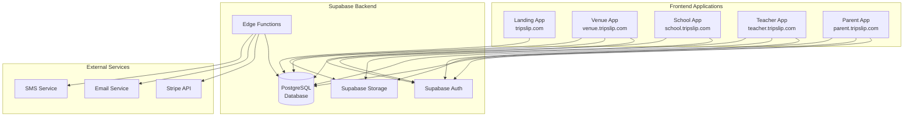
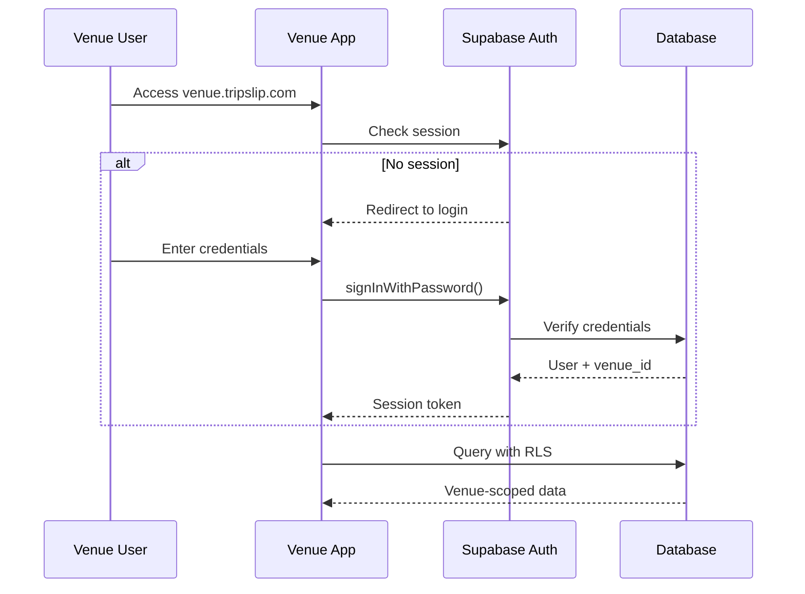
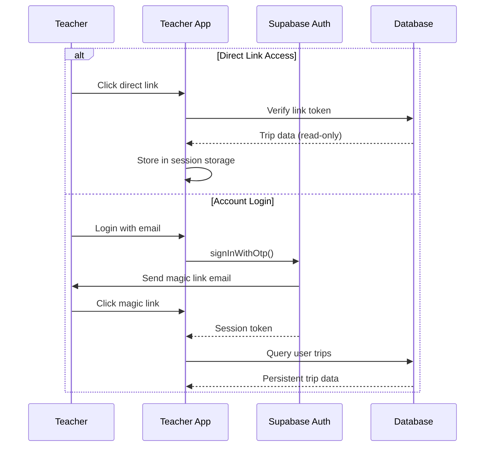
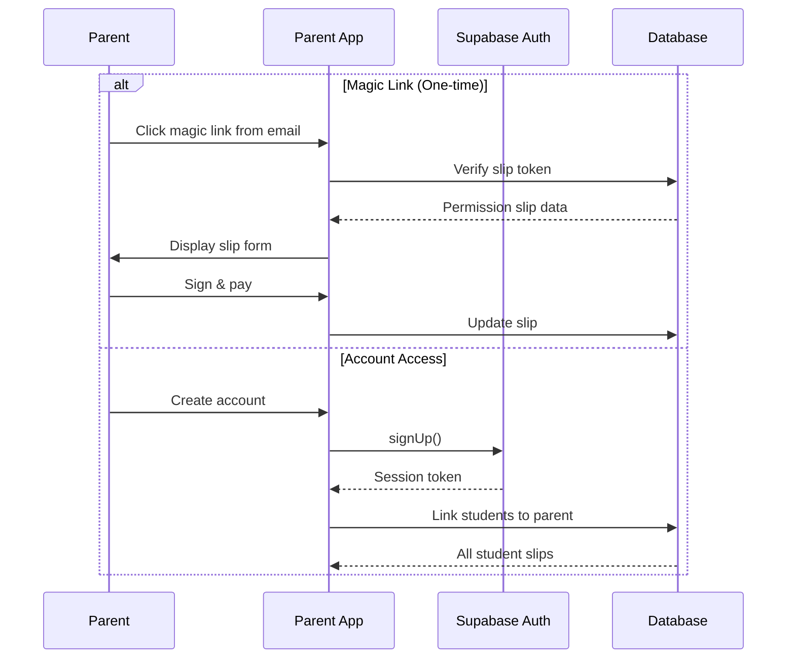
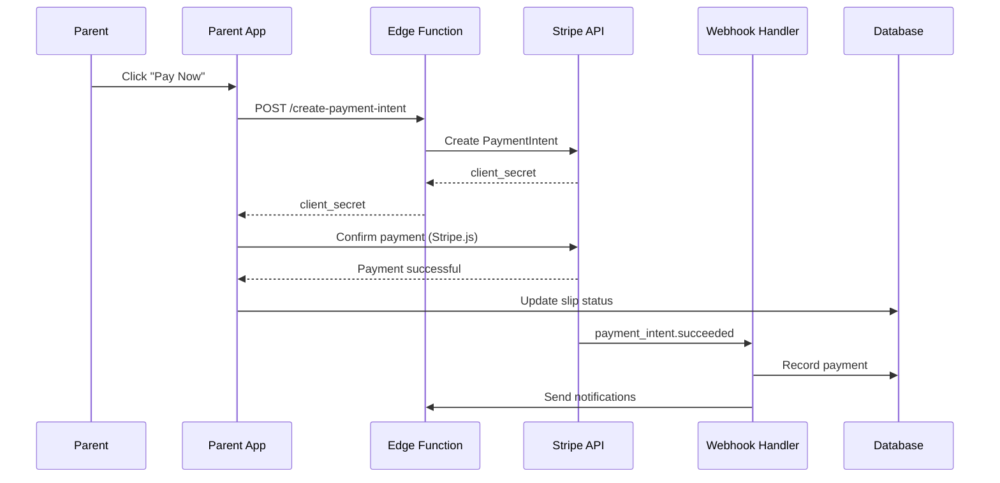
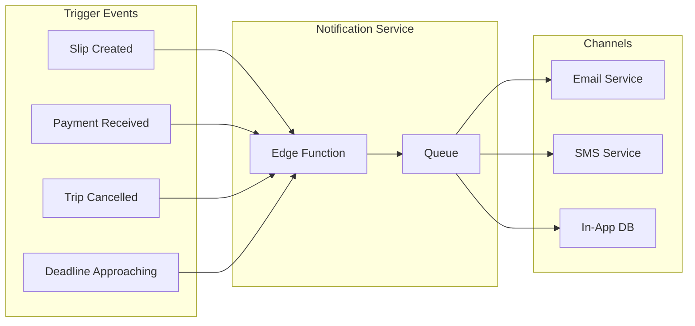

# Technical Design Document: TripSlip Platform Architecture

## Overview

This document specifies the technical architecture for transforming TripSlip from a single-page demo application into a production-ready multi-application platform. The platform consists of five separate web applications sharing a unified Supabase backend, supporting flexible organizational hierarchies and varied authentication patterns.

### System Goals

- **Multi-Application Architecture**: Five independent applications (Landing, Venue, School, Teacher, Parent) sharing a common database
- **Flexible Authentication**: Required auth for venues, optional auth for teachers/parents with magic links and direct links
- **Scalable Data Model**: Support for independent teachers and optional school/district hierarchies
- **Payment Processing**: Stripe integration with split payments and refund handling
- **Multi-Channel Notifications**: Email, SMS, and in-app notifications
- **Document Management**: PDF generation, secure storage, medical form encryption
- **Internationalization**: English, Spanish, and Arabic with RTL support
- **Compliance**: FERPA compliance, audit trails, data privacy controls

### Technology Stack

- **Frontend**: React 19 with TypeScript, Vite build system
- **UI Framework**: Radix UI components, Tailwind CSS 4
- **Backend**: Supabase (PostgreSQL, Auth, Storage, Edge Functions)
- **State Management**: Zustand for client state
- **Routing**: React Router v7
- **Internationalization**: i18next with react-i18next
- **Payments**: Stripe API with webhooks
- **Notifications**: Supabase Edge Functions + email/SMS providers
- **PDF Generation**: Server-side rendering with Edge Functions
- **Deployment**: Vercel/Netlify for frontend, Supabase for backend

## Design System

### Brand Identity

TripSlip's design system creates a warm, approachable, and efficient experience that reduces coordination chaos for venues, teachers, and parents. The system balances playful energy with professional reliability.

### Color System

**Primary Colors**:
- **TripSlip Yellow**: `#F5C518` - Primary brand color, matches logo exactly
  - Use for: Primary CTAs, highlights, active states, brand moments
  - Accessibility: Ensure 4.5:1 contrast when used with text
- **Black**: `#0A0A0A` - Primary text, borders, shadows
  - Use for: Body text, headings, borders, UI elements
- **White**: `#FFFFFF` - Backgrounds, cards, surfaces
  - Use for: Page backgrounds, card surfaces, input fields

**Color Distribution (60/20/20 Rule)**:
- 60% White - Dominant background color for clean, spacious layouts
- 20% Black - Supporting color for text, borders, and structure
- 20% Yellow - Accent color for CTAs, highlights, and brand moments

**Semantic Colors**:
- **Success**: `#10B981` (Green) - Confirmations, completed states
- **Warning**: `#F59E0B` (Amber) - Alerts, pending actions
- **Error**: `#EF4444` (Red) - Errors, destructive actions
- **Info**: `#3B82F6` (Blue) - Informational messages

**Color Usage Examples**:
```css
/* Primary Button */
.btn-primary {
  background: #F5C518;
  color: #0A0A0A;
  border: 2px solid #0A0A0A;
}

/* Card with Shadow */
.card {
  background: #FFFFFF;
  border: 2px solid #0A0A0A;
  box-shadow: 4px 4px 0px #0A0A0A;
}

/* Text Hierarchy */
.text-primary { color: #0A0A0A; }
.text-secondary { color: #6B7280; }
.text-accent { color: #F5C518; }
```

### Typography System

**Display Font: Fraunces**
- **Weights**: 700 (Bold), 900 (Black)
- **Styles**: Regular, Italic
- **Use for**: Headlines, hero text, marketing copy, emotional moments
- **Characteristics**: Serif with personality, adds warmth and character
- **Example sizes**: 
  - Hero: 72px / 4.5rem
  - H1: 48px / 3rem
  - H2: 36px / 2.25rem

**Body Font: Plus Jakarta Sans**
- **Weights**: 300 (Light), 400 (Regular), 500 (Medium), 600 (SemiBold), 700 (Bold)
- **Use for**: UI text, forms, buttons, body copy, emails, notifications
- **Characteristics**: Clean, modern, highly readable
- **Example sizes**:
  - Body Large: 18px / 1.125rem
  - Body: 16px / 1rem
  - Body Small: 14px / 0.875rem
  - Caption: 12px / 0.75rem

**Monospace Font: Space Mono**
- **Weights**: 400 (Regular), 700 (Bold)
- **Use for**: Labels, tags, data display, codes, timestamps
- **Characteristics**: Technical, precise, distinctive
- **Example sizes**:
  - Label: 14px / 0.875rem
  - Tag: 12px / 0.75rem

**Typography Scale**:
```css
/* Tailwind Config */
fontFamily: {
  display: ['Fraunces', 'serif'],
  sans: ['Plus Jakarta Sans', 'sans-serif'],
  mono: ['Space Mono', 'monospace'],
}

fontSize: {
  'hero': ['72px', { lineHeight: '1.1', letterSpacing: '-0.02em' }],
  'h1': ['48px', { lineHeight: '1.2', letterSpacing: '-0.01em' }],
  'h2': ['36px', { lineHeight: '1.3', letterSpacing: '-0.01em' }],
  'h3': ['24px', { lineHeight: '1.4' }],
  'body-lg': ['18px', { lineHeight: '1.6' }],
  'body': ['16px', { lineHeight: '1.5' }],
  'body-sm': ['14px', { lineHeight: '1.5' }],
  'caption': ['12px', { lineHeight: '1.4' }],
}
```

### Component Interaction Patterns

**Offset Shadow Interaction**:
- Default state: `box-shadow: 4px 4px 0px #0A0A0A`
- Hover state: `transform: translate(-4px, -4px)` + `box-shadow: 8px 8px 0px #0A0A0A`
- Active state: `transform: translate(0, 0)` + `box-shadow: 2px 2px 0px #0A0A0A`
- Creates playful, tactile feeling that invites interaction

```css
.interactive-card {
  border: 2px solid #0A0A0A;
  box-shadow: 4px 4px 0px #0A0A0A;
  transition: all 0.2s cubic-bezier(0.34, 1.56, 0.64, 1);
}

.interactive-card:hover {
  transform: translate(-4px, -4px);
  box-shadow: 8px 8px 0px #0A0A0A;
}

.interactive-card:active {
  transform: translate(0, 0);
  box-shadow: 2px 2px 0px #0A0A0A;
}
```

**Claymorphic 3D Icons**:
- Layered shadows create depth and dimension
- Use for: Feature icons, status indicators, category badges
- Shadow layers: 
  - Layer 1: `0 2px 0 rgba(0,0,0,0.1)`
  - Layer 2: `0 4px 0 rgba(0,0,0,0.08)`
  - Layer 3: `0 8px 0 rgba(0,0,0,0.06)`

```css
.clay-icon {
  background: #F5C518;
  border-radius: 16px;
  box-shadow: 
    0 2px 0 rgba(0,0,0,0.1),
    0 4px 0 rgba(0,0,0,0.08),
    0 8px 0 rgba(0,0,0,0.06);
}
```

**Bounce Animation**:
- Easing: `cubic-bezier(0.34, 1.56, 0.64, 1)`
- Duration: 200-300ms
- Use for: Button clicks, success states, micro-interactions
- Creates energetic, satisfying feedback

```css
.bounce-animation {
  animation: bounce 0.3s cubic-bezier(0.34, 1.56, 0.64, 1);
}

@keyframes bounce {
  0%, 100% { transform: scale(1); }
  50% { transform: scale(1.05); }
}
```

### Voice & Tone Guidelines

**Core Principles**:
- **Direct**: Get to the point quickly, no fluff
- **Warm**: Friendly and approachable, never corporate
- **Action-oriented**: Focus on what users can do
- **Problem-solving**: Address pain points directly

**Audience-Specific Messaging**:

**For Venues**:
- Pain point: "Stop losing revenue to coordination chaos"
- Value prop: "Fill more seats, reduce no-shows, get paid faster"
- Tone: Professional but energetic, ROI-focused
- Example: "Turn field trip chaos into revenue. TripSlip handles bookings, payments, and communication so you can focus on creating amazing experiences."

**For Teachers**:
- Pain point: "Stop burning hours on coordination chaos"
- Value prop: "Plan trips in minutes, not days"
- Tone: Empathetic, time-saving, supportive
- Example: "Field trips shouldn't feel like a second job. Create trips, collect permission slips, and track payments—all in one place."

**For Parents**:
- Pain point: "Never miss a permission slip deadline"
- Value prop: "Sign and pay in 2 minutes from your phone"
- Tone: Reassuring, simple, mobile-first
- Example: "Permission slips made simple. Sign, pay, and you're done—right from your phone."

**Writing Guidelines**:
- Use contractions (you're, we're, it's) for conversational tone
- Lead with benefits, not features
- Use active voice ("Create a trip" not "A trip can be created")
- Keep sentences short and scannable
- Avoid jargon: "field trip" not "educational excursion"
- Never use: "leverage", "synergy", "paradigm", "utilize"

**Button Copy Examples**:
- ✅ "Create Trip" (not "Add New Trip")
- ✅ "Sign & Pay" (not "Submit Permission Slip")
- ✅ "Get Started" (not "Begin Registration")
- ✅ "See Availability" (not "View Calendar")

**Error Message Examples**:
- ✅ "Oops! That email doesn't match our records. Try again?"
- ❌ "Authentication failed. Invalid credentials provided."
- ✅ "This trip is full, but you can join the waitlist"
- ❌ "Capacity exceeded. Waitlist enrollment available."

### Spacing System

**Base Unit**: 4px (0.25rem)

**Scale**:
- `xs`: 4px (0.25rem)
- `sm`: 8px (0.5rem)
- `md`: 16px (1rem)
- `lg`: 24px (1.5rem)
- `xl`: 32px (2rem)
- `2xl`: 48px (3rem)
- `3xl`: 64px (4rem)

**Component Spacing**:
- Card padding: `lg` (24px)
- Button padding: `sm` `md` (8px 16px)
- Section spacing: `2xl` (48px)
- Element spacing: `md` (16px)

### Border & Radius System

**Border Width**:
- Default: 2px (bold, confident borders)
- Thin: 1px (subtle dividers)

**Border Radius**:
- `sm`: 4px - Small elements, tags
- `md`: 8px - Buttons, inputs
- `lg`: 16px - Cards, modals
- `xl`: 24px - Large containers
- `full`: 9999px - Pills, avatars

### Component Library Standards

**Buttons**:
```tsx
// Primary Button
<button className="
  bg-yellow-500 text-black font-sans font-semibold
  px-4 py-2 rounded-md border-2 border-black
  shadow-[4px_4px_0px_0px_rgba(10,10,10,1)]
  hover:translate-x-[-4px] hover:translate-y-[-4px]
  hover:shadow-[8px_8px_0px_0px_rgba(10,10,10,1)]
  active:translate-x-0 active:translate-y-0
  active:shadow-[2px_2px_0px_0px_rgba(10,10,10,1)]
  transition-all duration-200 ease-bounce
">
  Create Trip
</button>

// Secondary Button
<button className="
  bg-white text-black font-sans font-semibold
  px-4 py-2 rounded-md border-2 border-black
  hover:bg-gray-50
  transition-colors duration-200
">
  Cancel
</button>
```

**Cards**:
```tsx
<div className="
  bg-white rounded-lg border-2 border-black
  shadow-[4px_4px_0px_0px_rgba(10,10,10,1)]
  p-6
">
  {/* Card content */}
</div>
```

**Inputs**:
```tsx
<input className="
  w-full px-4 py-2 rounded-md
  border-2 border-black
  font-sans text-body
  focus:outline-none focus:ring-2 focus:ring-yellow-500
  transition-all duration-200
" />
```

### Accessibility Requirements

**Color Contrast**:
- All text must meet WCAG AA standards (4.5:1 minimum)
- Yellow (#F5C518) on white: Use black text for contrast
- Black (#0A0A0A) on white: Excellent contrast (21:1)
- Test all color combinations with contrast checker

**Interactive Elements**:
- Minimum touch target: 44x44px
- Clear focus indicators (2px ring, yellow color)
- Keyboard navigation support for all interactions
- ARIA labels for icon-only buttons

**Typography**:
- Minimum body text size: 16px
- Line height: 1.5 for body text
- Maximum line length: 75 characters
- Support browser zoom up to 200%

### Responsive Breakpoints

```css
/* Tailwind Breakpoints */
sm: 640px   /* Mobile landscape, small tablets */
md: 768px   /* Tablets */
lg: 1024px  /* Laptops */
xl: 1280px  /* Desktops */
2xl: 1536px /* Large desktops */
```

**Mobile-First Approach**:
- Design for 375px width first (iPhone SE)
- Progressive enhancement for larger screens
- Touch-friendly interactions on mobile
- Simplified navigation on small screens

### Animation Guidelines

**Timing**:
- Micro-interactions: 150-200ms
- Component transitions: 200-300ms
- Page transitions: 300-500ms
- Never exceed 500ms

**Easing Functions**:
- Default: `cubic-bezier(0.34, 1.56, 0.64, 1)` (bounce)
- Smooth: `ease-in-out`
- Enter: `ease-out`
- Exit: `ease-in`

**Performance**:
- Use `transform` and `opacity` for animations (GPU-accelerated)
- Avoid animating `width`, `height`, `top`, `left`
- Use `will-change` sparingly
- Respect `prefers-reduced-motion` media query

## Architecture

### High-Level System Architecture



### Application Structure

Each application is a separate React SPA with shared component library:

```
tripslip-monorepo/
├── apps/
│   ├── landing/          # Public marketing site
│   ├── venue/            # Venue management app
│   ├── school/           # School/district admin app
│   ├── teacher/          # Teacher trip management app
│   └── parent/           # Parent permission slip app
├── packages/
│   ├── ui/               # Shared Radix UI components
│   ├── database/         # Shared database types
│   ├── auth/             # Shared auth utilities
│   ├── i18n/             # Shared translations
│   └── utils/            # Shared utility functions
└── supabase/
    ├── migrations/       # Database migrations
    ├── functions/        # Edge functions
    └── storage/          # Storage bucket configs
```

### Deployment Architecture

- **Frontend Apps**: Each app deployed independently to Vercel/Netlify
  - Landing: `tripslip.com`
  - Venue: `venue.tripslip.com`
  - School: `school.tripslip.com`
  - Teacher: `teacher.tripslip.com`
  - Parent: `parent.tripslip.com`
- **Backend**: Single Supabase project (yvzpgbhinxibebgeevcu)
- **CDN**: Static assets served via Vercel/Netlify CDN
- **Edge Functions**: Deployed to Supabase Edge Runtime

### Authentication Flows

#### Venue Authentication (Required)


#### Teacher Authentication (Optional)


#### Parent Authentication (Optional)


## Components and Interfaces

### Shared Component Library

Located in `packages/ui/`, provides consistent UI across all apps:

**Core Components**:
- `Button`, `Input`, `Select`, `Checkbox`, `Radio` - Form controls
- `Card`, `Dialog`, `Sheet`, `Popover` - Containers
- `Table`, `Pagination` - Data display
- `Calendar`, `DatePicker` - Date selection
- `Avatar`, `Badge`, `Tooltip` - Indicators
- `Alert`, `Toast` - Notifications

**Custom Components**:
- `SignaturePad` - Digital signature capture
- `DocumentViewer` - PDF preview
- `MetricCard` - Dashboard statistics
- `ProgressBar` - Status indicators
- `LanguageSelector` - i18n switcher
- `NotificationBell` - In-app notifications

### Application-Specific Components

#### Landing App Components
- `Hero` - Marketing hero section
- `FeatureGrid` - Feature showcase
- `PricingTable` - Subscription pricing
- `Testimonials` - User testimonials
- `CTASection` - Call-to-action blocks

#### Venue App Components
- `ExperienceEditor` - Create/edit experiences
- `AvailabilityCalendar` - Manage availability
- `TripList` - View bookings
- `FinancialDashboard` - Revenue reports
- `SurveyBuilder` - Custom surveys
- `WebhookConfig` - Webhook settings

#### School App Components
- `SchoolDashboard` - Aggregate statistics
- `TeacherList` - Manage teachers
- `TripCalendar` - School-wide calendar
- `DistrictView` - District-level overview
- `InvitationManager` - Invite teachers

#### Teacher App Components
- `RosterManager` - Student roster CRUD
- `TripBuilder` - Create trip wizard
- `ExperienceSearch` - Find experiences
- `PermissionSlipTracker` - Slip status
- `AttendanceSheet` - Day-of attendance
- `EmergencyContacts` - Quick access list
- `CSVImporter` - Bulk roster import

#### Parent App Components
- `PermissionSlipForm` - Sign slip
- `PaymentForm` - Stripe checkout
- `StudentList` - View all children
- `TripHistory` - Past trips
- `NotificationPreferences` - Settings
- `DocumentUploader` - Medical forms

### API Interfaces

#### Supabase Client Interface
```typescript
// packages/database/src/client.ts
import { createClient } from '@supabase/supabase-js';
import type { Database } from './types';

export const createSupabaseClient = () => {
  return createClient<Database>(
    process.env.VITE_SUPABASE_URL!,
    process.env.VITE_SUPABASE_ANON_KEY!
  );
};
```

#### Authentication Service
```typescript
// packages/auth/src/service.ts
export interface AuthService {
  // Venue auth
  signInWithPassword(email: string, password: string): Promise<Session>;
  
  // Teacher/Parent auth
  signInWithOtp(email: string): Promise<void>;
  verifyOtp(email: string, token: string): Promise<Session>;
  
  // Direct link auth
  verifyDirectLink(token: string): Promise<TripData>;
  
  // Magic link auth
  verifyMagicLink(token: string): Promise<PermissionSlipData>;
  
  // Session management
  getSession(): Promise<Session | null>;
  signOut(): Promise<void>;
  refreshSession(): Promise<Session>;
}
```

#### Trip Service
```typescript
// packages/database/src/services/trips.ts
export interface TripService {
  createTrip(data: CreateTripInput): Promise<Trip>;
  getTrip(id: string): Promise<Trip>;
  updateTrip(id: string, data: UpdateTripInput): Promise<Trip>;
  cancelTrip(id: string, reason: string): Promise<void>;
  
  addStudents(tripId: string, studentIds: string[]): Promise<void>;
  removeStudent(tripId: string, studentId: string): Promise<void>;
  
  generatePermissionSlips(tripId: string): Promise<PermissionSlip[]>;
  getPermissionSlipStatus(tripId: string): Promise<SlipStatus[]>;
  
  recordAttendance(tripId: string, attendance: AttendanceRecord[]): Promise<void>;
}
```

#### Payment Service
```typescript
// packages/database/src/services/payments.ts
export interface PaymentService {
  createPaymentIntent(slipId: string, amount: number): Promise<PaymentIntent>;
  confirmPayment(intentId: string): Promise<Payment>;
  
  createSplitPayment(slipId: string, splits: PaymentSplit[]): Promise<Payment[]>;
  
  refundPayment(paymentId: string, amount?: number): Promise<Refund>;
  batchRefund(tripId: string): Promise<Refund[]>;
  
  getPaymentStatus(slipId: string): Promise<PaymentStatus>;
}
```

#### Notification Service
```typescript
// packages/database/src/services/notifications.ts
export interface NotificationService {
  sendEmail(to: string, template: EmailTemplate, data: any): Promise<void>;
  sendSMS(to: string, message: string): Promise<void>;
  
  createInAppNotification(userId: string, notification: Notification): Promise<void>;
  markAsRead(notificationId: string): Promise<void>;
  markAllAsRead(userId: string): Promise<void>;
  
  getUserNotifications(userId: string): Promise<Notification[]>;
  getUnreadCount(userId: string): Promise<number>;
}
```

## Data Models

### Entity Relationship Diagram

```mermaid
erDiagram
    VENUES ||--o{ EXPERIENCES : offers
    VENUES ||--o{ VENUE_USERS : employs
    
    EXPERIENCES ||--o{ TRIPS : "booked as"
    EXPERIENCES ||--o{ AVAILABILITY : has
    EXPERIENCES ||--o{ PRICING_TIERS : has
    
    DISTRICTS ||--o{ SCHOOLS : contains
    SCHOOLS ||--o{ TEACHERS : employs
    TEACHERS ||--o{ ROSTERS : creates
    TEACHERS ||--o{ TRIPS : organizes
    
    ROSTERS ||--o{ STUDENTS : contains
    STUDENTS ||--o{ PARENTS : "has guardians"
    STUDENTS ||--o{ PERMISSION_SLIPS : requires
    
    TRIPS ||--o{ PERMISSION_SLIPS : generates
    TRIPS ||--o{ ATTENDANCE : tracks
    TRIPS ||--o{ CHAPERONES : includes
    
    PERMISSION_SLIPS ||--o{ PAYMENTS : "paid by"
    PERMISSION_SLIPS ||--o{ DOCUMENTS : attaches
    
    PAYMENTS ||--o{ REFUNDS : "refunded as"
    
    USERS ||--o{ NOTIFICATIONS : receives
    USERS ||--o{ AUDIT_LOGS : "actions logged"
    
    VENUES {
        uuid id PK
        string name
        string description
        jsonb address
        string contact_email
        string contact_phone
        jsonb settings
        timestamp created_at
        timestamp updated_at
    }
    
    VENUE_USERS {
        uuid id PK
        uuid venue_id FK
        uuid user_id FK
        string role
        timestamp created_at
    }
    
    EXPERIENCES {
        uuid id PK
        uuid venue_id FK
        string title
        text description
        int duration_minutes
        int capacity
        int min_students
        int max_students
        jsonb educational_standards
        string[] grade_levels
        string[] subjects
        boolean published
        timestamp created_at
        timestamp updated_at
    }
    
    AVAILABILITY {
        uuid id PK
        uuid experience_id FK
        date available_date
        time start_time
        time end_time
        int capacity
        int booked_count
        timestamp created_at
    }
    
    PRICING_TIERS {
        uuid id PK
        uuid experience_id FK
        int min_students
        int max_students
        int price_cents
        int free_chaperones
        timestamp created_at
    }
    
    DISTRICTS {
        uuid id PK
        string name
        string code
        jsonb address
        timestamp created_at
        timestamp updated_at
    }
    
    SCHOOLS {
        uuid id PK
        uuid district_id FK
        string name
        string code
        jsonb address
        timestamp created_at
        timestamp updated_at
    }
    
    TEACHERS {
        uuid id PK
        uuid user_id FK
        uuid school_id FK
        string first_name
        string last_name
        string email
        string phone
        boolean independent
        timestamp created_at
        timestamp updated_at
    }
    
    ROSTERS {
        uuid id PK
        uuid teacher_id FK
        string name
        string grade_level
        timestamp created_at
        timestamp updated_at
    }
    
    STUDENTS {
        uuid id PK
        uuid roster_id FK
        string first_name
        string last_name
        string grade
        date date_of_birth
        jsonb medical_info
        timestamp created_at
        timestamp updated_at
    }
    
    PARENTS {
        uuid id PK
        uuid user_id FK
        string first_name
        string last_name
        string email
        string phone
        string language
        timestamp created_at
        timestamp updated_at
    }
    
    STUDENT_PARENTS {
        uuid student_id FK
        uuid parent_id FK
        string relationship
        boolean primary_contact
        timestamp created_at
    }
    
    TRIPS {
        uuid id PK
        uuid experience_id FK
        uuid teacher_id FK
        date trip_date
        time trip_time
        int student_count
        string status
        string direct_link_token
        jsonb transportation
        timestamp created_at
        timestamp updated_at
    }
    
    PERMISSION_SLIPS {
        uuid id PK
        uuid trip_id FK
        uuid student_id FK
        string magic_link_token
        timestamp token_expires_at
        string status
        jsonb form_data
        string signature_data
        timestamp signed_at
        uuid signed_by_parent_id FK
        timestamp created_at
        timestamp updated_at
    }
    
    DOCUMENTS {
        uuid id PK
        uuid permission_slip_id FK
        string document_type
        string storage_path
        boolean encrypted
        timestamp created_at
    }
    
    PAYMENTS {
        uuid id PK
        uuid permission_slip_id FK
        uuid parent_id FK
        int amount_cents
        string stripe_payment_intent_id
        string status
        boolean is_split_payment
        timestamp created_at
        timestamp updated_at
    }
    
    REFUNDS {
        uuid id PK
        uuid payment_id FK
        int amount_cents
        string stripe_refund_id
        string reason
        timestamp created_at
    }
    
    ATTENDANCE {
        uuid id PK
        uuid trip_id FK
        uuid student_id FK
        boolean present
        string notes
        timestamp recorded_at
        uuid recorded_by FK
    }
    
    CHAPERONES {
        uuid id PK
        uuid trip_id FK
        uuid parent_id FK
        string status
        boolean background_check_verified
        timestamp invited_at
        timestamp accepted_at
    }
    
    NOTIFICATIONS {
        uuid id PK
        uuid user_id FK
        string type
        string title
        text message
        jsonb data
        boolean read
        timestamp created_at
    }
    
    AUDIT_LOGS {
        uuid id PK
        uuid user_id FK
        string action
        string entity_type
        uuid entity_id
        jsonb old_data
        jsonb new_data
        string ip_address
        timestamp created_at
    }
```



### Database Schema Details

#### Core Tables

**venues**
- Primary entity for organizations hosting field trips
- Contains profile information and settings
- RLS: Users can only access their own venue

**experiences**
- Field trip offerings created by venues
- Includes educational metadata and capacity limits
- RLS: Public read for published, venue write access

**trips**
- Scheduled instances of experiences
- Links teachers to experiences with specific dates
- Contains direct_link_token for shareable access
- RLS: Teacher can access their trips, venue can access trips for their experiences

**students**
- Student records managed by teachers
- Contains medical information (encrypted)
- RLS: Teacher can access students in their rosters, parents can access their children

**permission_slips**
- Generated for each student on each trip
- Contains magic_link_token for parent access
- Stores signature data and form responses
- RLS: Parent can access via magic link token, teacher can access for their trips

**payments**
- Stripe payment records
- Supports split payments via is_split_payment flag
- RLS: Parent can access their payments, venue can access payments for their trips

#### Supporting Tables

**availability**
- Date-specific availability for experiences
- Tracks capacity and booking counts
- Used for calendar display and booking validation

**pricing_tiers**
- Volume-based pricing for experiences
- Defines price per student count range
- Includes free chaperone allocations

**rosters**
- Named groups of students managed by teachers
- Enables quick trip creation from saved rosters

**student_parents**
- Many-to-many relationship between students and parents
- Supports multiple guardians per student
- Tracks primary contact designation

**documents**
- Medical forms, insurance cards, background checks
- References Supabase Storage paths
- Encrypted flag for sensitive documents

**chaperones**
- Parent volunteers for trips
- Tracks invitation and acceptance status
- Includes background check verification

**notifications**
- In-app notification records
- Supports read/unread tracking
- Includes structured data for action links

**audit_logs**
- Comprehensive activity logging
- Stores before/after state for modifications
- Required for FERPA compliance

### Row-Level Security Policies

#### Venue Access
```sql
-- Venues table
CREATE POLICY "Users can view their own venue"
  ON venues FOR SELECT
  USING (id IN (
    SELECT venue_id FROM venue_users WHERE user_id = auth.uid()
  ));

CREATE POLICY "Users can update their own venue"
  ON venues FOR UPDATE
  USING (id IN (
    SELECT venue_id FROM venue_users WHERE user_id = auth.uid()
  ));
```

#### Experience Access
```sql
-- Experiences table
CREATE POLICY "Anyone can view published experiences"
  ON experiences FOR SELECT
  USING (published = true);

CREATE POLICY "Venue users can manage their experiences"
  ON experiences FOR ALL
  USING (venue_id IN (
    SELECT venue_id FROM venue_users WHERE user_id = auth.uid()
  ));
```

#### Trip Access
```sql
-- Trips table
CREATE POLICY "Teachers can view their own trips"
  ON trips FOR SELECT
  USING (teacher_id IN (
    SELECT id FROM teachers WHERE user_id = auth.uid()
  ));

CREATE POLICY "Venue users can view trips for their experiences"
  ON trips FOR SELECT
  USING (experience_id IN (
    SELECT id FROM experiences WHERE venue_id IN (
      SELECT venue_id FROM venue_users WHERE user_id = auth.uid()
    )
  ));

CREATE POLICY "Anyone with valid direct link can view trip"
  ON trips FOR SELECT
  USING (direct_link_token = current_setting('request.headers')::json->>'x-direct-link-token');
```

#### Permission Slip Access
```sql
-- Permission slips table
CREATE POLICY "Parents can view slips via magic link"
  ON permission_slips FOR SELECT
  USING (
    magic_link_token = current_setting('request.headers')::json->>'x-magic-link-token'
    AND token_expires_at > now()
  );

CREATE POLICY "Parents can view their children's slips"
  ON permission_slips FOR SELECT
  USING (student_id IN (
    SELECT student_id FROM student_parents WHERE parent_id IN (
      SELECT id FROM parents WHERE user_id = auth.uid()
    )
  ));

CREATE POLICY "Teachers can view slips for their trips"
  ON permission_slips FOR SELECT
  USING (trip_id IN (
    SELECT id FROM trips WHERE teacher_id IN (
      SELECT id FROM teachers WHERE user_id = auth.uid()
    )
  ));
```

### Database Indexes

```sql
-- Performance indexes
CREATE INDEX idx_experiences_venue_published ON experiences(venue_id, published);
CREATE INDEX idx_trips_teacher_date ON trips(teacher_id, trip_date);
CREATE INDEX idx_trips_experience_date ON trips(experience_id, trip_date);
CREATE INDEX idx_permission_slips_trip ON permission_slips(trip_id);
CREATE INDEX idx_permission_slips_student ON permission_slips(student_id);
CREATE INDEX idx_permission_slips_token ON permission_slips(magic_link_token) WHERE token_expires_at > now();
CREATE INDEX idx_payments_slip ON payments(permission_slip_id);
CREATE INDEX idx_payments_stripe_intent ON payments(stripe_payment_intent_id);
CREATE INDEX idx_students_roster ON students(roster_id);
CREATE INDEX idx_notifications_user_unread ON notifications(user_id, read) WHERE read = false;
CREATE INDEX idx_audit_logs_user_created ON audit_logs(user_id, created_at DESC);
CREATE INDEX idx_audit_logs_entity ON audit_logs(entity_type, entity_id);
```

### Data Encryption

**Medical Information**: Encrypted at application level before storage
```typescript
// Encrypt medical data before insert
const encryptedMedical = await encrypt(medicalInfo, ENCRYPTION_KEY);
await supabase.from('students').insert({
  ...studentData,
  medical_info: encryptedMedical
});

// Decrypt on retrieval
const { data } = await supabase.from('students').select('*').eq('id', studentId);
const decryptedMedical = await decrypt(data.medical_info, ENCRYPTION_KEY);
```

**Documents**: Stored in Supabase Storage with encryption enabled
```typescript
// Upload encrypted document
const { data, error } = await supabase.storage
  .from('medical-documents')
  .upload(path, file, {
    cacheControl: '3600',
    upsert: false,
    contentType: 'application/pdf',
    // Supabase Storage encryption enabled at bucket level
  });
```


## Payment Processing Architecture

### Stripe Integration

**Payment Flow**:
1. Parent initiates payment in Parent App
2. Frontend creates payment intent via Edge Function
3. Stripe Elements collects payment method
4. Frontend confirms payment with Stripe
5. Webhook updates payment status in database
6. Notification sent to parent and teacher



### Split Payment Implementation

For students with multiple parents, payments can be split:

```typescript
// Edge Function: create-split-payment
export async function createSplitPayment(
  slipId: string,
  splits: Array<{ parentId: string; amountCents: number }>
) {
  const totalAmount = splits.reduce((sum, s) => sum + s.amountCents, 0);
  
  // Create payment intents for each parent
  const intents = await Promise.all(
    splits.map(split =>
      stripe.paymentIntents.create({
        amount: split.amountCents,
        currency: 'usd',
        metadata: {
          permission_slip_id: slipId,
          parent_id: split.parentId,
          is_split_payment: 'true'
        }
      })
    )
  );
  
  // Store payment records
  await supabase.from('payments').insert(
    intents.map((intent, i) => ({
      permission_slip_id: slipId,
      parent_id: splits[i].parentId,
      amount_cents: splits[i].amountCents,
      stripe_payment_intent_id: intent.id,
      status: 'pending',
      is_split_payment: true
    }))
  );
  
  return intents.map(i => i.client_secret);
}
```

### Refund Processing

```typescript
// Edge Function: process-refund
export async function processRefund(
  paymentId: string,
  amountCents?: number,
  reason?: string
) {
  // Get payment record
  const { data: payment } = await supabase
    .from('payments')
    .select('*')
    .eq('id', paymentId)
    .single();
  
  // Create Stripe refund
  const refund = await stripe.refunds.create({
    payment_intent: payment.stripe_payment_intent_id,
    amount: amountCents || payment.amount_cents,
    reason: reason || 'requested_by_customer'
  });
  
  // Record refund
  await supabase.from('refunds').insert({
    payment_id: paymentId,
    amount_cents: refund.amount,
    stripe_refund_id: refund.id,
    reason: reason
  });
  
  // Update payment status
  await supabase
    .from('payments')
    .update({ status: 'refunded' })
    .eq('id', paymentId);
  
  // Send notification
  await sendRefundNotification(payment.parent_id, refund.amount);
  
  return refund;
}
```

### Webhook Handling

```typescript
// Edge Function: stripe-webhook
export async function handleStripeWebhook(request: Request) {
  const signature = request.headers.get('stripe-signature');
  const body = await request.text();
  
  // Verify webhook signature
  const event = stripe.webhooks.constructEvent(
    body,
    signature,
    STRIPE_WEBHOOK_SECRET
  );
  
  switch (event.type) {
    case 'payment_intent.succeeded':
      await handlePaymentSuccess(event.data.object);
      break;
    case 'payment_intent.payment_failed':
      await handlePaymentFailure(event.data.object);
      break;
    case 'refund.created':
      await handleRefundCreated(event.data.object);
      break;
  }
  
  return new Response(JSON.stringify({ received: true }), {
    headers: { 'Content-Type': 'application/json' }
  });
}

async function handlePaymentSuccess(paymentIntent: Stripe.PaymentIntent) {
  const { permission_slip_id, parent_id } = paymentIntent.metadata;
  
  // Update payment status
  await supabase
    .from('payments')
    .update({ status: 'succeeded' })
    .eq('stripe_payment_intent_id', paymentIntent.id);
  
  // Check if all payments complete for slip
  const { data: payments } = await supabase
    .from('payments')
    .select('status')
    .eq('permission_slip_id', permission_slip_id);
  
  const allPaid = payments.every(p => p.status === 'succeeded');
  
  if (allPaid) {
    // Update slip status
    await supabase
      .from('permission_slips')
      .update({ status: 'paid' })
      .eq('id', permission_slip_id);
    
    // Notify teacher
    await notifyTeacherOfPayment(permission_slip_id);
  }
  
  // Send receipt to parent
  await sendPaymentReceipt(parent_id, paymentIntent);
}
```

## Notification System

### Multi-Channel Architecture



### Notification Service Implementation

```typescript
// Edge Function: send-notification
export interface NotificationPayload {
  userId: string;
  type: NotificationType;
  channels: ('email' | 'sms' | 'in_app')[];
  data: {
    title: string;
    message: string;
    actionUrl?: string;
    templateId?: string;
    templateData?: Record<string, any>;
  };
}

export async function sendNotification(payload: NotificationPayload) {
  const { userId, type, channels, data } = payload;
  
  // Get user preferences
  const { data: user } = await supabase
    .from('users')
    .select('email, phone, language, notification_preferences')
    .eq('id', userId)
    .single();
  
  const prefs = user.notification_preferences || {};
  
  // Send via each channel
  const promises = channels.map(async channel => {
    // Check if user has opted out
    if (prefs[channel]?.[type] === false && !isCritical(type)) {
      return;
    }
    
    switch (channel) {
      case 'email':
        return sendEmail(user.email, data, user.language);
      case 'sms':
        return sendSMS(user.phone, data.message, user.language);
      case 'in_app':
        return createInAppNotification(userId, data);
    }
  });
  
  await Promise.allSettled(promises);
}

function isCritical(type: NotificationType): boolean {
  return ['trip_cancelled', 'payment_confirmed'].includes(type);
}
```

### Email Templates

Using a template system for consistent, translatable emails:

```typescript
// Email templates with i18n support
const EMAIL_TEMPLATES = {
  permission_slip_created: {
    en: {
      subject: 'Permission Slip Required for {{tripName}}',
      body: `
        <h1>Permission Slip Required</h1>
        <p>Hello {{parentName}},</p>
        <p>{{teacherName}} has created a permission slip for {{studentName}} 
           for the upcoming field trip to {{venueName}} on {{tripDate}}.</p>
        <p><a href="{{magicLink}}">Click here to review and sign</a></p>
      `
    },
    es: {
      subject: 'Se Requiere Permiso para {{tripName}}',
      body: `
        <h1>Se Requiere Permiso</h1>
        <p>Hola {{parentName}},</p>
        <p>{{teacherName}} ha creado un permiso para {{studentName}} 
           para la excursión a {{venueName}} el {{tripDate}}.</p>
        <p><a href="{{magicLink}}">Haga clic aquí para revisar y firmar</a></p>
      `
    },
    ar: {
      subject: 'مطلوب إذن للرحلة {{tripName}}',
      body: `
        <h1>مطلوب إذن</h1>
        <p>مرحبا {{parentName}}،</p>
        <p>قام {{teacherName}} بإنشاء إذن لـ {{studentName}} 
           للرحلة الميدانية إلى {{venueName}} في {{tripDate}}.</p>
        <p><a href="{{magicLink}}">انقر هنا للمراجعة والتوقيع</a></p>
      `
    }
  }
};

async function sendEmail(
  to: string,
  data: any,
  language: string = 'en'
) {
  const template = EMAIL_TEMPLATES[data.templateId][language];
  
  const subject = interpolate(template.subject, data.templateData);
  const body = interpolate(template.body, data.templateData);
  
  // Send via email service (e.g., SendGrid, Resend)
  await emailService.send({
    to,
    subject,
    html: body
  });
}
```

### SMS Implementation

```typescript
// SMS service using Twilio or similar
async function sendSMS(
  to: string,
  message: string,
  language: string = 'en'
) {
  // Translate message if needed
  const translatedMessage = await translate(message, language);
  
  // Send via SMS service
  await smsService.send({
    to,
    body: translatedMessage,
    // Include opt-out instructions
    footer: language === 'en' 
      ? 'Reply STOP to unsubscribe'
      : language === 'es'
      ? 'Responda STOP para cancelar'
      : 'رد STOP لإلغاء الاشتراك'
  });
  
  // Rate limiting check
  await checkSMSRateLimit(to);
}
```

### In-App Notifications

```typescript
async function createInAppNotification(
  userId: string,
  data: {
    title: string;
    message: string;
    actionUrl?: string;
  }
) {
  await supabase.from('notifications').insert({
    user_id: userId,
    type: data.type,
    title: data.title,
    message: data.message,
    data: { actionUrl: data.actionUrl },
    read: false
  });
  
  // Trigger real-time update via Supabase Realtime
  // Client will receive notification via subscription
}

// Client-side subscription
export function useNotifications(userId: string) {
  const [notifications, setNotifications] = useState<Notification[]>([]);
  
  useEffect(() => {
    // Subscribe to new notifications
    const subscription = supabase
      .channel('notifications')
      .on(
        'postgres_changes',
        {
          event: 'INSERT',
          schema: 'public',
          table: 'notifications',
          filter: `user_id=eq.${userId}`
        },
        payload => {
          setNotifications(prev => [payload.new, ...prev]);
        }
      )
      .subscribe();
    
    return () => {
      subscription.unsubscribe();
    };
  }, [userId]);
  
  return notifications;
}
```

## Document Management

### PDF Generation

Using server-side rendering for permission slips and reports:

```typescript
// Edge Function: generate-pdf
import { PDFDocument, rgb } from 'pdf-lib';

export async function generatePermissionSlipPDF(slipId: string) {
  // Fetch slip data
  const { data: slip } = await supabase
    .from('permission_slips')
    .select(`
      *,
      trip:trips(*,
        experience:experiences(*,
          venue:venues(*)
        ),
        teacher:teachers(*)
      ),
      student:students(*,
        parents:student_parents(parent:parents(*))
      )
    `)
    .eq('id', slipId)
    .single();
  
  // Create PDF
  const pdfDoc = await PDFDocument.create();
  const page = pdfDoc.addPage([612, 792]); // Letter size
  
  // Add TripSlip branding
  const { width, height } = page.getSize();
  page.drawText('TripSlip', {
    x: 50,
    y: height - 50,
    size: 24,
    color: rgb(0.96, 0.77, 0.09) // #F5C518
  });
  
  // Add trip details
  let yPosition = height - 100;
  const addText = (text: string, size = 12) => {
    page.drawText(text, { x: 50, y: yPosition, size });
    yPosition -= size + 10;
  };
  
  addText(`Field Trip Permission Slip`, 18);
  addText(`Student: ${slip.student.first_name} ${slip.student.last_name}`);
  addText(`Trip: ${slip.trip.experience.title}`);
  addText(`Venue: ${slip.trip.experience.venue.name}`);
  addText(`Date: ${formatDate(slip.trip.trip_date)}`);
  addText(`Cost: $${slip.trip.experience.cost_cents / 100}`);
  
  // Add signature if signed
  if (slip.signature_data) {
    addText(`Signed by: ${slip.signed_by_parent.first_name} ${slip.signed_by_parent.last_name}`);
    addText(`Signed at: ${formatDateTime(slip.signed_at)}`);
    
    // Embed signature image
    const signatureImage = await pdfDoc.embedPng(slip.signature_data);
    page.drawImage(signatureImage, {
      x: 50,
      y: yPosition - 100,
      width: 200,
      height: 50
    });
  }
  
  // Save PDF
  const pdfBytes = await pdfDoc.save();
  
  // Upload to storage
  const path = `permission-slips/${slipId}.pdf`;
  await supabase.storage
    .from('documents')
    .upload(path, pdfBytes, {
      contentType: 'application/pdf',
      upsert: true
    });
  
  return path;
}
```

### Document Storage

```typescript
// Document upload with encryption
export async function uploadMedicalDocument(
  slipId: string,
  file: File
) {
  // Generate unique path
  const path = `medical/${slipId}/${crypto.randomUUID()}-${file.name}`;
  
  // Upload to encrypted bucket
  const { data, error } = await supabase.storage
    .from('medical-documents')
    .upload(path, file, {
      cacheControl: '3600',
      upsert: false
    });
  
  if (error) throw error;
  
  // Record in database
  await supabase.from('documents').insert({
    permission_slip_id: slipId,
    document_type: 'medical',
    storage_path: path,
    encrypted: true
  });
  
  return data.path;
}

// Document retrieval with access control
export async function getDocument(documentId: string) {
  // Verify access
  const { data: doc } = await supabase
    .from('documents')
    .select('*, permission_slip:permission_slips(*)')
    .eq('id', documentId)
    .single();
  
  // Check RLS policies automatically enforce access
  
  // Get signed URL
  const { data } = await supabase.storage
    .from(doc.encrypted ? 'medical-documents' : 'documents')
    .createSignedUrl(doc.storage_path, 3600); // 1 hour expiry
  
  return data.signedUrl;
}
```

## Internationalization

### i18n Configuration

```typescript
// packages/i18n/src/config.ts
import i18n from 'i18next';
import { initReactI18next } from 'react-i18next';
import LanguageDetector from 'i18next-browser-languagedetector';

import en from './locales/en.json';
import es from './locales/es.json';
import ar from './locales/ar.json';

i18n
  .use(LanguageDetector)
  .use(initReactI18next)
  .init({
    resources: {
      en: { translation: en },
      es: { translation: es },
      ar: { translation: ar }
    },
    fallbackLng: 'en',
    supportedLngs: ['en', 'es', 'ar'],
    interpolation: {
      escapeValue: false
    },
    detection: {
      order: ['localStorage', 'navigator'],
      caches: ['localStorage']
    }
  });

export default i18n;
```

### RTL Support

```typescript
// App-level RTL handling
import { useEffect } from 'react';
import { useTranslation } from 'react-i18next';

export function useRTL() {
  const { i18n } = useTranslation();
  
  useEffect(() => {
    const isRTL = i18n.language === 'ar';
    document.documentElement.dir = isRTL ? 'rtl' : 'ltr';
    document.documentElement.lang = i18n.language;
  }, [i18n.language]);
}

// Tailwind CSS RTL utilities
// Use logical properties for RTL support
// ms-4 instead of ml-4 (margin-inline-start)
// me-4 instead of mr-4 (margin-inline-end)
```

### Translation Files Structure

```json
// locales/en.json
{
  "common": {
    "save": "Save",
    "cancel": "Cancel",
    "delete": "Delete",
    "edit": "Edit"
  },
  "auth": {
    "signIn": "Sign In",
    "signOut": "Sign Out",
    "email": "Email",
    "password": "Password"
  },
  "trips": {
    "createTrip": "Create Trip",
    "tripDetails": "Trip Details",
    "studentCount": "{{count}} students",
    "tripDate": "Trip Date"
  },
  "permissionSlips": {
    "title": "Permission Slip",
    "signHere": "Sign Here",
    "parentSignature": "Parent Signature",
    "medicalInfo": "Medical Information"
  }
}
```

## Deployment Strategy

### Monorepo Structure with Turborepo

```json
// turbo.json
{
  "pipeline": {
    "build": {
      "dependsOn": ["^build"],
      "outputs": ["dist/**", ".next/**"]
    },
    "dev": {
      "cache": false
    },
    "lint": {
      "outputs": []
    },
    "test": {
      "dependsOn": ["^build"],
      "outputs": []
    }
  }
}
```

### Application Deployment

Each app deployed independently with environment-specific configs:

```bash
# apps/landing/.env.production
VITE_SUPABASE_URL=https://yvzpgbhinxibebgeevcu.supabase.co
VITE_SUPABASE_ANON_KEY=<anon_key>
VITE_APP_URL=https://tripslip.com

# apps/venue/.env.production
VITE_SUPABASE_URL=https://yvzpgbhinxibebgeevcu.supabase.co
VITE_SUPABASE_ANON_KEY=<anon_key>
VITE_APP_URL=https://venue.tripslip.com
VITE_STRIPE_PUBLISHABLE_KEY=<stripe_key>

# apps/teacher/.env.production
VITE_SUPABASE_URL=https://yvzpgbhinxibebgeevcu.supabase.co
VITE_SUPABASE_ANON_KEY=<anon_key>
VITE_APP_URL=https://teacher.tripslip.com

# apps/parent/.env.production
VITE_SUPABASE_URL=https://yvzpgbhinxibebgeevcu.supabase.co
VITE_SUPABASE_ANON_KEY=<anon_key>
VITE_APP_URL=https://parent.tripslip.com
VITE_STRIPE_PUBLISHABLE_KEY=<stripe_key>

# apps/school/.env.production
VITE_SUPABASE_URL=https://yvzpgbhinxibebgeevcu.supabase.co
VITE_SUPABASE_ANON_KEY=<anon_key>
VITE_APP_URL=https://school.tripslip.com
```

### Vercel Configuration

```json
// apps/landing/vercel.json
{
  "buildCommand": "cd ../.. && npx turbo run build --filter=landing",
  "outputDirectory": "dist",
  "framework": "vite",
  "env": {
    "VITE_SUPABASE_URL": "@supabase-url",
    "VITE_SUPABASE_ANON_KEY": "@supabase-anon-key"
  },
  "headers": [
    {
      "source": "/(.*)",
      "headers": [
        {
          "key": "X-Frame-Options",
          "value": "DENY"
        },
        {
          "key": "X-Content-Type-Options",
          "value": "nosniff"
        }
      ]
    }
  ]
}
```

### Supabase Edge Functions Deployment

```bash
# Deploy all edge functions
supabase functions deploy create-payment-intent
supabase functions deploy process-refund
supabase functions deploy stripe-webhook
supabase functions deploy send-notification
supabase functions deploy generate-pdf

# Set secrets
supabase secrets set STRIPE_SECRET_KEY=<key>
supabase secrets set STRIPE_WEBHOOK_SECRET=<secret>
supabase secrets set EMAIL_API_KEY=<key>
supabase secrets set SMS_API_KEY=<key>
```

### CI/CD Pipeline

```yaml
# .github/workflows/deploy.yml
name: Deploy

on:
  push:
    branches: [main]

jobs:
  deploy-apps:
    runs-on: ubuntu-latest
    strategy:
      matrix:
        app: [landing, venue, school, teacher, parent]
    steps:
      - uses: actions/checkout@v3
      - uses: actions/setup-node@v3
        with:
          node-version: 18
      - run: npm ci
      - run: npx turbo run build --filter=${{ matrix.app }}
      - uses: amondnet/vercel-action@v20
        with:
          vercel-token: ${{ secrets.VERCEL_TOKEN }}
          vercel-org-id: ${{ secrets.VERCEL_ORG_ID }}
          vercel-project-id: ${{ secrets[format('VERCEL_PROJECT_ID_{0}', matrix.app)] }}
          working-directory: apps/${{ matrix.app }}

  deploy-functions:
    runs-on: ubuntu-latest
    steps:
      - uses: actions/checkout@v3
      - uses: supabase/setup-cli@v1
      - run: supabase functions deploy --project-ref yvzpgbhinxibebgeevcu
        env:
          SUPABASE_ACCESS_TOKEN: ${{ secrets.SUPABASE_ACCESS_TOKEN }}
```


## Correctness Properties

A property is a characteristic or behavior that should hold true across all valid executions of a system—essentially, a formal statement about what the system should do. Properties serve as the bridge between human-readable specifications and machine-verifiable correctness guarantees.

### Property Reflection

After analyzing all 60 requirements, I identified the following consolidations to eliminate redundancy:

- Requirements 7.6 and 9.1 both test permission slip generation - combined into single property
- Multiple authentication requirements (2.1, 2.3, 3.1, 4.1) test similar token validation patterns - consolidated into authentication property pattern
- Several requirements test data preservation (5.4, 6.3, 56.5) - combined into data integrity property
- Encryption requirements (16.5, 25.7) test same underlying mechanism - consolidated
- Multiple notification requirements (12.1, etc.) test same triggering mechanism - consolidated

### Property 1: Cross-Application Data Consistency

For any data written by one application, when queried by any other application, the data should be identical and immediately available.

**Validates: Requirements 1.9**

### Property 2: Venue Authentication Enforcement

For any request to venue-scoped endpoints without valid authentication, the system should reject the request with 401 status.

**Validates: Requirements 2.1, 2.3**

### Property 3: Direct Link Access

For any valid direct link token, accessing the trip should grant read-only access without requiring authentication, and the trip data returned should match the trip associated with that token.

**Validates: Requirements 3.1, 34.3**

### Property 4: Session to Account Conversion Preserves Data

For any teacher session with trip data, converting to a permanent account should preserve all trip data, and querying the account should return the same trips that were in the session.

**Validates: Requirements 3.4**

### Property 5: Magic Link Access Scoping

For any valid magic link token, accessing the permission slip should grant access only to the specific slip associated with that token, and no other slips should be accessible.

**Validates: Requirements 4.1, 4.3**

### Property 6: Independent Teacher Trip Creation

For any teacher not associated with a school, creating a trip should succeed, and the trip should have null school_id.

**Validates: Requirements 5.1**

### Property 7: Organizational Link Preserves Trip Data

For any teacher with existing trips, linking to a school should preserve all trips, and the trip count before and after linking should be equal.

**Validates: Requirements 5.4, 56.5**

### Property 8: Experience CRUD Round Trip

For any experience data, creating then retrieving the experience should return equivalent data.

**Validates: Requirements 6.1**

### Property 9: Experience Update Preserves Trip References

For any experience with associated trips, updating the experience should maintain all trip foreign key relationships, and querying trips should still return the same trip IDs.

**Validates: Requirements 6.3**

### Property 10: Capacity Validation

For any trip where student count exceeds experience capacity, the system should reject the booking or offer waitlist enrollment.

**Validates: Requirements 7.3, 21.6**

### Property 11: Permission Slip Generation Completeness

For any trip with N students, generating permission slips should create exactly N slips, and each student should have exactly one slip for that trip.

**Validates: Requirements 7.6, 9.1**

### Property 12: CSV Import Round Trip

For any valid CSV roster data, importing then exporting should produce equivalent data (modulo formatting).

**Validates: Requirements 8.6, 36.2**

### Property 13: Split Payment Sum Equals Total

For any permission slip with split payments, the sum of all split payment amounts should equal the total trip cost.

**Validates: Requirements 10.7**

### Property 14: Refund Identification Completeness

For any cancelled trip, the refund workflow should identify all permission slips with status 'paid', and the count should match the number of paid slips.

**Validates: Requirements 11.1**

### Property 15: Notification Creation on Slip Generation

For any permission slip created, a notification record should be created for each parent contact associated with the student.

**Validates: Requirements 12.1**

### Property 16: PDF Content Completeness

For any permission slip, the generated PDF should contain the trip title, venue name, student name, trip date, and cost.

**Validates: Requirements 15.3**

### Property 17: Medical Document Encryption

For any medical document uploaded, querying the storage bucket directly should return encrypted data that cannot be read without the decryption key.

**Validates: Requirements 16.5, 25.7**

### Property 18: Attendance Audit Trail

For any attendance record created, the record should include a timestamp and the teacher_id of the user who recorded it.

**Validates: Requirements 17.4, 26.2**

### Property 19: Stripe Fee Calculation Accuracy

For any payment amount, the calculated Stripe fee should equal (amount * 0.029 + 30 cents), and gross revenue should equal amount minus fee.

**Validates: Requirements 19.7**

### Property 20: Waitlist Ordering by Timestamp

For any waitlist for an experience date, the waitlist positions should be ordered by enrollment timestamp ascending, where earlier timestamps have lower position numbers.

**Validates: Requirements 22.4**

### Property 21: RTL Layout for Arabic

For any page when language is set to 'ar', the document dir attribute should be 'rtl' and the lang attribute should be 'ar'.

**Validates: Requirements 24.6**

### Property 22: Row-Level Security Enforcement

For any student record, querying as a user without authorization should return zero rows, while querying as the student's teacher should return the record.

**Validates: Requirements 25.1, 32.7**

### Property 23: Magic Link Token Security

For any generated magic link token, the token should be at least 32 characters long and composed of cryptographically random characters.

**Validates: Requirements 33.1**

### Property 24: Magic Link Expiration

For any magic link created, the token_expires_at should be exactly 7 days (168 hours) from creation timestamp.

**Validates: Requirements 33.2**

### Property 25: Expired Token Rejection

For any magic link where current time is after token_expires_at, attempting to access the slip should return an error.

**Validates: Requirements 33.3**

### Property 26: Session Expiration Setting

For any new session created, the expiration timestamp should be 7 days from the current timestamp.

**Validates: Requirements 35.2**

### Property 27: Color Contrast Compliance

For any text element, the contrast ratio between text color and background color should be at least 4.5:1.

**Validates: Requirements 38.3**

### Property 28: Form State Preservation on Error

For any form with user input, when a recoverable error occurs, the form values should remain unchanged after the error is displayed.

**Validates: Requirements 39.3**

### Property 29: Query Performance

For any database query, the execution time should be less than 500 milliseconds.

**Validates: Requirements 40.5**

### Property 30: Search Autocomplete Response

For any search query of length >= 3, the autocomplete endpoint should return suggestions within 200 milliseconds.

**Validates: Requirements 42.6**

### Property 31: Review Association

For any review submitted, the review record should have a foreign key to the experience, and querying reviews for that experience should include the new review.

**Validates: Requirements 44.4**

### Property 32: Cancellation Refund Calculation

For any trip cancelled D days before trip_date, the refund percentage should match the cancellation policy tier for D days, and refund amount should equal (payment amount * refund percentage).

**Validates: Requirements 45.4**

### Property 33: Pricing Tier Selection

For any trip with S students, the selected pricing tier should be the tier where min_students <= S <= max_students, and the cost should equal (S * tier.price_cents).

**Validates: Requirements 46.3**

### Property 34: Emergency Contact Tel Link

For any emergency contact with phone number P, the rendered HTML should contain a tel: link with href="tel:P".

**Validates: Requirements 48.4**

### Property 35: Offline Sync Completeness

For any changes made while offline, when connection is restored, all queued changes should be applied to the database, and the queue should be empty after sync.

**Validates: Requirements 49.4**

### Property 36: Rate Limiting Enforcement

For any user making more than 100 requests in a 60-second window, the 101st request should return HTTP 429 status.

**Validates: Requirements 52.1**

### Property 37: Webhook Delivery on Booking

For any trip created, if the venue has a webhook URL configured, a POST request should be made to that URL with trip data.

**Validates: Requirements 53.2**

### Property 38: Duplicate Student Detection

For any student being added with name N, if a student with name N already exists in the roster, a warning should be displayed with the existing student's information.

**Validates: Requirements 56.1**

### Property 39: UTC Timestamp Storage

For any timestamp stored in the database, the timezone should be UTC (offset +00:00).

**Validates: Requirements 57.1**

### Property 40: Timezone Display Conversion

For any timestamp displayed to a user in timezone T, the displayed time should equal (UTC timestamp converted to timezone T).

**Validates: Requirements 57.3**

### Property 41: Critical Notification Override

For any critical notification (payment confirmation or trip cancellation), the notification should be sent even if the user has opted out of that notification category.

**Validates: Requirements 59.4**

### Property 42: Export Data Completeness

For any venue data export, the exported data should include all experiences, trips, and payments associated with that venue, and the count of each entity type should match database counts.

**Validates: Requirements 60.4**

## Error Handling

### Error Categories

**Authentication Errors**:
- Invalid credentials: Return 401 with clear message
- Expired session: Return 401 and redirect to login
- Insufficient permissions: Return 403 with explanation
- Invalid magic/direct link: Return 404 with option to request new link

**Validation Errors**:
- Missing required fields: Return 400 with field-specific errors
- Invalid data format: Return 400 with format requirements
- Business rule violations: Return 422 with rule explanation
- Capacity exceeded: Return 409 with waitlist option

**Payment Errors**:
- Card declined: Display Stripe error message with retry option
- Insufficient funds: Suggest alternative payment methods
- Payment processing timeout: Preserve form state, offer retry
- Webhook failure: Retry with exponential backoff (3 attempts)

**System Errors**:
- Database connection failure: Display maintenance message
- External service timeout: Graceful degradation with retry
- File upload failure: Preserve file, offer retry
- PDF generation failure: Log error, offer alternative formats

### Error Recovery Patterns

```typescript
// Retry with exponential backoff
async function retryWithBackoff<T>(
  fn: () => Promise<T>,
  maxAttempts: number = 3,
  baseDelay: number = 1000
): Promise<T> {
  for (let attempt = 0; attempt < maxAttempts; attempt++) {
    try {
      return await fn();
    } catch (error) {
      if (attempt === maxAttempts - 1) throw error;
      
      const delay = baseDelay * Math.pow(2, attempt);
      await new Promise(resolve => setTimeout(resolve, delay));
    }
  }
  throw new Error('Max attempts reached');
}

// Form state preservation
function useFormWithErrorRecovery<T>(initialValues: T) {
  const [values, setValues] = useState<T>(initialValues);
  const [errors, setErrors] = useState<Record<string, string>>({});
  
  const handleSubmit = async (onSubmit: (values: T) => Promise<void>) => {
    try {
      setErrors({});
      await onSubmit(values);
    } catch (error) {
      // Preserve form values
      if (error instanceof ValidationError) {
        setErrors(error.fieldErrors);
      } else {
        // Show generic error, keep form state
        toast.error('An error occurred. Your changes have been preserved.');
      }
    }
  };
  
  return { values, setValues, errors, handleSubmit };
}

// Graceful degradation
async function fetchWithFallback<T>(
  primary: () => Promise<T>,
  fallback: () => Promise<T>
): Promise<T> {
  try {
    return await primary();
  } catch (error) {
    console.warn('Primary fetch failed, using fallback', error);
    return await fallback();
  }
}
```

### User-Facing Error Messages

```typescript
const ERROR_MESSAGES = {
  en: {
    auth: {
      invalid_credentials: 'Email or password is incorrect. Please try again.',
      session_expired: 'Your session has expired. Please sign in again.',
      insufficient_permissions: 'You do not have permission to perform this action.'
    },
    validation: {
      required_field: '{{field}} is required.',
      invalid_email: 'Please enter a valid email address.',
      invalid_phone: 'Please enter a valid phone number.',
      capacity_exceeded: 'This trip is at capacity. Would you like to join the waitlist?'
    },
    payment: {
      card_declined: 'Your card was declined. Please try a different payment method.',
      processing_error: 'Payment processing failed. Please try again.',
      insufficient_funds: 'Insufficient funds. Please try a different card.'
    },
    system: {
      network_error: 'Network connection lost. Please check your internet connection.',
      server_error: 'Something went wrong. Our team has been notified.',
      maintenance: 'TripSlip is currently undergoing maintenance. Please try again shortly.'
    }
  },
  es: {
    auth: {
      invalid_credentials: 'El correo electrónico o la contraseña son incorrectos.',
      session_expired: 'Su sesión ha expirado. Por favor, inicie sesión nuevamente.',
      insufficient_permissions: 'No tiene permiso para realizar esta acción.'
    },
    // ... Spanish translations
  },
  ar: {
    auth: {
      invalid_credentials: 'البريد الإلكتروني أو كلمة المرور غير صحيحة.',
      session_expired: 'انتهت صلاحية جلستك. يرجى تسجيل الدخول مرة أخرى.',
      insufficient_permissions: 'ليس لديك إذن لتنفيذ هذا الإجراء.'
    },
    // ... Arabic translations
  }
};
```

## Testing Strategy

### Dual Testing Approach

The TripSlip platform requires both unit testing and property-based testing for comprehensive coverage:

**Unit Tests**: Verify specific examples, edge cases, and error conditions
- Authentication flows with valid/invalid credentials
- Payment processing with various card scenarios
- CSV import with malformed data
- PDF generation with missing fields
- Notification delivery failures
- Integration points between services

**Property-Based Tests**: Verify universal properties across all inputs
- Data consistency across applications
- RLS policy enforcement with random user contexts
- Token generation and validation with random data
- Pricing calculations with random student counts
- Timestamp conversions with random timezones
- Search functionality with random queries

Together, these approaches provide comprehensive coverage where unit tests catch concrete bugs and property tests verify general correctness.

### Property-Based Testing Configuration

**Library Selection**: 
- JavaScript/TypeScript: `fast-check` library
- Minimum 100 iterations per property test
- Each test tagged with design document property reference

**Example Property Test**:
```typescript
import fc from 'fast-check';
import { describe, it, expect } from 'vitest';

describe('Feature: tripslip-platform-architecture, Property 11: Permission Slip Generation Completeness', () => {
  it('should generate exactly one slip per student', async () => {
    await fc.assert(
      fc.asyncProperty(
        fc.array(fc.record({
          id: fc.uuid(),
          first_name: fc.string({ minLength: 1 }),
          last_name: fc.string({ minLength: 1 })
        }), { minLength: 1, maxLength: 50 }),
        async (students) => {
          // Create trip with students
          const trip = await createTrip({
            experience_id: testExperienceId,
            teacher_id: testTeacherId,
            students: students
          });
          
          // Generate permission slips
          const slips = await generatePermissionSlips(trip.id);
          
          // Verify count matches
          expect(slips.length).toBe(students.length);
          
          // Verify each student has exactly one slip
          const studentIds = students.map(s => s.id);
          const slipStudentIds = slips.map(s => s.student_id);
          expect(slipStudentIds.sort()).toEqual(studentIds.sort());
        }
      ),
      { numRuns: 100 }
    );
  });
});
```

**Example Unit Test**:
```typescript
describe('Permission Slip Generation', () => {
  it('should handle trip with no students gracefully', async () => {
    const trip = await createTrip({
      experience_id: testExperienceId,
      teacher_id: testTeacherId,
      students: []
    });
    
    const slips = await generatePermissionSlips(trip.id);
    expect(slips).toEqual([]);
  });
  
  it('should include magic link token in each slip', async () => {
    const trip = await createTripWithStudents(3);
    const slips = await generatePermissionSlips(trip.id);
    
    slips.forEach(slip => {
      expect(slip.magic_link_token).toBeDefined();
      expect(slip.magic_link_token.length).toBeGreaterThanOrEqual(32);
    });
  });
});
```

### Test Coverage Goals

- **Unit Test Coverage**: Minimum 80% code coverage
- **Property Test Coverage**: All 42 correctness properties implemented
- **Integration Test Coverage**: All critical user flows (sign up, create trip, sign slip, process payment)
- **E2E Test Coverage**: Happy path for each application
- **Performance Test Coverage**: All endpoints under load
- **Security Test Coverage**: All authentication and authorization flows

### Testing Infrastructure

```typescript
// Test utilities
export async function createTestVenue() {
  const { data } = await supabase.from('venues').insert({
    name: 'Test Venue',
    description: 'Test venue for automated tests'
  }).select().single();
  return data;
}

export async function createTestTeacher(schoolId?: string) {
  const { data: user } = await supabase.auth.signUp({
    email: `teacher-${Date.now()}@test.com`,
    password: 'test-password'
  });
  
  const { data } = await supabase.from('teachers').insert({
    user_id: user.user.id,
    school_id: schoolId,
    first_name: 'Test',
    last_name: 'Teacher',
    email: user.user.email,
    independent: !schoolId
  }).select().single();
  
  return { user, teacher: data };
}

export async function cleanupTestData() {
  // Clean up in reverse dependency order
  await supabase.from('payments').delete().like('id', '%');
  await supabase.from('permission_slips').delete().like('id', '%');
  await supabase.from('trips').delete().like('id', '%');
  await supabase.from('students').delete().like('id', '%');
  await supabase.from('teachers').delete().like('id', '%');
  await supabase.from('experiences').delete().like('id', '%');
  await supabase.from('venues').delete().like('id', '%');
}
```

### Continuous Integration

```yaml
# .github/workflows/test.yml
name: Test

on: [push, pull_request]

jobs:
  test:
    runs-on: ubuntu-latest
    steps:
      - uses: actions/checkout@v3
      - uses: actions/setup-node@v3
        with:
          node-version: 18
      - run: npm ci
      - run: npm run test:unit
      - run: npm run test:property
      - run: npm run test:integration
      - uses: codecov/codecov-action@v3
        with:
          files: ./coverage/coverage-final.json
```

## Security Considerations

### Authentication Security

- All passwords hashed with bcrypt (handled by Supabase Auth)
- Magic links use cryptographically secure random tokens (32+ characters)
- Direct links use UUID v4 for unpredictability
- Session tokens stored in httpOnly cookies
- CSRF protection via SameSite cookie attribute
- Rate limiting on authentication endpoints (10 attempts per hour)

### Authorization Security

- Row-level security policies enforce data access control
- All queries automatically filtered by RLS
- No direct database access from frontend
- API endpoints validate user permissions before operations
- Audit logs track all access to sensitive data (medical info, payments)

### Data Security

- All connections use HTTPS/TLS 1.3
- Medical information encrypted at rest using AES-256
- Payment card data never stored (Stripe handles PCI compliance)
- Database backups encrypted
- Secrets stored in environment variables, never in code
- API keys rotated quarterly

### Input Validation

- All user input sanitized before database insertion
- SQL injection prevented by parameterized queries (Supabase client)
- XSS prevention via React's automatic escaping
- File uploads validated for type and size
- CSV imports validated against schema
- Email addresses validated with regex
- Phone numbers validated with libphonenumber

### Compliance

**FERPA Compliance**:
- Student data access restricted to authorized users only
- Parental consent required before sharing with venues
- Audit logs retained for 7 years
- Data deletion within 30 days of request
- Annual security training for platform administrators

**GDPR Compliance** (if applicable):
- Right to access: Data export functionality
- Right to erasure: Data deletion workflow
- Right to portability: JSON/CSV export formats
- Privacy by design: Minimal data collection
- Consent management: Explicit opt-ins for optional data sharing

**PCI DSS Compliance**:
- No card data stored in TripSlip database
- All payment processing via Stripe (PCI Level 1 certified)
- Stripe.js used for client-side card collection
- Webhooks verified with HMAC signatures

## Performance Optimization

### Frontend Optimization

- Code splitting by route (React.lazy)
- Image lazy loading with Intersection Observer
- Virtual scrolling for large lists (react-window)
- Debounced search inputs (300ms delay)
- Optimistic UI updates for better perceived performance
- Service worker for offline functionality
- CDN for static assets

### Database Optimization

- Indexes on all foreign keys and frequently queried columns
- Composite indexes for common query patterns
- Materialized views for complex aggregations
- Connection pooling (Supabase handles automatically)
- Query result caching with short TTL (5 minutes)
- Pagination for large result sets (50 items per page)

### API Optimization

- Edge Functions deployed globally for low latency
- Response compression (gzip/brotli)
- ETags for conditional requests
- Rate limiting to prevent abuse
- Batch endpoints for bulk operations
- Webhook retry with exponential backoff

### Monitoring

- Real-time error tracking (Sentry)
- Performance monitoring (Web Vitals)
- Database query performance (Supabase Dashboard)
- API endpoint latency tracking
- User session recording for debugging
- Uptime monitoring (UptimeRobot)

## Migration Strategy

### Phase 1: Monorepo Setup (Week 1-2)

1. Create monorepo structure with Turborepo
2. Extract shared packages (ui, database, auth, i18n, utils)
3. Set up build pipeline and CI/CD
4. Configure deployment for each app

### Phase 2: Database Migration (Week 3-4)

1. Create comprehensive database schema
2. Write migration scripts from current schema
3. Implement RLS policies
4. Add indexes and performance optimizations
5. Test data migration with production copy

### Phase 3: Application Separation (Week 5-8)

1. Create Landing App (marketing site)
2. Create Venue App (experience management)
3. Create Teacher App (trip management)
4. Create Parent App (permission slips)
5. Create School App (admin dashboard)

### Phase 4: Feature Implementation (Week 9-16)

1. Implement authentication flows
2. Implement payment processing
3. Implement notification system
4. Implement document management
5. Implement internationalization
6. Implement offline functionality

### Phase 5: Testing & QA (Week 17-20)

1. Write unit tests (80% coverage goal)
2. Write property-based tests (all 42 properties)
3. Conduct integration testing
4. Perform security audit
5. Conduct performance testing
6. User acceptance testing

### Phase 6: Deployment (Week 21-22)

1. Deploy to staging environment
2. Conduct final testing
3. Train initial users
4. Deploy to production
5. Monitor for issues
6. Iterate based on feedback

### Rollback Plan

- Database migrations are reversible
- Each app deployment is independent
- Feature flags for gradual rollout
- Blue-green deployment for zero downtime
- Automated rollback on critical errors
- Database backups before each migration

## Conclusion

This technical design provides a comprehensive architecture for transforming TripSlip into a production-ready multi-application platform. The design addresses all 60 requirements while maintaining flexibility for future enhancements.

Key architectural decisions:
- **Monorepo structure** enables code sharing while maintaining app independence
- **Supabase backend** provides authentication, database, storage, and edge functions in one platform
- **Row-level security** ensures data isolation without application-level checks
- **Flexible authentication** supports required auth for venues and optional auth for teachers/parents
- **Property-based testing** ensures correctness across all input combinations

The implementation follows a phased approach over 22 weeks, with clear milestones and rollback capabilities at each phase. The architecture is designed for scalability, security, and maintainability while providing an excellent user experience across all five applications.
