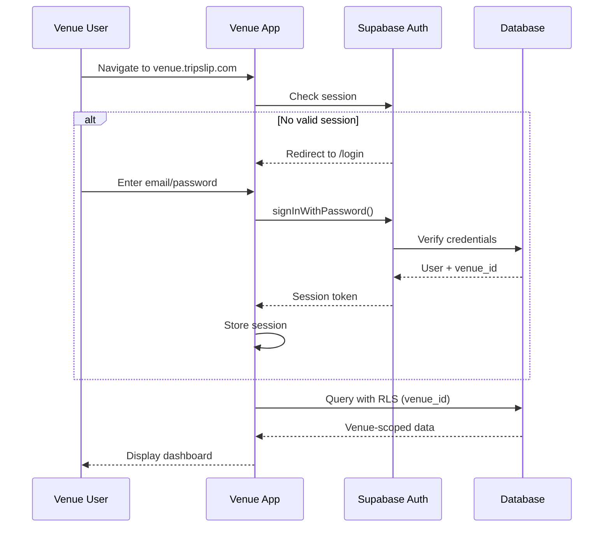
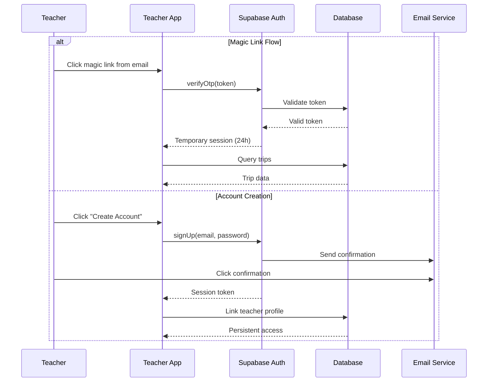
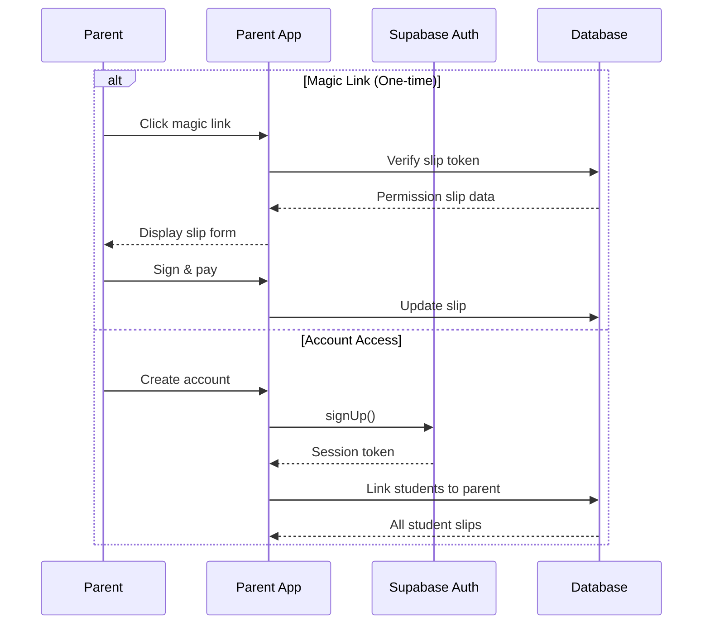
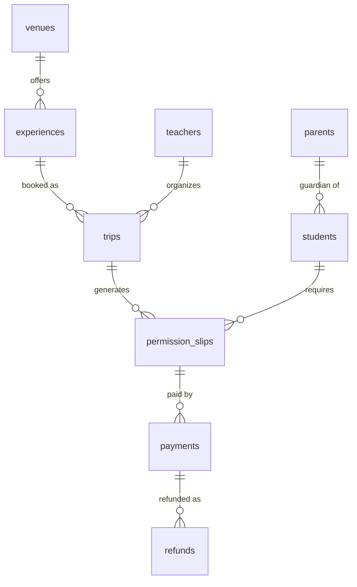
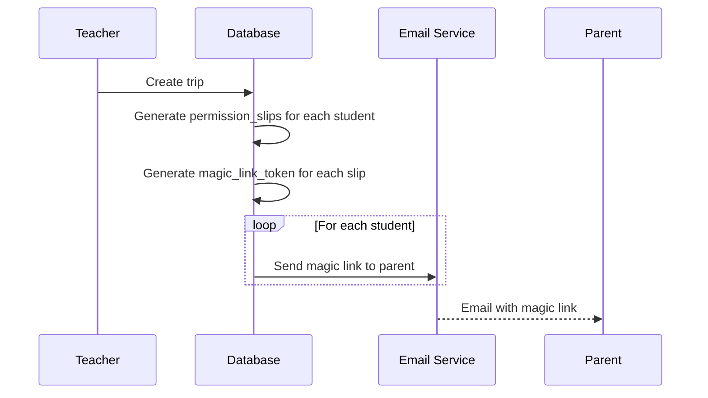
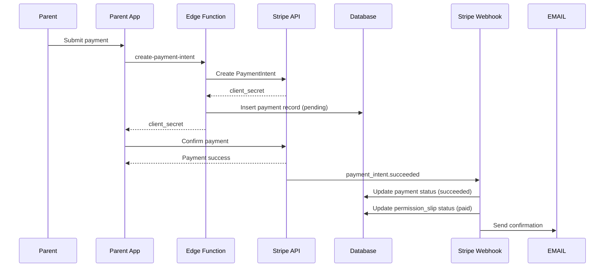

# Technical Design Document: TripSlip Production Launch

## Overview

This design document provides comprehensive technical specifications for taking the TripSlip platform from 45% completion to production-ready and launched. The platform consists of five web applications (Landing, Venue, School, Teacher, Parent) sharing a unified Supabase backend with 21 database tables, 5 Edge Functions, and 5 shared packages.

### Current State

- **Infrastructure**: 95% complete (monorepo, database schema, Edge Functions, shared packages)
- **Applications**: 20-40% complete (skeleton UIs, minimal functionality)
- **Testing**: 0% complete (no tests exist)
- **Configuration**: Critical issues (duplicate files, outdated types, missing configs)

### Target State

- **Infrastructure**: 100% complete with all critical fixes resolved
- **Applications**: 100% complete with full feature implementation
- **Testing**: Comprehensive unit and property-based test coverage
- **Configuration**: Production-ready with proper environment management
- **Deployment**: All 5 apps deployed to production with monitoring

### Technology Stack

- **Monorepo**: Turborepo
- **Frontend**: React 19, TypeScript, Vite 7, React Router 7
- **UI**: Radix UI, Tailwind CSS 4
- **Backend**: Supabase (PostgreSQL, Auth, Storage, Edge Functions)
- **State**: Zustand
- **i18n**: i18next (English, Spanish)
- **Payments**: Stripe
- **Deployment**: Vercel (frontend), Supabase (backend)

### Design Principles

1. **Leverage Existing Infrastructure**: Build on the solid 95% complete foundation
2. **Complete, Don't Redesign**: Focus on finishing incomplete applications
3. **Type Safety First**: Use generated database types throughout
4. **Security by Default**: Implement RLS, encryption, rate limiting
5. **Multi-Language Support**: English and Spanish from day one
6. **Mobile-First**: Responsive design for all applications
7. **FERPA Compliance**: Protect student data with encryption and audit logs


## Architecture

### System Architecture Diagram

```mermaid
graph TB
    subgraph "Frontend Layer - Vercel"
        LA[Landing App<br/>tripslip.com]
        VA[Venue App<br/>venue.tripslip.com]
        SA[School App<br/>school.tripslip.com]
        TA[Teacher App<br/>teacher.tripslip.com]
        PA[Parent App<br/>parent.tripslip.com]
    end
    
    subgraph "Shared Packages"
        UI[@tripslip/ui]
        DB[@tripslip/database]
        AUTH[@tripslip/auth]
        I18N[@tripslip/i18n]
        UTILS[@tripslip/utils]
    end
    
    subgraph "Supabase Backend"
        POSTGRES[(PostgreSQL<br/>21 Tables)]
        SUPAAUTH[Supabase Auth]
        STORAGE[Supabase Storage]
        EDGE[Edge Functions<br/>5 Functions]
    end
    
    subgraph "External Services"
        STRIPE[Stripe API]
        EMAIL[Email Service]
        SMS[SMS Service]
        SENTRY[Sentry]
    end
    
    LA --> UI
    VA --> UI
    SA --> UI
    TA --> UI
    PA --> UI
    
    LA --> DB
    VA --> DB
    SA --> DB
    TA --> DB
    PA --> DB
    
    VA --> AUTH
    SA --> AUTH
    TA --> AUTH
    PA --> AUTH
    
    DB --> POSTGRES
    AUTH --> SUPAAUTH
    
    EDGE --> POSTGRES
    EDGE --> STRIPE
    EDGE --> EMAIL
    EDGE --> SMS
    
    VA --> STORAGE
    TA --> STORAGE
    PA --> STORAGE
    
    LA --> SENTRY
    VA --> SENTRY
    SA --> SENTRY
    TA --> SENTRY
    PA --> SENTRY
```

### Monorepo Structure

```
tripslip-monorepo/
├── apps/
│   ├── landing/              # Public marketing site
│   │   ├── src/
│   │   ├── public/
│   │   ├── vercel.json
│   │   └── package.json
│   ├── venue/                # Venue management app
│   │   ├── src/
│   │   ├── vercel.json
│   │   └── package.json
│   ├── school/               # School admin app
│   │   ├── src/
│   │   ├── vercel.json
│   │   └── package.json
│   ├── teacher/              # Teacher trip management
│   │   ├── src/
│   │   ├── vercel.json
│   │   └── package.json
│   └── parent/               # Parent permission slips
│       ├── src/
│       ├── vercel.json
│       └── package.json
├── packages/
│   ├── ui/                   # Shared Radix UI components
│   ├── database/             # Database types and client
│   ├── auth/                 # Auth utilities
│   ├── i18n/                 # Translations
│   └── utils/                # Utility functions
├── supabase/
│   ├── migrations/           # 12 database migrations
│   ├── functions/            # 5 Edge Functions
│   └── config.toml           # Supabase configuration
├── turbo.json                # Turborepo configuration
└── package.json              # Root package.json
```


### Authentication Architecture

#### Venue Authentication (Required)

Venues must authenticate with email/password to access their management dashboard.



**Implementation Details**:
- Use Supabase Auth `signInWithPassword()`
- Session duration: 7 days
- Store venue_id in session metadata
- RLS policies filter by venue_id from venue_users table

#### Teacher Authentication (Optional with Magic Links)

Teachers can access via magic link (one-time) or create an account for persistent access.



**Implementation Details**:
- Magic link: `signInWithOtp()` with 24-hour expiration
- Account: `signUp()` with email confirmation
- Link teacher profile to auth.users via user_id
- RLS policies filter by teacher_id

#### Parent Authentication (Magic Links)

Parents receive magic links for each permission slip, with optional account creation.



**Implementation Details**:
- Magic link stored in permission_slips.magic_link_token
- Token expires after 30 days or after use
- Account creation links parent to students via student_parents
- RLS policies allow access to children's slips


## Components and Interfaces

### Phase 1: Critical Infrastructure Fixes

#### File Cleanup Strategy

**Problem**: Duplicate root application files conflict with monorepo structure.

**Solution**:
1. Remove duplicate files: `src/`, `index.html`, `vite.config.ts` at root
2. Remove duplicate database types: `src/lib/database.types.ts`
3. Keep only package-based types: `packages/database/src/types.ts`

**Implementation**:
```bash
# Remove duplicate root application
rm -rf src/ index.html vite.config.ts tsconfig.app.json tsconfig.node.json

# Remove duplicate database types
rm -f src/lib/database.types.ts
```

#### Database Type Regeneration

**Problem**: Types only include 7 tables, missing 14 new tables.

**Solution**: Regenerate types from current schema.

**Implementation**:
```bash
# Install Supabase CLI
npm install -g supabase

# Login and link project
supabase login
supabase link --project-ref yvzpgbhinxibebgeevcu

# Generate types
supabase gen types typescript --linked > packages/database/src/types.ts
```

**Expected Output**: Types for all 21 tables:
- venues, venue_users, experiences, availability, pricing_tiers
- districts, schools, teachers, rosters, students, parents, student_parents
- trips, permission_slips, documents, payments, refunds
- attendance, chaperones, notifications, audit_logs

#### Configuration Files

**supabase/config.toml**:
```toml
project_id = "yvzpgbhinxibebgeevcu"

[api]
enabled = true
port = 54321
schemas = ["public"]
extra_search_path = ["public"]
max_rows = 1000

[db]
port = 54322
major_version = 15

[studio]
enabled = true
port = 54323

[auth]
enabled = true
site_url = "https://tripslip.com"
additional_redirect_urls = [
  "https://venue.tripslip.com",
  "https://school.tripslip.com",
  "https://teacher.tripslip.com",
  "https://parent.tripslip.com"
]
jwt_expiry = 3600
enable_signup = true

[auth.email]
enable_signup = true
double_confirm_changes = true
enable_confirmations = true
```

**.env.example**:
```env
# Supabase Configuration
VITE_SUPABASE_URL=https://yvzpgbhinxibebgeevcu.supabase.co
VITE_SUPABASE_ANON_KEY=your-anon-key
SUPABASE_SERVICE_ROLE_KEY=your-service-role-key

# Stripe Configuration
VITE_STRIPE_PUBLISHABLE_KEY=pk_test_your-key
STRIPE_SECRET_KEY=sk_test_your-key
STRIPE_WEBHOOK_SECRET=whsec_your-secret

# Email Service (SendGrid/Resend/AWS SES)
EMAIL_API_KEY=your-email-api-key
EMAIL_FROM=noreply@tripslip.com

# SMS Service (Twilio/AWS SNS)
SMS_API_KEY=your-sms-api-key
SMS_FROM=+1234567890

# Application URLs
VITE_LANDING_URL=https://tripslip.com
VITE_VENUE_URL=https://venue.tripslip.com
VITE_SCHOOL_URL=https://school.tripslip.com
VITE_TEACHER_URL=https://teacher.tripslip.com
VITE_PARENT_URL=https://parent.tripslip.com

# Error Monitoring
VITE_SENTRY_DSN=your-sentry-dsn
```

#### Vercel Deployment Configurations

**apps/landing/vercel.json**:
```json
{
  "buildCommand": "cd ../.. && npx turbo run build --filter=@tripslip/landing",
  "outputDirectory": "dist",
  "framework": "vite",
  "rewrites": [
    { "source": "/(.*)", "destination": "/index.html" }
  ],
  "headers": [
    {
      "source": "/(.*)",
      "headers": [
        {
          "key": "X-Frame-Options",
          "value": "DENY"
        },
        {
          "key": "X-Content-Type-Options",
          "value": "nosniff"
        },
        {
          "key": "Strict-Transport-Security",
          "value": "max-age=31536000; includeSubDomains"
        }
      ]
    }
  ]
}
```

Repeat similar configuration for venue, school, teacher, and parent apps.


### Phase 2: Parent App Architecture

#### Permission Slip Viewing Component

**Component**: `PermissionSlipView`

**Purpose**: Display complete permission slip details for parent review.

**Data Flow**:
```typescript
// Fetch permission slip data
const { data: slip, error } = await supabase
  .from('permission_slips')
  .select(`
    *,
    trip:trips (
      *,
      experience:experiences (
        *,
        venue:venues (*)
      ),
      teacher:teachers (*)
    ),
    student:students (*)
  `)
  .eq('magic_link_token', token)
  .single();
```

**UI Structure**:
```tsx
<PermissionSlipView>
  <TripHeader trip={slip.trip} />
  <ExperienceDetails experience={slip.trip.experience} />
  <VenueInformation venue={slip.trip.experience.venue} />
  <TeacherContact teacher={slip.trip.teacher} />
  <StudentInformation student={slip.student} />
  <MedicalFormSection slip={slip} />
  <SignatureSection slip={slip} onSign={handleSign} />
  <PaymentSection slip={slip} onPay={handlePayment} />
  <StatusIndicator status={slip.status} />
</PermissionSlipView>
```

**State Management**:
```typescript
interface PermissionSlipState {
  slip: PermissionSlip | null;
  loading: boolean;
  error: string | null;
  signatureData: string | null;
  paymentIntent: PaymentIntent | null;
}

const usePermissionSlipStore = create<PermissionSlipState>((set) => ({
  slip: null,
  loading: false,
  error: null,
  signatureData: null,
  paymentIntent: null,
  
  fetchSlip: async (token: string) => {
    set({ loading: true });
    // Fetch logic
  },
  
  saveSignature: async (data: string) => {
    // Upload to Supabase Storage
    // Update permission_slips.signature_data
  },
  
  processPayment: async (paymentMethodId: string) => {
    // Call create-payment-intent Edge Function
    // Confirm payment with Stripe
  }
}));
```

#### Digital Signature Component

**Component**: `SignatureCanvas`

**Purpose**: Capture parent signature on touch/mouse devices.

**Implementation**:
```tsx
import { useRef, useState } from 'react';

interface SignatureCanvasProps {
  onSave: (dataUrl: string) => void;
  onClear: () => void;
}

export function SignatureCanvas({ onSave, onClear }: SignatureCanvasProps) {
  const canvasRef = useRef<HTMLCanvasElement>(null);
  const [isDrawing, setIsDrawing] = useState(false);
  
  const startDrawing = (e: React.MouseEvent | React.TouchEvent) => {
    const canvas = canvasRef.current;
    if (!canvas) return;
    
    const ctx = canvas.getContext('2d');
    if (!ctx) return;
    
    const rect = canvas.getBoundingClientRect();
    const x = 'touches' in e ? e.touches[0].clientX - rect.left : e.clientX - rect.left;
    const y = 'touches' in e ? e.touches[0].clientY - rect.top : e.clientY - rect.top;
    
    ctx.beginPath();
    ctx.moveTo(x, y);
    setIsDrawing(true);
  };
  
  const draw = (e: React.MouseEvent | React.TouchEvent) => {
    if (!isDrawing) return;
    
    const canvas = canvasRef.current;
    if (!canvas) return;
    
    const ctx = canvas.getContext('2d');
    if (!ctx) return;
    
    const rect = canvas.getBoundingClientRect();
    const x = 'touches' in e ? e.touches[0].clientX - rect.left : e.clientX - rect.left;
    const y = 'touches' in e ? e.touches[0].clientY - rect.top : e.clientY - rect.top;
    
    ctx.lineTo(x, y);
    ctx.stroke();
  };
  
  const stopDrawing = () => {
    setIsDrawing(false);
  };
  
  const clear = () => {
    const canvas = canvasRef.current;
    if (!canvas) return;
    
    const ctx = canvas.getContext('2d');
    if (!ctx) return;
    
    ctx.clearRect(0, 0, canvas.width, canvas.height);
    onClear();
  };
  
  const save = () => {
    const canvas = canvasRef.current;
    if (!canvas) return;
    
    const dataUrl = canvas.toDataURL('image/png');
    onSave(dataUrl);
  };
  
  return (
    <div className="signature-canvas-container">
      <canvas
        ref={canvasRef}
        width={600}
        height={200}
        className="border-2 border-black rounded-md touch-none"
        onMouseDown={startDrawing}
        onMouseMove={draw}
        onMouseUp={stopDrawing}
        onMouseLeave={stopDrawing}
        onTouchStart={startDrawing}
        onTouchMove={draw}
        onTouchEnd={stopDrawing}
      />
      <div className="flex gap-4 mt-4">
        <button onClick={clear} className="btn-secondary">
          Clear
        </button>
        <button onClick={save} className="btn-primary">
          Save Signature
        </button>
      </div>
    </div>
  );
}
```

**Signature Storage**:
```typescript
async function uploadSignature(dataUrl: string, slipId: string): Promise<string> {
  // Convert data URL to blob
  const blob = await fetch(dataUrl).then(r => r.blob());
  
  // Upload to Supabase Storage
  const fileName = `${slipId}-${Date.now()}.png`;
  const { data, error } = await supabase.storage
    .from('documents')
    .upload(`signatures/${fileName}`, blob, {
      contentType: 'image/png',
      cacheControl: '3600'
    });
  
  if (error) throw error;
  
  // Get public URL
  const { data: { publicUrl } } = supabase.storage
    .from('documents')
    .getPublicUrl(`signatures/${fileName}`);
  
  // Update permission slip
  await supabase
    .from('permission_slips')
    .update({
      signature_data: publicUrl,
      signed_at: new Date().toISOString(),
      status: 'signed'
    })
    .eq('id', slipId);
  
  return publicUrl;
}
```


#### Payment Processing Integration

**Component**: `PaymentForm`

**Purpose**: Integrate Stripe Elements for secure payment processing.

**Implementation**:
```tsx
import { Elements, PaymentElement, useStripe, useElements } from '@stripe/react-stripe-js';
import { loadStripe } from '@stripe/stripe-js';

const stripePromise = loadStripe(import.meta.env.VITE_STRIPE_PUBLISHABLE_KEY);

interface PaymentFormProps {
  slipId: string;
  amount: number;
  onSuccess: () => void;
  onError: (error: string) => void;
}

function PaymentFormInner({ slipId, amount, onSuccess, onError }: PaymentFormProps) {
  const stripe = useStripe();
  const elements = useElements();
  const [loading, setLoading] = useState(false);
  
  const handleSubmit = async (e: React.FormEvent) => {
    e.preventDefault();
    
    if (!stripe || !elements) return;
    
    setLoading(true);
    
    try {
      // Create payment intent via Edge Function
      const { data: { clientSecret } } = await supabase.functions.invoke(
        'create-payment-intent',
        {
          body: {
            slipId,
            amount
          }
        }
      );
      
      // Confirm payment
      const { error } = await stripe.confirmPayment({
        elements,
        clientSecret,
        confirmParams: {
          return_url: `${window.location.origin}/payment/success`
        }
      });
      
      if (error) {
        onError(error.message);
      } else {
        onSuccess();
      }
    } catch (err) {
      onError(err.message);
    } finally {
      setLoading(false);
    }
  };
  
  return (
    <form onSubmit={handleSubmit} className="space-y-4">
      <div className="text-lg font-semibold">
        Amount: ${(amount / 100).toFixed(2)}
      </div>
      <PaymentElement />
      <button
        type="submit"
        disabled={!stripe || loading}
        className="btn-primary w-full"
      >
        {loading ? 'Processing...' : 'Pay Now'}
      </button>
    </form>
  );
}

export function PaymentForm(props: PaymentFormProps) {
  return (
    <Elements stripe={stripePromise}>
      <PaymentFormInner {...props} />
    </Elements>
  );
}
```

**Edge Function**: `create-payment-intent`

```typescript
import { serve } from 'https://deno.land/std@0.168.0/http/server.ts';
import Stripe from 'https://esm.sh/stripe@12.0.0';
import { createClient } from 'https://esm.sh/@supabase/supabase-js@2.21.0';

const stripe = new Stripe(Deno.env.get('STRIPE_SECRET_KEY')!, {
  apiVersion: '2023-10-16'
});

serve(async (req) => {
  try {
    const { slipId, amount } = await req.json();
    
    // Validate request
    if (!slipId || !amount) {
      return new Response(
        JSON.stringify({ error: 'Missing required fields' }),
        { status: 400, headers: { 'Content-Type': 'application/json' } }
      );
    }
    
    // Create Supabase client
    const supabase = createClient(
      Deno.env.get('SUPABASE_URL')!,
      Deno.env.get('SUPABASE_SERVICE_ROLE_KEY')!
    );
    
    // Fetch permission slip details
    const { data: slip, error } = await supabase
      .from('permission_slips')
      .select('*, trip:trips(*, student:students(*))')
      .eq('id', slipId)
      .single();
    
    if (error || !slip) {
      return new Response(
        JSON.stringify({ error: 'Permission slip not found' }),
        { status: 404, headers: { 'Content-Type': 'application/json' } }
      );
    }
    
    // Create payment intent
    const paymentIntent = await stripe.paymentIntents.create({
      amount,
      currency: 'usd',
      metadata: {
        slipId,
        tripId: slip.trip_id,
        studentId: slip.student_id
      },
      description: `Field trip payment for ${slip.trip.student.first_name} ${slip.trip.student.last_name}`
    });
    
    // Store payment intent in database
    await supabase
      .from('payments')
      .insert({
        permission_slip_id: slipId,
        amount_cents: amount,
        stripe_payment_intent_id: paymentIntent.id,
        status: 'pending'
      });
    
    return new Response(
      JSON.stringify({ clientSecret: paymentIntent.client_secret }),
      { status: 200, headers: { 'Content-Type': 'application/json' } }
    );
  } catch (error) {
    return new Response(
      JSON.stringify({ error: error.message }),
      { status: 500, headers: { 'Content-Type': 'application/json' } }
    );
  }
});
```

#### Split Payment Handling

**Component**: `SplitPaymentForm`

**Purpose**: Allow multiple parents to share payment for a single permission slip.

**Data Model**:
```typescript
interface SplitPayment {
  id: string;
  permission_slip_id: string;
  parent_id: string;
  amount_cents: number;
  status: 'pending' | 'paid' | 'failed';
  stripe_payment_intent_id: string;
}
```

**Implementation**:
```tsx
interface SplitPaymentFormProps {
  slipId: string;
  totalAmount: number;
  contributors: Array<{ parentId: string; email: string; amount: number }>;
}

export function SplitPaymentForm({ slipId, totalAmount, contributors }: SplitPaymentFormProps) {
  const [myContribution, setMyContribution] = useState(0);
  const [remainingBalance, setRemainingBalance] = useState(totalAmount);
  
  useEffect(() => {
    // Calculate remaining balance
    const paid = contributors
      .filter(c => c.status === 'paid')
      .reduce((sum, c) => sum + c.amount, 0);
    setRemainingBalance(totalAmount - paid);
  }, [contributors, totalAmount]);
  
  const handlePayment = async () => {
    // Create split payment record
    const { data: splitPayment } = await supabase
      .from('payments')
      .insert({
        permission_slip_id: slipId,
        parent_id: currentParentId,
        amount_cents: myContribution,
        is_split_payment: true,
        status: 'pending'
      })
      .select()
      .single();
    
    // Process payment via Stripe
    // ... (similar to regular payment flow)
  };
  
  return (
    <div className="split-payment-form">
      <h3>Split Payment</h3>
      <div className="mb-4">
        <p>Total Amount: ${(totalAmount / 100).toFixed(2)}</p>
        <p>Remaining Balance: ${(remainingBalance / 100).toFixed(2)}</p>
      </div>
      
      <div className="contributors-list mb-4">
        <h4>Contributors:</h4>
        {contributors.map(c => (
          <div key={c.parentId} className="flex justify-between">
            <span>{c.email}</span>
            <span className={c.status === 'paid' ? 'text-green-600' : 'text-gray-500'}>
              ${(c.amount / 100).toFixed(2)} - {c.status}
            </span>
          </div>
        ))}
      </div>
      
      <div className="my-contribution">
        <label>My Contribution:</label>
        <input
          type="number"
          value={myContribution / 100}
          onChange={(e) => setMyContribution(Math.round(parseFloat(e.target.value) * 100))}
          max={remainingBalance / 100}
          step="0.01"
        />
      </div>
      
      <button onClick={handlePayment} className="btn-primary">
        Pay ${(myContribution / 100).toFixed(2)}
      </button>
    </div>
  );
}
```


### Phase 3: Teacher App Architecture

#### Dashboard Data Aggregation

**Component**: `TeacherDashboard`

**Purpose**: Display real-time overview of trips and permission slip status.

**Data Queries**:
```typescript
// Fetch dashboard data
async function fetchDashboardData(teacherId: string) {
  // Get all trips for teacher
  const { data: trips } = await supabase
    .from('trips')
    .select(`
      *,
      experience:experiences(title, venue:venues(name)),
      permission_slips(
        id,
        status,
        signed_at,
        payments(status, amount_cents)
      )
    `)
    .eq('teacher_id', teacherId)
    .order('trip_date', { ascending: true });
  
  // Calculate metrics
  const metrics = trips.reduce((acc, trip) => {
    const slips = trip.permission_slips;
    const totalSlips = slips.length;
    const signedSlips = slips.filter(s => s.status === 'signed' || s.status === 'paid').length;
    const paidSlips = slips.filter(s => s.status === 'paid').length;
    const totalRevenue = slips
      .flatMap(s => s.payments)
      .filter(p => p.status === 'succeeded')
      .reduce((sum, p) => sum + p.amount_cents, 0);
    
    return {
      totalTrips: acc.totalTrips + 1,
      totalStudents: acc.totalStudents + totalSlips,
      signedSlips: acc.signedSlips + signedSlips,
      paidSlips: acc.paidSlips + paidSlips,
      totalRevenue: acc.totalRevenue + totalRevenue
    };
  }, {
    totalTrips: 0,
    totalStudents: 0,
    signedSlips: 0,
    paidSlips: 0,
    totalRevenue: 0
  });
  
  return { trips, metrics };
}
```

**Real-Time Updates**:
```typescript
// Subscribe to permission slip changes
useEffect(() => {
  const channel = supabase
    .channel('permission-slips-changes')
    .on(
      'postgres_changes',
      {
        event: '*',
        schema: 'public',
        table: 'permission_slips',
        filter: `trip_id=in.(${tripIds.join(',')})`
      },
      (payload) => {
        // Update dashboard state
        updateDashboard(payload);
      }
    )
    .subscribe();
  
  return () => {
    supabase.removeChannel(channel);
  };
}, [tripIds]);
```

**UI Structure**:
```tsx
<TeacherDashboard>
  <MetricsGrid>
    <MetricCard
      title="Total Trips"
      value={metrics.totalTrips}
      icon={<CalendarIcon />}
    />
    <MetricCard
      title="Total Students"
      value={metrics.totalStudents}
      icon={<UsersIcon />}
    />
    <MetricCard
      title="Signed Slips"
      value={`${metrics.signedSlips}/${metrics.totalStudents}`}
      percentage={(metrics.signedSlips / metrics.totalStudents) * 100}
      icon={<CheckIcon />}
    />
    <MetricCard
      title="Paid Slips"
      value={`${metrics.paidSlips}/${metrics.totalStudents}`}
      percentage={(metrics.paidSlips / metrics.totalStudents) * 100}
      icon={<DollarIcon />}
    />
  </MetricsGrid>
  
  <UpcomingTrips trips={upcomingTrips} />
  <RecentActivity activities={recentActivities} />
  <QuickActions>
    <Button onClick={() => navigate('/trips/create')}>Create Trip</Button>
    <Button onClick={() => sendReminders()}>Send Reminders</Button>
  </QuickActions>
</TeacherDashboard>
```

#### Multi-Step Trip Creation Form

**Component**: `TripCreationWizard`

**Purpose**: Guide teachers through trip creation with validation at each step.

**State Management**:
```typescript
interface TripFormState {
  step: number;
  tripDetails: {
    name: string;
    date: Date;
    time: string;
    description: string;
  };
  selectedExperience: Experience | null;
  students: Student[];
  transportation: {
    type: 'bus' | 'walk' | 'parent';
    details: string;
  };
  chaperones: number;
}

const useTripFormStore = create<TripFormState>((set) => ({
  step: 1,
  tripDetails: null,
  selectedExperience: null,
  students: [],
  transportation: null,
  chaperones: 0,
  
  nextStep: () => set((state) => ({ step: state.step + 1 })),
  prevStep: () => set((state) => ({ step: state.step - 1 })),
  
  setTripDetails: (details) => set({ tripDetails: details }),
  setExperience: (experience) => set({ selectedExperience: experience }),
  setStudents: (students) => set({ students }),
  
  submitTrip: async () => {
    // Create trip in database
    // Generate permission slips
    // Send notifications
  }
}));
```

**Step Components**:
```tsx
function TripCreationWizard() {
  const { step } = useTripFormStore();
  
  return (
    <div className="trip-creation-wizard">
      <ProgressIndicator currentStep={step} totalSteps={4} />
      
      {step === 1 && <TripDetailsStep />}
      {step === 2 && <ExperienceSelectionStep />}
      {step === 3 && <StudentSelectionStep />}
      {step === 4 && <ReviewAndSubmitStep />}
    </div>
  );
}

function TripDetailsStep() {
  const { tripDetails, setTripDetails, nextStep } = useTripFormStore();
  const [form, setForm] = useState(tripDetails || {});
  
  const handleSubmit = (e: React.FormEvent) => {
    e.preventDefault();
    
    // Validate form
    if (!form.name || !form.date || !form.time) {
      toast.error('Please fill in all required fields');
      return;
    }
    
    setTripDetails(form);
    nextStep();
  };
  
  return (
    <form onSubmit={handleSubmit} className="space-y-4">
      <h2>Trip Details</h2>
      
      <div>
        <label>Trip Name *</label>
        <input
          type="text"
          value={form.name}
          onChange={(e) => setForm({ ...form, name: e.target.value })}
          required
        />
      </div>
      
      <div>
        <label>Date *</label>
        <input
          type="date"
          value={form.date}
          onChange={(e) => setForm({ ...form, date: e.target.value })}
          required
        />
      </div>
      
      <div>
        <label>Time *</label>
        <input
          type="time"
          value={form.time}
          onChange={(e) => setForm({ ...form, time: e.target.value })}
          required
        />
      </div>
      
      <div>
        <label>Description</label>
        <textarea
          value={form.description}
          onChange={(e) => setForm({ ...form, description: e.target.value })}
          rows={4}
        />
      </div>
      
      <button type="submit" className="btn-primary">
        Next: Select Experience
      </button>
    </form>
  );
}
```


#### CSV Import Validation and Processing

**Component**: `CSVImporter`

**Purpose**: Allow teachers to bulk import student rosters from CSV files.

**CSV Format**:
```csv
first_name,last_name,email,parent_email,parent_phone,grade,date_of_birth
John,Doe,john.doe@school.edu,parent@email.com,555-0100,5,2015-03-15
Jane,Smith,jane.smith@school.edu,parent2@email.com,555-0101,5,2015-04-20
```

**Implementation**:
```typescript
import Papa from 'papaparse';

interface CSVRow {
  first_name: string;
  last_name: string;
  email: string;
  parent_email: string;
  parent_phone: string;
  grade: string;
  date_of_birth: string;
}

interface ValidationError {
  row: number;
  field: string;
  message: string;
}

function validateCSVRow(row: CSVRow, index: number): ValidationError[] {
  const errors: ValidationError[] = [];
  
  // Required fields
  if (!row.first_name) {
    errors.push({ row: index, field: 'first_name', message: 'First name is required' });
  }
  if (!row.last_name) {
    errors.push({ row: index, field: 'last_name', message: 'Last name is required' });
  }
  if (!row.parent_email) {
    errors.push({ row: index, field: 'parent_email', message: 'Parent email is required' });
  }
  
  // Email validation
  const emailRegex = /^[^\s@]+@[^\s@]+\.[^\s@]+$/;
  if (row.email && !emailRegex.test(row.email)) {
    errors.push({ row: index, field: 'email', message: 'Invalid email format' });
  }
  if (row.parent_email && !emailRegex.test(row.parent_email)) {
    errors.push({ row: index, field: 'parent_email', message: 'Invalid parent email format' });
  }
  
  // Phone validation
  const phoneRegex = /^\d{3}-\d{4}$/;
  if (row.parent_phone && !phoneRegex.test(row.parent_phone)) {
    errors.push({ row: index, field: 'parent_phone', message: 'Invalid phone format (use XXX-XXXX)' });
  }
  
  // Date validation
  if (row.date_of_birth) {
    const date = new Date(row.date_of_birth);
    if (isNaN(date.getTime())) {
      errors.push({ row: index, field: 'date_of_birth', message: 'Invalid date format (use YYYY-MM-DD)' });
    }
  }
  
  return errors;
}

async function processCSV(file: File, rosterId: string): Promise<{
  success: number;
  errors: ValidationError[];
  duplicates: string[];
}> {
  return new Promise((resolve) => {
    Papa.parse<CSVRow>(file, {
      header: true,
      skipEmptyLines: true,
      complete: async (results) => {
        const errors: ValidationError[] = [];
        const duplicates: string[] = [];
        const validRows: CSVRow[] = [];
        
        // Validate each row
        results.data.forEach((row, index) => {
          const rowErrors = validateCSVRow(row, index + 2); // +2 for header and 0-index
          if (rowErrors.length > 0) {
            errors.push(...rowErrors);
          } else {
            validRows.push(row);
          }
        });
        
        // Check for duplicates in CSV
        const emails = validRows.map(r => r.email);
        const emailSet = new Set(emails);
        if (emails.length !== emailSet.size) {
          duplicates.push('Duplicate emails found in CSV');
        }
        
        // Check for existing students in roster
        const { data: existingStudents } = await supabase
          .from('students')
          .select('email')
          .eq('roster_id', rosterId);
        
        const existingEmails = new Set(existingStudents?.map(s => s.email) || []);
        validRows.forEach((row, index) => {
          if (existingEmails.has(row.email)) {
            duplicates.push(`Row ${index + 2}: ${row.email} already exists in roster`);
          }
        });
        
        // Insert valid rows
        let successCount = 0;
        if (errors.length === 0 && duplicates.length === 0) {
          for (const row of validRows) {
            try {
              // Create or find parent
              let parent = await findOrCreateParent({
                email: row.parent_email,
                phone: row.parent_phone,
                first_name: row.first_name, // Use student name as fallback
                last_name: row.last_name
              });
              
              // Create student
              const { data: student } = await supabase
                .from('students')
                .insert({
                  roster_id: rosterId,
                  first_name: row.first_name,
                  last_name: row.last_name,
                  email: row.email,
                  grade: row.grade,
                  date_of_birth: row.date_of_birth
                })
                .select()
                .single();
              
              // Link student to parent
              await supabase
                .from('student_parents')
                .insert({
                  student_id: student.id,
                  parent_id: parent.id,
                  relationship: 'parent',
                  primary_contact: true
                });
              
              successCount++;
            } catch (err) {
              errors.push({
                row: validRows.indexOf(row) + 2,
                field: 'general',
                message: err.message
              });
            }
          }
        }
        
        resolve({ success: successCount, errors, duplicates });
      }
    });
  });
}
```

**UI Component**:
```tsx
export function CSVImporter({ rosterId }: { rosterId: string }) {
  const [file, setFile] = useState<File | null>(null);
  const [processing, setProcessing] = useState(false);
  const [results, setResults] = useState<any>(null);
  
  const handleFileChange = (e: React.ChangeEvent<HTMLInputElement>) => {
    if (e.target.files && e.target.files[0]) {
      setFile(e.target.files[0]);
      setResults(null);
    }
  };
  
  const handleImport = async () => {
    if (!file) return;
    
    setProcessing(true);
    const results = await processCSV(file, rosterId);
    setResults(results);
    setProcessing(false);
  };
  
  return (
    <div className="csv-importer">
      <h3>Import Students from CSV</h3>
      
      <div className="mb-4">
        <a href="/templates/student-roster-template.csv" download className="text-blue-600">
          Download CSV Template
        </a>
      </div>
      
      <input
        type="file"
        accept=".csv"
        onChange={handleFileChange}
        className="mb-4"
      />
      
      {file && (
        <div className="mb-4">
          <p>Selected file: {file.name}</p>
          <button
            onClick={handleImport}
            disabled={processing}
            className="btn-primary"
          >
            {processing ? 'Processing...' : 'Import Students'}
          </button>
        </div>
      )}
      
      {results && (
        <div className="results">
          <h4>Import Results</h4>
          <p className="text-green-600">Successfully imported: {results.success} students</p>
          
          {results.errors.length > 0 && (
            <div className="errors mt-4">
              <h5 className="text-red-600">Errors:</h5>
              <ul>
                {results.errors.map((err, i) => (
                  <li key={i}>
                    Row {err.row}, {err.field}: {err.message}
                  </li>
                ))}
              </ul>
            </div>
          )}
          
          {results.duplicates.length > 0 && (
            <div className="duplicates mt-4">
              <h5 className="text-yellow-600">Duplicates:</h5>
              <ul>
                {results.duplicates.map((dup, i) => (
                  <li key={i}>{dup}</li>
                ))}
              </ul>
            </div>
          )}
        </div>
      )}
    </div>
  );
}
```


### Phase 4: Venue App Architecture

#### Analytics Data Aggregation

**Component**: `VenueDashboard`

**Purpose**: Display revenue, bookings, and performance metrics for venue managers.

**Data Queries**:
```typescript
async function fetchVenueAnalytics(venueId: string, dateRange: { start: Date; end: Date }) {
  // Get all trips for venue experiences
  const { data: trips } = await supabase
    .from('trips')
    .select(`
      *,
      experience:experiences!inner(id, title, venue_id),
      permission_slips(
        id,
        status,
        payments(amount_cents, status, created_at)
      )
    `)
    .eq('experience.venue_id', venueId)
    .gte('trip_date', dateRange.start.toISOString())
    .lte('trip_date', dateRange.end.toISOString());
  
  // Calculate metrics
  const metrics = {
    totalRevenue: 0,
    totalBookings: trips.length,
    confirmedBookings: 0,
    completedBookings: 0,
    totalStudents: 0,
    averageBookingValue: 0,
    topExperiences: [] as Array<{ title: string; revenue: number; bookings: number }>
  };
  
  const experienceMap = new Map();
  
  trips.forEach(trip => {
    const payments = trip.permission_slips.flatMap(s => s.payments);
    const revenue = payments
      .filter(p => p.status === 'succeeded')
      .reduce((sum, p) => sum + p.amount_cents, 0);
    
    metrics.totalRevenue += revenue;
    metrics.totalStudents += trip.permission_slips.length;
    
    if (trip.status === 'confirmed') metrics.confirmedBookings++;
    if (trip.status === 'completed') metrics.completedBookings++;
    
    // Track by experience
    const expTitle = trip.experience.title;
    if (!experienceMap.has(expTitle)) {
      experienceMap.set(expTitle, { title: expTitle, revenue: 0, bookings: 0 });
    }
    const exp = experienceMap.get(expTitle);
    exp.revenue += revenue;
    exp.bookings++;
  });
  
  metrics.averageBookingValue = metrics.totalBookings > 0
    ? metrics.totalRevenue / metrics.totalBookings
    : 0;
  
  metrics.topExperiences = Array.from(experienceMap.values())
    .sort((a, b) => b.revenue - a.revenue)
    .slice(0, 5);
  
  return metrics;
}
```

**Revenue Trend Chart**:
```tsx
import { LineChart, Line, XAxis, YAxis, CartesianGrid, Tooltip, Legend } from 'recharts';

function RevenueTrendChart({ venueId }: { venueId: string }) {
  const [data, setData] = useState([]);
  
  useEffect(() => {
    async function fetchTrendData() {
      const months = [];
      for (let i = 11; i >= 0; i--) {
        const date = new Date();
        date.setMonth(date.getMonth() - i);
        const start = new Date(date.getFullYear(), date.getMonth(), 1);
        const end = new Date(date.getFullYear(), date.getMonth() + 1, 0);
        
        const metrics = await fetchVenueAnalytics(venueId, { start, end });
        
        months.push({
          month: start.toLocaleDateString('en-US', { month: 'short', year: 'numeric' }),
          revenue: metrics.totalRevenue / 100,
          bookings: metrics.totalBookings
        });
      }
      setData(months);
    }
    
    fetchTrendData();
  }, [venueId]);
  
  return (
    <LineChart width={800} height={400} data={data}>
      <CartesianGrid strokeDasharray="3 3" />
      <XAxis dataKey="month" />
      <YAxis yAxisId="left" />
      <YAxis yAxisId="right" orientation="right" />
      <Tooltip />
      <Legend />
      <Line yAxisId="left" type="monotone" dataKey="revenue" stroke="#F5C518" name="Revenue ($)" />
      <Line yAxisId="right" type="monotone" dataKey="bookings" stroke="#0A0A0A" name="Bookings" />
    </LineChart>
  );
}
```

#### Experience CRUD Operations

**Component**: `ExperienceEditor`

**Purpose**: Create and edit venue experiences with photos, pricing, and availability.

**Form Structure**:
```tsx
interface ExperienceFormData {
  title: string;
  description: string;
  duration_minutes: number;
  capacity: number;
  min_students: number;
  max_students: number;
  grade_levels: string[];
  subjects: string[];
  educational_standards: string[];
  photos: File[];
  pricing_tiers: Array<{
    min_students: number;
    max_students: number;
    price_cents: number;
    free_chaperones: number;
  }>;
  availability: Array<{
    day_of_week: number;
    start_time: string;
    end_time: string;
    capacity: number;
  }>;
}

export function ExperienceEditor({ experienceId }: { experienceId?: string }) {
  const [form, setForm] = useState<ExperienceFormData>(defaultForm);
  const [photos, setPhotos] = useState<string[]>([]);
  const [saving, setSaving] = useState(false);
  
  useEffect(() => {
    if (experienceId) {
      loadExperience(experienceId);
    }
  }, [experienceId]);
  
  const handleSubmit = async (e: React.FormEvent) => {
    e.preventDefault();
    setSaving(true);
    
    try {
      // Upload photos first
      const photoUrls = await uploadPhotos(form.photos);
      
      // Create or update experience
      const { data: experience } = await supabase
        .from('experiences')
        .upsert({
          id: experienceId,
          venue_id: currentVenueId,
          title: form.title,
          description: form.description,
          duration_minutes: form.duration_minutes,
          capacity: form.capacity,
          min_students: form.min_students,
          max_students: form.max_students,
          grade_levels: form.grade_levels,
          subjects: form.subjects,
          educational_standards: form.educational_standards,
          published: false
        })
        .select()
        .single();
      
      // Insert pricing tiers
      await supabase
        .from('pricing_tiers')
        .delete()
        .eq('experience_id', experience.id);
      
      await supabase
        .from('pricing_tiers')
        .insert(
          form.pricing_tiers.map(tier => ({
            experience_id: experience.id,
            ...tier
          }))
        );
      
      // Store photos
      await supabase
        .from('experience_photos')
        .delete()
        .eq('experience_id', experience.id);
      
      await supabase
        .from('experience_photos')
        .insert(
          photoUrls.map((url, index) => ({
            experience_id: experience.id,
            url,
            order: index
          }))
        );
      
      toast.success('Experience saved successfully');
      navigate(`/experiences/${experience.id}`);
    } catch (error) {
      toast.error('Failed to save experience');
      console.error(error);
    } finally {
      setSaving(false);
    }
  };
  
  return (
    <form onSubmit={handleSubmit} className="experience-editor space-y-6">
      <section>
        <h2>Basic Information</h2>
        <Input
          label="Title"
          value={form.title}
          onChange={(e) => setForm({ ...form, title: e.target.value })}
          required
        />
        <Textarea
          label="Description"
          value={form.description}
          onChange={(e) => setForm({ ...form, description: e.target.value })}
          rows={6}
          required
        />
      </section>
      
      <section>
        <h2>Capacity & Duration</h2>
        <div className="grid grid-cols-2 gap-4">
          <Input
            label="Duration (minutes)"
            type="number"
            value={form.duration_minutes}
            onChange={(e) => setForm({ ...form, duration_minutes: parseInt(e.target.value) })}
            required
          />
          <Input
            label="Total Capacity"
            type="number"
            value={form.capacity}
            onChange={(e) => setForm({ ...form, capacity: parseInt(e.target.value) })}
            required
          />
          <Input
            label="Minimum Students"
            type="number"
            value={form.min_students}
            onChange={(e) => setForm({ ...form, min_students: parseInt(e.target.value) })}
          />
          <Input
            label="Maximum Students"
            type="number"
            value={form.max_students}
            onChange={(e) => setForm({ ...form, max_students: parseInt(e.target.value) })}
          />
        </div>
      </section>
      
      <section>
        <h2>Photos</h2>
        <PhotoUploader
          photos={photos}
          onUpload={(files) => setForm({ ...form, photos: [...form.photos, ...files] })}
          onRemove={(index) => {
            const newPhotos = [...form.photos];
            newPhotos.splice(index, 1);
            setForm({ ...form, photos: newPhotos });
          }}
          onReorder={(newOrder) => setForm({ ...form, photos: newOrder })}
          maxPhotos={10}
        />
      </section>
      
      <section>
        <h2>Pricing Tiers</h2>
        <PricingTierEditor
          tiers={form.pricing_tiers}
          onChange={(tiers) => setForm({ ...form, pricing_tiers: tiers })}
        />
      </section>
      
      <div className="flex gap-4">
        <button type="submit" disabled={saving} className="btn-primary">
          {saving ? 'Saving...' : 'Save Experience'}
        </button>
        <button type="button" onClick={() => navigate('/experiences')} className="btn-secondary">
          Cancel
        </button>
      </div>
    </form>
  );
}
```


## Data Models

### Database Schema Overview

The platform uses 21 tables organized into logical groups:

**Core Entities** (8 tables):
- `venues` - Venue organizations
- `venue_users` - Venue staff members
- `experiences` - Field trip offerings
- `availability` - Date-specific availability
- `pricing_tiers` - Volume-based pricing
- `districts` - School districts
- `schools` - Individual schools
- `teachers` - Teacher accounts

**Student Management** (4 tables):
- `rosters` - Named student groups
- `students` - Student records
- `parents` - Parent/guardian accounts
- `student_parents` - Student-parent relationships

**Trip Management** (5 tables):
- `trips` - Scheduled field trips
- `permission_slips` - Digital permission slips
- `documents` - Attached files
- `attendance` - Day-of attendance
- `chaperones` - Parent volunteers

**Financial** (2 tables):
- `payments` - Payment records
- `refunds` - Refund records

**Supporting** (2 tables):
- `notifications` - In-app notifications
- `audit_logs` - Compliance audit trail

### Key Data Relationships



### Critical Data Flows

#### Permission Slip Creation Flow



#### Payment Processing Flow




## Correctness Properties

A property is a characteristic or behavior that should hold true across all valid executions of a system—essentially, a formal statement about what the system should do. Properties serve as the bridge between human-readable specifications and machine-verifiable correctness guarantees.

### Property 1: Magic Link Token Validation

*For any* magic link token, if the token is invalid or expired, then authentication SHALL be rejected and an error message SHALL be displayed.

**Validates: Requirements 2.2, 2.3**

### Property 2: Multi-Language Support Completeness

*For any* user-facing text in authentication flows, the text SHALL have translations in all supported languages (English, Spanish).

**Validates: Requirements 2.6, 3.7**

### Property 3: Permission Slip Data Completeness

*For any* permission slip displayed to a parent, the rendered output SHALL contain all required fields: trip name, date, time, location, cost, description, venue information, experience details, teacher contact, student information, and current status.

**Validates: Requirements 3.2, 3.3, 3.4, 3.5, 3.6**

### Property 4: Empty Signature Rejection

*For any* signature submission attempt, if the signature canvas is empty (no drawing data), then the submission SHALL be rejected with a validation error.

**Validates: Requirement 4.4**

### Property 5: Signature Storage Round Trip

*For any* valid signature image, uploading to Supabase Storage and then retrieving the URL SHALL result in an accessible image that matches the original signature data.

**Validates: Requirements 4.5, 4.6**

### Property 6: Payment Intent Creation

*For any* permission slip requiring payment, creating a payment intent SHALL result in a valid Stripe client_secret and a corresponding payment record in the database with status 'pending'.

**Validates: Requirement 5.2**

### Property 7: Payment Success Updates Status

*For any* successful payment, the permission slip status SHALL be updated to 'paid' and the payment record status SHALL be 'succeeded'.

**Validates: Requirement 5.5**

### Property 8: Split Payment Sum Equals Total

*For any* permission slip with split payments enabled, the sum of all successful split payment amounts SHALL equal the total permission slip cost.

**Validates: Requirement 5.9**

### Property 9: Split Payment Balance Display

*For any* permission slip with split payments, the displayed remaining balance SHALL equal the total cost minus the sum of all paid contributions.

**Validates: Requirement 5.10**

### Property 10: Password Requirements Enforcement

*For any* password submission during teacher registration, if the password does not meet requirements (minimum 8 characters, uppercase, lowercase, number), then registration SHALL be rejected.

**Validates: Requirement 6.3**

### Property 11: Deactivated Teacher Authentication Denial

*For any* teacher account with deactivated status, authentication attempts SHALL be denied regardless of correct credentials.

**Validates: Requirement 6.7**

### Property 12: Dashboard Metric Accuracy

*For any* teacher dashboard, the displayed metrics (total students, signed slips, pending payments) SHALL match the actual counts from the database.

**Validates: Requirements 7.2, 7.3, 7.4**

### Property 13: Trip Filtering Correctness

*For any* trip filter criteria (status, date range), all displayed trips SHALL match the filter criteria and no trips matching the criteria SHALL be excluded.

**Validates: Requirement 7.8**

### Property 14: Required Field Validation

*For any* trip creation form submission, if any required field (name, date, time) is missing, then form progression SHALL be prevented with appropriate error messages.

**Validates: Requirement 8.2**

### Property 15: Student Data Validation

*For any* student data submission (manual or CSV), if the data does not meet validation rules (valid email format, valid phone format), then the submission SHALL be rejected with specific error messages.

**Validates: Requirements 8.6, 9.4**

### Property 16: Trip Cost Calculation

*For any* trip with N students, the calculated total cost SHALL match the pricing tier that includes N students, multiplied by N.

**Validates: Requirement 8.7**

### Property 17: Permission Slip Generation

*For any* trip creation with N students, exactly N permission slip records SHALL be generated, one for each student.

**Validates: Requirement 8.9**

### Property 18: Parent Notification Sending

*For any* trip creation, notification emails SHALL be sent to all parents of students in the trip roster.

**Validates: Requirement 8.10**

### Property 19: Student Removal Cascades to Permission Slip

*For any* student removed from a trip roster, the associated permission slip SHALL be marked as 'cancelled'.

**Validates: Requirement 9.6**

### Property 20: Duplicate Student Prevention

*For any* attempt to add a student to a trip roster, if the student is already in the roster, then the addition SHALL be rejected.

**Validates: Requirement 9.8**

### Property 21: Student Count Accuracy

*For any* trip, the displayed student count SHALL equal the number of students in the trip roster.

**Validates: Requirement 9.9**

### Property 22: Completion Percentage Calculation

*For any* trip, the completion percentage SHALL equal (number of completed permission slips / total permission slips) * 100.

**Validates: Requirement 10.3**

### Property 23: Student Filtering Correctness

*For any* student filter criteria (status), all displayed students SHALL match the filter criteria.

**Validates: Requirement 10.4**

### Property 24: Student Sorting Correctness

*For any* student sort criteria (name, status, date), the displayed students SHALL be ordered according to the sort criteria.

**Validates: Requirement 10.5**

### Property 25: CSV Validation Error Reporting

*For any* CSV import with invalid data, the error report SHALL include the row number, field name, and specific error message for each validation failure.

**Validates: Requirement 9.4**

### Property 26: Database Type Completeness

*For any* database schema with 21 tables, the generated TypeScript types SHALL include type definitions for all 21 tables.

**Validates: Requirement 1.3**

### Property 27: Environment Variable Completeness

*For any* .env.example file, it SHALL contain all required environment variables: VITE_SUPABASE_URL, VITE_SUPABASE_ANON_KEY, SUPABASE_SERVICE_ROLE_KEY, VITE_STRIPE_PUBLISHABLE_KEY, STRIPE_SECRET_KEY, STRIPE_WEBHOOK_SECRET, EMAIL_API_KEY, SMS_API_KEY.

**Validates: Requirement 1.5**

### Property 28: Vercel Configuration Presence

*For any* application in the apps/ directory (landing, venue, school, teacher, parent), a vercel.json configuration file SHALL exist in that application's directory.

**Validates: Requirement 1.6**

### Property 29: Rate Limiting Enforcement

*For any* API endpoint with rate limiting configured, if the request rate exceeds the limit, then subsequent requests SHALL return HTTP 429 status code with Retry-After header.

**Validates: Requirement 44**

### Property 30: Input Sanitization

*For any* user input containing HTML tags, the input SHALL be sanitized to prevent XSS attacks before storage or display.

**Validates: Requirement 45**

### Property 31: Medical Form Encryption

*For any* medical form data stored in the database, the data SHALL be encrypted using AES-256 before storage and decrypted only when accessed by authorized users.

**Validates: Requirement 46**

### Property 32: Session Expiration

*For any* user session, if the session age exceeds the configured duration (24 hours for parents, 7 days for teachers), then the session SHALL be invalidated and the user SHALL be redirected to login.

**Validates: Requirements 2.4, 6.5**

### Property 33: RLS Policy Enforcement

*For any* database query, Row Level Security policies SHALL ensure that users can only access data they are authorized to view based on their role and relationships.

**Validates: Requirements 30, 31**

### Property 34: Audit Log Completeness

*For any* sensitive operation (permission slip status change, payment transaction, medical form access), an audit log entry SHALL be created with user_id, action, timestamp, and before/after state.

**Validates: Requirement 69**

### Property 35: Webhook Signature Validation

*For any* incoming Stripe webhook request, the signature SHALL be validated before processing the webhook payload.

**Validates: Requirement 30**


## Error Handling

### Error Handling Strategy

The platform implements a comprehensive error handling strategy across all layers:

**Frontend Error Handling**:
- User-friendly error messages (no technical jargon)
- Toast notifications for transient errors
- Inline form validation errors
- Fallback UI for component errors (Error Boundaries)
- Retry mechanisms for network failures

**Backend Error Handling**:
- Try-catch blocks in all Edge Functions
- Appropriate HTTP status codes (400, 401, 403, 404, 500)
- Consistent error response format
- Error logging to Sentry
- Graceful degradation for third-party service failures

### Error Response Format

All API errors follow a consistent JSON format:

```typescript
interface ErrorResponse {
  error: {
    code: string;
    message: string;
    details?: any;
  };
}
```

**Example Error Responses**:

```json
// Validation Error (400)
{
  "error": {
    "code": "VALIDATION_ERROR",
    "message": "Invalid input data",
    "details": {
      "fields": {
        "email": "Invalid email format",
        "phone": "Phone number must be in format XXX-XXXX"
      }
    }
  }
}

// Authentication Error (401)
{
  "error": {
    "code": "UNAUTHORIZED",
    "message": "Invalid or expired authentication token"
  }
}

// Permission Error (403)
{
  "error": {
    "code": "FORBIDDEN",
    "message": "You do not have permission to access this resource"
  }
}

// Not Found Error (404)
{
  "error": {
    "code": "NOT_FOUND",
    "message": "Permission slip not found"
  }
}

// Server Error (500)
{
  "error": {
    "code": "INTERNAL_ERROR",
    "message": "An unexpected error occurred. Please try again later."
  }
}
```

### Edge Function Error Handling

**Template for Edge Functions**:

```typescript
import { serve } from 'https://deno.land/std@0.168.0/http/server.ts';
import * as Sentry from 'https://deno.land/x/sentry/index.ts';

Sentry.init({ dsn: Deno.env.get('SENTRY_DSN') });

serve(async (req) => {
  try {
    // Validate request
    const body = await req.json();
    if (!body.requiredField) {
      return new Response(
        JSON.stringify({
          error: {
            code: 'VALIDATION_ERROR',
            message: 'Missing required field: requiredField'
          }
        }),
        { status: 400, headers: { 'Content-Type': 'application/json' } }
      );
    }
    
    // Process request
    const result = await processRequest(body);
    
    return new Response(
      JSON.stringify({ data: result }),
      { status: 200, headers: { 'Content-Type': 'application/json' } }
    );
  } catch (error) {
    // Log error to Sentry
    Sentry.captureException(error);
    
    // Return user-friendly error
    return new Response(
      JSON.stringify({
        error: {
          code: 'INTERNAL_ERROR',
          message: 'An unexpected error occurred'
        }
      }),
      { status: 500, headers: { 'Content-Type': 'application/json' } }
    );
  }
});
```

### Frontend Error Boundaries

**React Error Boundary Component**:

```tsx
import { Component, ReactNode } from 'react';
import * as Sentry from '@sentry/react';

interface Props {
  children: ReactNode;
  fallback?: ReactNode;
}

interface State {
  hasError: boolean;
  error?: Error;
}

export class ErrorBoundary extends Component<Props, State> {
  constructor(props: Props) {
    super(props);
    this.state = { hasError: false };
  }
  
  static getDerivedStateFromError(error: Error): State {
    return { hasError: true, error };
  }
  
  componentDidCatch(error: Error, errorInfo: any) {
    Sentry.captureException(error, { extra: errorInfo });
  }
  
  render() {
    if (this.state.hasError) {
      return this.props.fallback || (
        <div className="error-boundary">
          <h2>Something went wrong</h2>
          <p>We've been notified and are working on a fix.</p>
          <button onClick={() => window.location.reload()}>
            Reload Page
          </button>
        </div>
      );
    }
    
    return this.props.children;
  }
}
```

### Retry Logic

**Exponential Backoff for Failed Requests**:

```typescript
async function fetchWithRetry<T>(
  fn: () => Promise<T>,
  maxRetries = 3,
  baseDelay = 1000
): Promise<T> {
  let lastError: Error;
  
  for (let i = 0; i < maxRetries; i++) {
    try {
      return await fn();
    } catch (error) {
      lastError = error;
      
      // Don't retry on client errors (4xx)
      if (error.status >= 400 && error.status < 500) {
        throw error;
      }
      
      // Wait before retrying (exponential backoff)
      if (i < maxRetries - 1) {
        const delay = baseDelay * Math.pow(2, i);
        await new Promise(resolve => setTimeout(resolve, delay));
      }
    }
  }
  
  throw lastError;
}
```

### Graceful Degradation

**Service Availability Checks**:

```typescript
interface ServiceStatus {
  stripe: boolean;
  email: boolean;
  sms: boolean;
  storage: boolean;
}

async function checkServiceStatus(): Promise<ServiceStatus> {
  const status: ServiceStatus = {
    stripe: true,
    email: true,
    sms: true,
    storage: true
  };
  
  try {
    await stripe.customers.list({ limit: 1 });
  } catch {
    status.stripe = false;
  }
  
  // Check other services...
  
  return status;
}

// Use in UI
function PaymentForm() {
  const [serviceStatus, setServiceStatus] = useState<ServiceStatus | null>(null);
  
  useEffect(() => {
    checkServiceStatus().then(setServiceStatus);
  }, []);
  
  if (!serviceStatus?.stripe) {
    return (
      <div className="service-unavailable">
        <p>Payment processing is temporarily unavailable.</p>
        <p>Please try again later or contact support.</p>
      </div>
    );
  }
  
  return <StripePaymentForm />;
}
```


## Testing Strategy

### Dual Testing Approach

The platform requires both unit testing and property-based testing for comprehensive coverage:

**Unit Tests**:
- Specific examples and edge cases
- Integration points between components
- Error conditions and boundary cases
- UI component rendering
- Mock external dependencies

**Property-Based Tests**:
- Universal properties across all inputs
- Comprehensive input coverage through randomization
- Validation logic across input ranges
- Data transformation correctness
- Business rule enforcement

### Testing Framework Configuration

**Vitest Configuration** (`vitest.config.ts`):

```typescript
import { defineConfig } from 'vitest/config';
import react from '@vitejs/plugin-react';

export default defineConfig({
  plugins: [react()],
  test: {
    globals: true,
    environment: 'jsdom',
    setupFiles: ['./src/test/setup.ts'],
    coverage: {
      provider: 'v8',
      reporter: ['text', 'json', 'html'],
      exclude: [
        'node_modules/',
        'src/test/',
        '**/*.d.ts',
        '**/*.config.*',
        '**/mockData.ts'
      ]
    }
  }
});
```

**Test Setup** (`src/test/setup.ts`):

```typescript
import { expect, afterEach, vi } from 'vitest';
import { cleanup } from '@testing-library/react';
import matchers from '@testing-library/jest-dom/matchers';
import { createClient } from '@supabase/supabase-js';

// Extend Vitest matchers
expect.extend(matchers);

// Cleanup after each test
afterEach(() => {
  cleanup();
});

// Mock Supabase client
vi.mock('@supabase/supabase-js', () => ({
  createClient: vi.fn(() => ({
    from: vi.fn(),
    auth: {
      signInWithPassword: vi.fn(),
      signInWithOtp: vi.fn(),
      signOut: vi.fn(),
      getSession: vi.fn()
    },
    storage: {
      from: vi.fn()
    },
    functions: {
      invoke: vi.fn()
    }
  }))
}));

// Mock Stripe
vi.mock('@stripe/stripe-js', () => ({
  loadStripe: vi.fn(() => Promise.resolve({
    confirmPayment: vi.fn()
  }))
}));
```

### Property-Based Testing with fast-check

**Installation**:
```bash
npm install --save-dev fast-check
```

**Property Test Configuration**:
- Minimum 100 iterations per property test
- Each test references its design document property
- Tag format: `Feature: tripslip-production-launch, Property {number}: {property_text}`

**Example Property Tests**:

```typescript
import { test, expect } from 'vitest';
import * as fc from 'fast-check';

/**
 * Feature: tripslip-production-launch, Property 4: Empty Signature Rejection
 * For any signature submission attempt, if the signature canvas is empty,
 * then the submission SHALL be rejected with a validation error.
 */
test('empty signature rejection', () => {
  fc.assert(
    fc.property(
      fc.constant(''), // Empty signature data
      (signatureData) => {
        const result = validateSignature(signatureData);
        expect(result.valid).toBe(false);
        expect(result.error).toContain('Signature cannot be empty');
      }
    ),
    { numRuns: 100 }
  );
});

/**
 * Feature: tripslip-production-launch, Property 10: Password Requirements Enforcement
 * For any password submission, if the password does not meet requirements,
 * then registration SHALL be rejected.
 */
test('password requirements enforcement', () => {
  fc.assert(
    fc.property(
      fc.string(), // Random password
      (password) => {
        const meetsRequirements = 
          password.length >= 8 &&
          /[A-Z]/.test(password) &&
          /[a-z]/.test(password) &&
          /[0-9]/.test(password);
        
        const result = validatePassword(password);
        
        if (meetsRequirements) {
          expect(result.valid).toBe(true);
        } else {
          expect(result.valid).toBe(false);
          expect(result.errors.length).toBeGreaterThan(0);
        }
      }
    ),
    { numRuns: 100 }
  );
});

/**
 * Feature: tripslip-production-launch, Property 16: Trip Cost Calculation
 * For any trip with N students, the calculated total cost SHALL match
 * the pricing tier that includes N students, multiplied by N.
 */
test('trip cost calculation', () => {
  const pricingTiers = [
    { min_students: 1, max_students: 10, price_cents: 1000 },
    { min_students: 11, max_students: 25, price_cents: 900 },
    { min_students: 26, max_students: 50, price_cents: 800 }
  ];
  
  fc.assert(
    fc.property(
      fc.integer({ min: 1, max: 50 }), // Random student count
      (studentCount) => {
        const calculatedCost = calculateTripCost(studentCount, pricingTiers);
        
        // Find applicable tier
        const tier = pricingTiers.find(
          t => studentCount >= t.min_students && studentCount <= t.max_students
        );
        
        const expectedCost = tier ? tier.price_cents * studentCount : 0;
        expect(calculatedCost).toBe(expectedCost);
      }
    ),
    { numRuns: 100 }
  );
});

/**
 * Feature: tripslip-production-launch, Property 17: Permission Slip Generation
 * For any trip creation with N students, exactly N permission slip records
 * SHALL be generated, one for each student.
 */
test('permission slip generation', async () => {
  await fc.assert(
    fc.asyncProperty(
      fc.array(fc.uuid(), { minLength: 1, maxLength: 50 }), // Random student IDs
      async (studentIds) => {
        const tripId = await createTrip({
          name: 'Test Trip',
          date: new Date(),
          studentIds
        });
        
        const slips = await getPermissionSlips(tripId);
        
        expect(slips.length).toBe(studentIds.length);
        
        // Verify each student has exactly one slip
        const slipStudentIds = slips.map(s => s.student_id);
        expect(new Set(slipStudentIds).size).toBe(studentIds.length);
        
        studentIds.forEach(studentId => {
          expect(slipStudentIds).toContain(studentId);
        });
      }
    ),
    { numRuns: 100 }
  );
});

/**
 * Feature: tripslip-production-launch, Property 8: Split Payment Sum Equals Total
 * For any permission slip with split payments, the sum of all successful
 * split payment amounts SHALL equal the total permission slip cost.
 */
test('split payment sum equals total', () => {
  fc.assert(
    fc.property(
      fc.integer({ min: 1000, max: 50000 }), // Total cost in cents
      fc.array(fc.integer({ min: 100, max: 10000 }), { minLength: 2, maxLength: 5 }), // Split amounts
      (totalCost, splitAmounts) => {
        // Adjust split amounts to sum to total
        const adjustedSplits = adjustSplitsToTotal(splitAmounts, totalCost);
        
        const sum = adjustedSplits.reduce((a, b) => a + b, 0);
        expect(sum).toBe(totalCost);
        
        // Verify each split is positive
        adjustedSplits.forEach(amount => {
          expect(amount).toBeGreaterThan(0);
        });
      }
    ),
    { numRuns: 100 }
  );
});
```

### Unit Test Examples

**Component Testing**:

```typescript
import { render, screen, fireEvent, waitFor } from '@testing-library/react';
import { describe, it, expect, vi } from 'vitest';
import { SignatureCanvas } from './SignatureCanvas';

describe('SignatureCanvas', () => {
  it('renders canvas element', () => {
    render(<SignatureCanvas onSave={vi.fn()} onClear={vi.fn()} />);
    const canvas = screen.getByRole('img'); // Canvas has img role
    expect(canvas).toBeInTheDocument();
  });
  
  it('calls onClear when clear button is clicked', () => {
    const onClear = vi.fn();
    render(<SignatureCanvas onSave={vi.fn()} onClear={onClear} />);
    
    const clearButton = screen.getByText('Clear');
    fireEvent.click(clearButton);
    
    expect(onClear).toHaveBeenCalledOnce();
  });
  
  it('calls onSave with data URL when save button is clicked', async () => {
    const onSave = vi.fn();
    render(<SignatureCanvas onSave={onSave} onClear={vi.fn()} />);
    
    // Simulate drawing (in real test, would use canvas API)
    const canvas = screen.getByRole('img');
    fireEvent.mouseDown(canvas, { clientX: 10, clientY: 10 });
    fireEvent.mouseMove(canvas, { clientX: 50, clientY: 50 });
    fireEvent.mouseUp(canvas);
    
    const saveButton = screen.getByText('Save Signature');
    fireEvent.click(saveButton);
    
    await waitFor(() => {
      expect(onSave).toHaveBeenCalledWith(expect.stringContaining('data:image/png'));
    });
  });
});
```

**Service Testing**:

```typescript
import { describe, it, expect, beforeEach, vi } from 'vitest';
import { createPaymentIntent } from './paymentService';
import { supabase } from './supabaseClient';

describe('Payment Service', () => {
  beforeEach(() => {
    vi.clearAllMocks();
  });
  
  it('creates payment intent and stores in database', async () => {
    const mockInvoke = vi.fn().mockResolvedValue({
      data: { clientSecret: 'pi_test_secret' }
    });
    
    supabase.functions.invoke = mockInvoke;
    
    const result = await createPaymentIntent('slip-123', 5000);
    
    expect(mockInvoke).toHaveBeenCalledWith('create-payment-intent', {
      body: { slipId: 'slip-123', amount: 5000 }
    });
    
    expect(result.clientSecret).toBe('pi_test_secret');
  });
  
  it('throws error when payment intent creation fails', async () => {
    const mockInvoke = vi.fn().mockRejectedValue(new Error('Stripe error'));
    supabase.functions.invoke = mockInvoke;
    
    await expect(createPaymentIntent('slip-123', 5000)).rejects.toThrow('Stripe error');
  });
});
```

### Integration Testing

**End-to-End Permission Slip Flow**:

```typescript
import { describe, it, expect } from 'vitest';
import { createTestDatabase, cleanupTestDatabase } from './testUtils';

describe('Permission Slip Workflow', () => {
  let testDb: any;
  
  beforeEach(async () => {
    testDb = await createTestDatabase();
  });
  
  afterEach(async () => {
    await cleanupTestDatabase(testDb);
  });
  
  it('completes full permission slip workflow', async () => {
    // 1. Create trip
    const trip = await testDb.createTrip({
      name: 'Museum Visit',
      date: new Date('2024-06-15'),
      teacher_id: 'teacher-123',
      experience_id: 'exp-456'
    });
    
    // 2. Add students
    const students = await testDb.addStudents(trip.id, [
      { first_name: 'John', last_name: 'Doe', parent_email: 'parent@test.com' }
    ]);
    
    // 3. Verify permission slips generated
    const slips = await testDb.getPermissionSlips(trip.id);
    expect(slips.length).toBe(students.length);
    expect(slips[0].status).toBe('pending');
    
    // 4. Sign permission slip
    await testDb.signPermissionSlip(slips[0].id, 'signature-data-url');
    const signedSlip = await testDb.getPermissionSlip(slips[0].id);
    expect(signedSlip.status).toBe('signed');
    expect(signedSlip.signature_data).toBe('signature-data-url');
    
    // 5. Process payment
    await testDb.createPayment({
      permission_slip_id: slips[0].id,
      amount_cents: 2500,
      status: 'succeeded'
    });
    
    const paidSlip = await testDb.getPermissionSlip(slips[0].id);
    expect(paidSlip.status).toBe('paid');
    
    // 6. Verify trip completion percentage
    const tripStatus = await testDb.getTripStatus(trip.id);
    expect(tripStatus.completion_percentage).toBe(100);
  });
});
```

### Test Coverage Goals

- **Critical Paths**: 90% coverage
- **Business Logic**: 80% coverage
- **UI Components**: 70% coverage
- **Utility Functions**: 85% coverage
- **Overall**: 75% minimum

### Continuous Integration

**GitHub Actions Workflow** (`.github/workflows/test.yml`):

```yaml
name: Test

on:
  pull_request:
    branches: [main, develop]
  push:
    branches: [main, develop]

jobs:
  test:
    runs-on: ubuntu-latest
    
    steps:
      - uses: actions/checkout@v3
      
      - name: Setup Node.js
        uses: actions/setup-node@v3
        with:
          node-version: '20'
          cache: 'npm'
      
      - name: Install dependencies
        run: npm ci
      
      - name: Run linter
        run: npm run lint
      
      - name: Run type check
        run: npm run type-check
      
      - name: Run unit tests
        run: npm run test:unit
      
      - name: Run property tests
        run: npm run test:property
      
      - name: Upload coverage
        uses: codecov/codecov-action@v3
        with:
          files: ./coverage/coverage-final.json
```


## Deployment Architecture

### Infrastructure Overview

```
┌─────────────────────────────────────────────────────────────┐
│                     DNS Layer (Cloudflare)                   │
│  tripslip.com → Vercel                                      │
│  *.tripslip.com → Vercel (wildcard)                         │
└─────────────────────────────────────────────────────────────┘
                              │
                              ▼
┌─────────────────────────────────────────────────────────────┐
│                  Vercel Edge Network (CDN)                   │
│  ┌──────────┐ ┌──────────┐ ┌──────────┐ ┌──────────┐      │
│  │ Landing  │ │  Venue   │ │  School  │ │ Teacher  │      │
│  │   App    │ │   App    │ │   App    │ │   App    │      │
│  └──────────┘ └──────────┘ └──────────┘ └──────────┘      │
│  ┌──────────┐                                               │
│  │  Parent  │                                               │
│  │   App    │                                               │
│  └──────────┘                                               │
└─────────────────────────────────────────────────────────────┘
                              │
                              ▼
┌─────────────────────────────────────────────────────────────┐
│              Supabase (us-east-1)                            │
│  - PostgreSQL Database                                       │
│  - Edge Functions                                            │
│  - Storage Buckets                                           │
│  - Auth Service                                              │
└─────────────────────────────────────────────────────────────┘
                              │
                              ▼
┌─────────────────────────────────────────────────────────────┐
│                 External Services                            │
│  - Stripe (payments)                                         │
│  - SendGrid/Resend (email)                                   │
│  - Twilio (SMS)                                              │
│  - Sentry (monitoring)                                       │
└─────────────────────────────────────────────────────────────┘
```

### Deployment Process

#### Phase 1: Supabase Setup

**1. Create Supabase Project**:
```bash
# Already exists: yvzpgbhinxibebgeevcu
# Region: us-east-1
```

**2. Run Database Migrations**:
```bash
supabase db push
```

**3. Deploy Edge Functions**:
```bash
supabase functions deploy create-payment-intent
supabase functions deploy stripe-webhook
supabase functions deploy process-refund
supabase functions deploy send-notification
supabase functions deploy generate-pdf
```

**4. Set Edge Function Secrets**:
```bash
supabase secrets set STRIPE_SECRET_KEY=sk_live_...
supabase secrets set STRIPE_WEBHOOK_SECRET=whsec_...
supabase secrets set EMAIL_API_KEY=...
supabase secrets set SMS_API_KEY=...
```

**5. Create Storage Buckets**:
```bash
# Documents bucket (public)
supabase storage create documents --public

# Medical forms bucket (private, encrypted)
supabase storage create medical-forms --private

# Experience photos bucket (public)
supabase storage create experience-photos --public
```

#### Phase 2: Vercel Deployment

**1. Create Vercel Projects**:
```bash
# Create 5 separate projects
vercel project add tripslip-landing
vercel project add tripslip-venue
vercel project add tripslip-school
vercel project add tripslip-teacher
vercel project add tripslip-parent
```

**2. Configure Domains**:
- Landing: `tripslip.com`
- Venue: `venue.tripslip.com`
- School: `school.tripslip.com`
- Teacher: `teacher.tripslip.com`
- Parent: `parent.tripslip.com`

**3. Set Environment Variables** (per project):
```bash
vercel env add VITE_SUPABASE_URL production
vercel env add VITE_SUPABASE_ANON_KEY production
vercel env add VITE_STRIPE_PUBLISHABLE_KEY production
vercel env add VITE_SENTRY_DSN production
```

**4. Deploy Applications**:
```bash
# Deploy from main branch
cd apps/landing && vercel --prod
cd apps/venue && vercel --prod
cd apps/school && vercel --prod
cd apps/teacher && vercel --prod
cd apps/parent && vercel --prod
```

#### Phase 3: DNS Configuration

**Cloudflare DNS Records**:
```
Type  Name     Value                          TTL
A     @        76.76.21.21                    Auto
CNAME venue    cname.vercel-dns.com          Auto
CNAME school   cname.vercel-dns.com          Auto
CNAME teacher  cname.vercel-dns.com          Auto
CNAME parent   cname.vercel-dns.com          Auto
```

#### Phase 4: Third-Party Service Configuration

**Stripe Setup**:
1. Create Stripe account
2. Get API keys from Dashboard
3. Configure webhook endpoint: `https://yvzpgbhinxibebgeevcu.supabase.co/functions/v1/stripe-webhook`
4. Subscribe to events:
   - `payment_intent.succeeded`
   - `payment_intent.payment_failed`
   - `charge.refunded`
5. Get webhook signing secret

**Email Service Setup** (SendGrid):
1. Create SendGrid account
2. Get API key
3. Verify sender domain: `tripslip.com`
4. Create email templates:
   - Permission slip notification
   - Payment confirmation
   - Trip reminder
   - Password reset

**SMS Service Setup** (Twilio):
1. Create Twilio account
2. Get Account SID and Auth Token
3. Purchase phone number
4. Configure messaging service

**Sentry Setup**:
1. Create Sentry project
2. Get DSN
3. Configure source maps upload
4. Set up alerts

### Environment-Specific Configurations

**Development** (`.env.development`):
```env
VITE_SUPABASE_URL=http://localhost:54321
VITE_SUPABASE_ANON_KEY=local-anon-key
VITE_STRIPE_PUBLISHABLE_KEY=pk_test_...
STRIPE_SECRET_KEY=sk_test_...
```

**Staging** (`.env.staging`):
```env
VITE_SUPABASE_URL=https://staging-project.supabase.co
VITE_SUPABASE_ANON_KEY=staging-anon-key
VITE_STRIPE_PUBLISHABLE_KEY=pk_test_...
STRIPE_SECRET_KEY=sk_test_...
```

**Production** (`.env.production`):
```env
VITE_SUPABASE_URL=https://yvzpgbhinxibebgeevcu.supabase.co
VITE_SUPABASE_ANON_KEY=production-anon-key
VITE_STRIPE_PUBLISHABLE_KEY=pk_live_...
STRIPE_SECRET_KEY=sk_live_...
```

### CI/CD Pipeline

**GitHub Actions Workflow** (`.github/workflows/deploy.yml`):

```yaml
name: Deploy

on:
  push:
    branches:
      - main
      - develop

jobs:
  deploy:
    runs-on: ubuntu-latest
    
    steps:
      - uses: actions/checkout@v3
      
      - name: Setup Node.js
        uses: actions/setup-node@v3
        with:
          node-version: '20'
          cache: 'npm'
      
      - name: Install dependencies
        run: npm ci
      
      - name: Run tests
        run: npm test
      
      - name: Build applications
        run: npm run build
      
      - name: Deploy to Vercel
        uses: amondnet/vercel-action@v25
        with:
          vercel-token: ${{ secrets.VERCEL_TOKEN }}
          vercel-org-id: ${{ secrets.VERCEL_ORG_ID }}
          vercel-project-id: ${{ secrets.VERCEL_PROJECT_ID }}
          vercel-args: '--prod'
      
      - name: Deploy Edge Functions
        run: |
          supabase functions deploy --project-ref ${{ secrets.SUPABASE_PROJECT_REF }}
        env:
          SUPABASE_ACCESS_TOKEN: ${{ secrets.SUPABASE_ACCESS_TOKEN }}
      
      - name: Notify deployment
        uses: 8398a7/action-slack@v3
        with:
          status: ${{ job.status }}
          text: 'Deployment to production completed'
          webhook_url: ${{ secrets.SLACK_WEBHOOK }}
```

### Rollback Strategy

**Vercel Rollback**:
```bash
# List recent deployments
vercel ls

# Rollback to specific deployment
vercel rollback <deployment-url>
```

**Database Rollback**:
```bash
# Revert last migration
supabase db reset --version <previous-version>
```

**Edge Function Rollback**:
```bash
# Redeploy previous version
git checkout <previous-commit>
supabase functions deploy
```

### Health Checks

**Application Health Endpoints**:
```typescript
// apps/*/src/routes/health.ts
export async function healthCheck() {
  const checks = {
    database: false,
    storage: false,
    auth: false
  };
  
  try {
    // Check database
    const { error: dbError } = await supabase.from('venues').select('count').limit(1);
    checks.database = !dbError;
    
    // Check storage
    const { error: storageError } = await supabase.storage.from('documents').list('', { limit: 1 });
    checks.storage = !storageError;
    
    // Check auth
    const { error: authError } = await supabase.auth.getSession();
    checks.auth = !authError;
  } catch (error) {
    console.error('Health check failed:', error);
  }
  
  const healthy = Object.values(checks).every(v => v);
  
  return {
    status: healthy ? 'healthy' : 'unhealthy',
    checks,
    timestamp: new Date().toISOString()
  };
}
```

**Monitoring Health Checks**:
```bash
# UptimeRobot configuration
curl -X POST https://api.uptimerobot.com/v2/newMonitor \
  -d "api_key=$UPTIMEROBOT_API_KEY" \
  -d "friendly_name=TripSlip Landing" \
  -d "url=https://tripslip.com/health" \
  -d "type=1" \
  -d "interval=300"
```


## Security Architecture

### Security Layers

```
┌─────────────────────────────────────────────────────────────┐
│  Layer 1: Network Security                                   │
│  - HTTPS/TLS 1.3                                            │
│  - Security Headers (CSP, HSTS, X-Frame-Options)            │
│  - DDoS Protection (Cloudflare)                             │
└─────────────────────────────────────────────────────────────┘
                              │
                              ▼
┌─────────────────────────────────────────────────────────────┐
│  Layer 2: Application Security                               │
│  - Rate Limiting                                             │
│  - Input Validation & Sanitization                          │
│  - CSRF Protection                                           │
│  - XSS Prevention                                            │
└─────────────────────────────────────────────────────────────┘
                              │
                              ▼
┌─────────────────────────────────────────────────────────────┐
│  Layer 3: Authentication & Authorization                     │
│  - JWT Tokens (Supabase Auth)                               │
│  - Row Level Security (RLS)                                  │
│  - Session Management                                        │
└─────────────────────────────────────────────────────────────┘
                              │
                              ▼
┌─────────────────────────────────────────────────────────────┐
│  Layer 4: Data Security                                      │
│  - Encryption at Rest (AES-256)                             │
│  - Encryption in Transit (TLS)                              │
│  - Medical Form Encryption                                   │
│  - Audit Logging                                             │
└─────────────────────────────────────────────────────────────┘
```

### Security Headers Configuration

**Vercel Configuration** (`vercel.json`):

```json
{
  "headers": [
    {
      "source": "/(.*)",
      "headers": [
        {
          "key": "Content-Security-Policy",
          "value": "default-src 'self'; script-src 'self' 'unsafe-inline' 'unsafe-eval' https://js.stripe.com https://cdn.jsdelivr.net; style-src 'self' 'unsafe-inline' https://fonts.googleapis.com; font-src 'self' https://fonts.gstatic.com; img-src 'self' data: https: blob:; connect-src 'self' https://yvzpgbhinxibebgeevcu.supabase.co https://api.stripe.com; frame-src https://js.stripe.com; object-src 'none'; base-uri 'self'; form-action 'self'; frame-ancestors 'none'; upgrade-insecure-requests;"
        },
        {
          "key": "X-Frame-Options",
          "value": "DENY"
        },
        {
          "key": "X-Content-Type-Options",
          "value": "nosniff"
        },
        {
          "key": "Strict-Transport-Security",
          "value": "max-age=31536000; includeSubDomains; preload"
        },
        {
          "key": "Referrer-Policy",
          "value": "strict-origin-when-cross-origin"
        },
        {
          "key": "Permissions-Policy",
          "value": "camera=(), microphone=(), geolocation=()"
        }
      ]
    }
  ]
}
```

### Rate Limiting Implementation

**Edge Function Rate Limiter**:

```typescript
import { createClient } from '@supabase/supabase-js';

interface RateLimitConfig {
  maxRequests: number;
  windowMs: number;
}

const RATE_LIMITS: Record<string, RateLimitConfig> = {
  'auth': { maxRequests: 10, windowMs: 60000 }, // 10 per minute
  'payment': { maxRequests: 5, windowMs: 60000 }, // 5 per minute
  'email': { maxRequests: 20, windowMs: 3600000 }, // 20 per hour
  'sms': { maxRequests: 10, windowMs: 3600000 } // 10 per hour
};

async function checkRateLimit(
  identifier: string,
  endpoint: string
): Promise<{ allowed: boolean; retryAfter?: number }> {
  const config = RATE_LIMITS[endpoint];
  if (!config) return { allowed: true };
  
  const supabase = createClient(
    Deno.env.get('SUPABASE_URL')!,
    Deno.env.get('SUPABASE_SERVICE_ROLE_KEY')!
  );
  
  const now = Date.now();
  const windowStart = now - config.windowMs;
  
  // Get recent requests
  const { data: requests } = await supabase
    .from('rate_limits')
    .select('*')
    .eq('identifier', identifier)
    .eq('endpoint', endpoint)
    .gte('timestamp', new Date(windowStart).toISOString());
  
  if (requests && requests.length >= config.maxRequests) {
    const oldestRequest = requests[0];
    const retryAfter = Math.ceil(
      (new Date(oldestRequest.timestamp).getTime() + config.windowMs - now) / 1000
    );
    
    return { allowed: false, retryAfter };
  }
  
  // Record this request
  await supabase
    .from('rate_limits')
    .insert({
      identifier,
      endpoint,
      timestamp: new Date().toISOString()
    });
  
  return { allowed: true };
}

// Usage in Edge Function
serve(async (req) => {
  const identifier = req.headers.get('x-forwarded-for') || 'unknown';
  const rateLimit = await checkRateLimit(identifier, 'payment');
  
  if (!rateLimit.allowed) {
    return new Response(
      JSON.stringify({ error: 'Rate limit exceeded' }),
      {
        status: 429,
        headers: {
          'Content-Type': 'application/json',
          'Retry-After': rateLimit.retryAfter!.toString()
        }
      }
    );
  }
  
  // Process request...
});
```

### Input Validation and Sanitization

**Validation Schema** (using Zod):

```typescript
import { z } from 'zod';

// Student validation
export const studentSchema = z.object({
  first_name: z.string().min(1).max(100),
  last_name: z.string().min(1).max(100),
  email: z.string().email().optional(),
  grade: z.string().max(20).optional(),
  date_of_birth: z.string().date().optional()
});

// Trip validation
export const tripSchema = z.object({
  name: z.string().min(1).max(200),
  date: z.string().date(),
  time: z.string().regex(/^([0-1]?[0-9]|2[0-3]):[0-5][0-9]$/),
  description: z.string().max(2000).optional(),
  experience_id: z.string().uuid(),
  teacher_id: z.string().uuid()
});

// Payment validation
export const paymentSchema = z.object({
  slipId: z.string().uuid(),
  amount: z.number().int().positive().max(1000000) // Max $10,000
});

// Usage
function validateInput<T>(schema: z.ZodSchema<T>, data: unknown): T {
  try {
    return schema.parse(data);
  } catch (error) {
    if (error instanceof z.ZodError) {
      throw new ValidationError(error.errors);
    }
    throw error;
  }
}
```

**HTML Sanitization**:

```typescript
import DOMPurify from 'isomorphic-dompurify';

export function sanitizeHtml(html: string): string {
  return DOMPurify.sanitize(html, {
    ALLOWED_TAGS: ['b', 'i', 'em', 'strong', 'a', 'p', 'br'],
    ALLOWED_ATTR: ['href', 'target'],
    ALLOW_DATA_ATTR: false
  });
}

// Usage
const userInput = req.body.description;
const sanitized = sanitizeHtml(userInput);
```

### Medical Form Encryption

**Encryption Service**:

```typescript
import { createCipheriv, createDecipheriv, randomBytes } from 'crypto';

const ALGORITHM = 'aes-256-gcm';
const KEY = Buffer.from(Deno.env.get('ENCRYPTION_KEY')!, 'hex'); // 32 bytes

export function encryptMedicalData(data: string): {
  encrypted: string;
  iv: string;
  authTag: string;
} {
  const iv = randomBytes(16);
  const cipher = createCipheriv(ALGORITHM, KEY, iv);
  
  let encrypted = cipher.update(data, 'utf8', 'hex');
  encrypted += cipher.final('hex');
  
  const authTag = cipher.getAuthTag();
  
  return {
    encrypted,
    iv: iv.toString('hex'),
    authTag: authTag.toString('hex')
  };
}

export function decryptMedicalData(
  encrypted: string,
  iv: string,
  authTag: string
): string {
  const decipher = createDecipheriv(
    ALGORITHM,
    KEY,
    Buffer.from(iv, 'hex')
  );
  
  decipher.setAuthTag(Buffer.from(authTag, 'hex'));
  
  let decrypted = decipher.update(encrypted, 'hex', 'utf8');
  decrypted += decipher.final('utf8');
  
  return decrypted;
}

// Usage
async function storeMedicalForm(studentId: string, medicalData: any) {
  const dataString = JSON.stringify(medicalData);
  const { encrypted, iv, authTag } = encryptMedicalData(dataString);
  
  await supabase
    .from('students')
    .update({
      medical_info: {
        encrypted,
        iv,
        authTag
      }
    })
    .eq('id', studentId);
  
  // Log access
  await supabase
    .from('audit_logs')
    .insert({
      user_id: currentUserId,
      action: 'MEDICAL_FORM_UPDATE',
      table_name: 'students',
      record_id: studentId
    });
}
```

### Session Management

**Session Configuration**:

```typescript
// Supabase Auth configuration
const authConfig = {
  // Parent sessions: 24 hours
  parentSessionDuration: 24 * 60 * 60, // seconds
  
  // Teacher sessions: 7 days
  teacherSessionDuration: 7 * 24 * 60 * 60,
  
  // Venue sessions: 7 days
  venueSessionDuration: 7 * 24 * 60 * 60,
  
  // Session refresh threshold: 1 hour before expiry
  refreshThreshold: 60 * 60
};

// Session refresh logic
async function refreshSessionIfNeeded() {
  const { data: { session } } = await supabase.auth.getSession();
  
  if (!session) return;
  
  const expiresAt = new Date(session.expires_at!).getTime();
  const now = Date.now();
  const timeUntilExpiry = expiresAt - now;
  
  if (timeUntilExpiry < authConfig.refreshThreshold * 1000) {
    await supabase.auth.refreshSession();
  }
}

// Logout all devices
async function logoutAllDevices(userId: string) {
  // Revoke all sessions
  await supabase.auth.admin.signOut(userId, 'global');
  
  // Log action
  await supabase
    .from('audit_logs')
    .insert({
      user_id: userId,
      action: 'LOGOUT_ALL_DEVICES',
      table_name: 'auth.users',
      record_id: userId
    });
}
```

### FERPA Compliance

**Data Access Logging**:

```typescript
async function logDataAccess(
  userId: string,
  action: string,
  studentId: string,
  dataType: string
) {
  await supabase
    .from('audit_logs')
    .insert({
      user_id: userId,
      user_type: 'teacher',
      action,
      table_name: 'students',
      record_id: studentId,
      metadata: {
        data_type: dataType,
        timestamp: new Date().toISOString(),
        ip_address: req.headers.get('x-forwarded-for')
      }
    });
}

// Usage
async function viewStudentMedicalForm(studentId: string) {
  // Check authorization
  const authorized = await checkTeacherAuthorization(currentUserId, studentId);
  if (!authorized) {
    throw new Error('Unauthorized access');
  }
  
  // Log access
  await logDataAccess(currentUserId, 'VIEW_MEDICAL_FORM', studentId, 'medical_info');
  
  // Retrieve and decrypt data
  const { data: student } = await supabase
    .from('students')
    .select('medical_info')
    .eq('id', studentId)
    .single();
  
  const decrypted = decryptMedicalData(
    student.medical_info.encrypted,
    student.medical_info.iv,
    student.medical_info.authTag
  );
  
  return JSON.parse(decrypted);
}
```

**Data Export (Right to Access)**:

```typescript
async function exportParentData(parentId: string) {
  // Get all related data
  const { data: parent } = await supabase
    .from('parents')
    .select('*')
    .eq('id', parentId)
    .single();
  
  const { data: students } = await supabase
    .from('students')
    .select(`
      *,
      permission_slips(*),
      student_parents!inner(*)
    `)
    .eq('student_parents.parent_id', parentId);
  
  const exportData = {
    parent,
    students,
    exported_at: new Date().toISOString()
  };
  
  // Log export
  await supabase
    .from('audit_logs')
    .insert({
      user_id: parentId,
      action: 'DATA_EXPORT',
      table_name: 'parents',
      record_id: parentId
    });
  
  return exportData;
}
```

**Data Deletion (Right to be Forgotten)**:

```typescript
async function deleteParentData(parentId: string) {
  // Verify no active trips
  const { data: activeSlips } = await supabase
    .from('permission_slips')
    .select('id')
    .in('student_id', 
      supabase
        .from('student_parents')
        .select('student_id')
        .eq('parent_id', parentId)
    )
    .in('status', ['pending', 'signed']);
  
  if (activeSlips && activeSlips.length > 0) {
    throw new Error('Cannot delete data with active permission slips');
  }
  
  // Anonymize instead of delete (for audit trail)
  await supabase
    .from('parents')
    .update({
      first_name: 'DELETED',
      last_name: 'USER',
      email: `deleted-${parentId}@tripslip.com`,
      phone: 'DELETED',
      deleted_at: new Date().toISOString()
    })
    .eq('id', parentId);
  
  // Log deletion
  await supabase
    .from('audit_logs')
    .insert({
      user_id: parentId,
      action: 'DATA_DELETION',
      table_name: 'parents',
      record_id: parentId
    });
}
```

### Security Monitoring

**Sentry Configuration**:

```typescript
import * as Sentry from '@sentry/react';

Sentry.init({
  dsn: import.meta.env.VITE_SENTRY_DSN,
  environment: import.meta.env.MODE,
  tracesSampleRate: 1.0,
  
  beforeSend(event, hint) {
    // Filter sensitive data
    if (event.request) {
      delete event.request.cookies;
      delete event.request.headers?.['Authorization'];
    }
    
    // Don't send PII
    if (event.user) {
      delete event.user.email;
      delete event.user.ip_address;
    }
    
    return event;
  }
});
```

**Security Alerts**:

```typescript
async function sendSecurityAlert(alert: {
  type: string;
  severity: 'low' | 'medium' | 'high' | 'critical';
  message: string;
  metadata?: any;
}) {
  // Log to database
  await supabase
    .from('security_alerts')
    .insert({
      type: alert.type,
      severity: alert.severity,
      message: alert.message,
      metadata: alert.metadata,
      created_at: new Date().toISOString()
    });
  
  // Send to Sentry
  Sentry.captureMessage(alert.message, {
    level: alert.severity === 'critical' ? 'error' : 'warning',
    tags: { type: alert.type },
    extra: alert.metadata
  });
  
  // Send to Slack for critical alerts
  if (alert.severity === 'critical') {
    await fetch(Deno.env.get('SLACK_WEBHOOK_URL')!, {
      method: 'POST',
      headers: { 'Content-Type': 'application/json' },
      body: JSON.stringify({
        text: `🚨 CRITICAL SECURITY ALERT: ${alert.message}`,
        attachments: [{
          color: 'danger',
          fields: [
            { title: 'Type', value: alert.type, short: true },
            { title: 'Severity', value: alert.severity, short: true }
          ]
        }]
      })
    });
  }
}
```

## Summary

This comprehensive technical design document provides complete specifications for taking the TripSlip platform from 45% completion to production-ready. The design covers:

- **Architecture**: Multi-application system with shared backend
- **Components**: Detailed implementation for all 5 applications
- **Data Models**: 21-table database schema with relationships
- **Correctness Properties**: 35 testable properties for validation
- **Error Handling**: Comprehensive error management strategy
- **Testing**: Dual approach with unit and property-based tests
- **Deployment**: Complete CI/CD pipeline and infrastructure
- **Security**: Multi-layer security with FERPA compliance

The design leverages the existing 95% complete infrastructure while providing clear guidance for completing the remaining 55% of application functionality. All requirements from the requirements document are addressed with specific implementation details, enabling developers to build the platform without ambiguity.

