# Design Document: Venue Experience Database and Discovery System

## Overview

The Venue Experience Database and Discovery System extends the TripSlip platform to provide comprehensive venue discovery, profile management, and data sharing capabilities. This system enables teachers to search and book educational venues while allowing venues to claim and manage their profiles, creating a two-sided marketplace for educational field trips.

The system integrates deeply with the existing TripSlip architecture, extending the current venue, experience, and booking infrastructure with:

- Comprehensive venue database with rich media and detailed information
- Venue profile claiming and employee account management
- Advanced search and discovery with filtering, mapping, and recommendations
- Automated data sharing flows between teachers, schools, and venues
- Transportation and bus management with real-time GPS tracking
- Chaperone recruitment, background checks, and training
- Mobile day-of-trip management with offline capabilities
- Post-trip evaluation and outcome reporting
- Financial management including budgets, expenses, and vendor payments

This design addresses all 60 requirements spanning venue management, trip logistics, safety, compliance, and analytics.

## Architecture

### System Components


The system follows a modular architecture with clear separation of concerns:

```mermaid
graph TB
    subgraph "Frontend Applications"
        TeacherApp[Teacher App]
        VenueApp[Venue App]
        ParentApp[Parent App]
        DriverApp[Driver Mobile App]
        MobileApp[Day-of-Trip Mobile App]
    end
    
    subgraph "API Layer"
        VenueAPI[Venue Discovery API]
        BookingAPI[Booking Management API]
        TransportAPI[Transportation API]
        ChaperoneAPI[Chaperone Management API]
        AnalyticsAPI[Analytics & Reporting API]
        PublicAPI[Public REST API]
    end
    
    subgraph "Core Services"
        SearchEngine[Search & Discovery Engine]
        DataSharing[Data Sharing Service]
        NotificationService[Notification Service]
        PaymentService[Payment Processing]
        DocumentService[Document Management]
        GPSTracking[GPS Tracking Service]
    end
    
    subgraph "Data Layer"
        PostgreSQL[(PostgreSQL/Supabase)]
        FileStorage[File Storage]
        SearchIndex[Search Index]
        Cache[Redis Cache]
    end
    
    subgraph "External Integrations"
        Stripe[Stripe Payments]
        Maps[Google Maps API]
        Calendar[Calendar APIs]
        SIS[School Information Systems]
        BackgroundCheck[Background Check Providers]
    end
    
    TeacherApp --> VenueAPI
    TeacherApp --> BookingAPI
    VenueApp --> VenueAPI
    VenueApp --> AnalyticsAPI
    DriverApp --> TransportAPI
    MobileApp --> BookingAPI
    
    VenueAPI --> SearchEngine
    VenueAPI --> DocumentService
    BookingAPI --> DataSharing
    BookingAPI --> PaymentService
    TransportAPI --> GPSTracking
    
    SearchEngine --> SearchIndex
    SearchEngine --> PostgreSQL
    DataSharing --> NotificationService
    PaymentService --> Stripe
    
    VenueAPI --> Maps
    BookingAPI --> Calendar
    DataSharing --> SIS
    ChaperoneAPI --> BackgroundCheck
```



### Technology Stack

- **Database**: PostgreSQL (via Supabase) with PostGIS extension for geographic queries
- **Search**: PostgreSQL full-text search with pg_trgm for fuzzy matching, or Elasticsearch for advanced scenarios
- **File Storage**: Supabase Storage for venue media, documents, and receipts
- **Caching**: Redis for search results, venue profiles, and session data
- **Real-time**: Supabase Realtime for live updates and GPS tracking
- **Authentication**: Supabase Auth with role-based access control (RBAC)
- **Payments**: Stripe Connect for marketplace payments
- **Maps**: Google Maps Platform (Maps JavaScript API, Geocoding API, Distance Matrix API)
- **Notifications**: Twilio for SMS, SendGrid for email, Firebase Cloud Messaging for push

### Deployment Architecture

- **Frontend**: Cloudflare Pages (existing)
- **Backend**: Supabase hosted PostgreSQL and Edge Functions
- **File Storage**: Supabase Storage with CDN
- **Search Index**: Managed Elasticsearch or PostgreSQL with optimized indexes
- **Cache**: Redis Cloud or Upstash
- **Mobile Apps**: React Native compiled to iOS/Android

## Components and Interfaces

### 1. Venue Database Management


**Purpose**: Store and manage comprehensive venue information including profiles, media, forms, and metadata.

**Key Components**:
- Venue profile storage with versioning
- Media gallery management (photos, videos, virtual tours)
- Document management for venue forms
- Profile completeness tracking
- Verification status management

**Interfaces**:

```typescript
interface VenueProfile {
  id: string;
  name: string;
  description: string;
  address: Address;
  contactEmail: string;
  contactPhone: string;
  website?: string;
  
  // Operational details
  operatingHours: OperatingHours[];
  seasonalAvailability: SeasonalAvailability[];
  bookingLeadTimeDays: number;
  
  // Capacity and features
  capacityRange: { min: number; max: number };
  supportedAgeGroups: AgeGroup[];
  subjectAreas: string[];
  accessibilityFeatures: AccessibilityFeature[];
  
  // Media
  primaryPhotoUrl: string;
  photos: VenuePhoto[];
  videos: VenueVideo[];
  virtualTourUrl?: string;
  
  // Status
  claimed: boolean;
  verified: boolean;
  profileCompleteness: number; // 0-100
  
  // Metadata
  createdAt: Date;
  updatedAt: Date;
  claimedAt?: Date;
  verifiedAt?: Date;
}

interface Address {
  street: string;
  city: string;
  state: string;
  zipCode: string;
  country: string;
  coordinates: { lat: number; lng: number };
}

interface VenuePhoto {
  id: string;
  url: string;
  caption?: string;
  displayOrder: number;
  uploadedAt: Date;
}

interface AccessibilityFeature {
  type: 'wheelchair' | 'parking' | 'entrance' | 'restroom' | 
        'hearing' | 'visual' | 'sensory' | 'service_animal';
  available: boolean;
  description?: string;
}
```

### 2. Experience Management


**Purpose**: Manage venue experiences with detailed educational information, pricing, and availability.

**Interfaces**:

```typescript
interface Experience {
  id: string;
  venueId: string;
  title: string;
  description: string;
  educationalObjectives: string[];
  
  // Logistics
  durationMinutes: number;
  minGroupSize: number;
  maxGroupSize: number;
  recommendedAgeRange: { min: number; max: number };
  gradeLevels: string[];
  
  // Educational alignment
  subjectAreas: string[];
  curriculumStandards: CurriculumStandard[];
  
  // Pricing
  pricingTiers: PricingTier[];
  cancellationPolicy: CancellationPolicy;
  
  // Requirements
  requiredForms: VenueForm[];
  specialRequirements?: string;
  
  // Status
  active: boolean;
  published: boolean;
  
  createdAt: Date;
  updatedAt: Date;
}

interface PricingTier {
  id: string;
  minStudents: number;
  maxStudents: number;
  priceCents: number;
  freeChaperones: number;
  additionalFees?: Fee[];
}

interface Fee {
  name: string;
  amountCents: number;
  required: boolean;
}

interface CancellationPolicy {
  fullRefundDays: number; // Days before trip for full refund
  partialRefundDays: number; // Days before trip for partial refund
  partialRefundPercent: number;
  noRefundAfterDays: number;
}

interface VenueForm {
  id: string;
  venueId: string;
  name: string;
  category: 'permission_slip' | 'waiver' | 'medical' | 'photo_release';
  fileUrl: string;
  version: number;
  required: boolean;
  uploadedAt: Date;
}
```

### 3. Search and Discovery Engine


**Purpose**: Provide fast, relevant search results with multiple filtering options and geographic queries.

**Search Architecture**:
- PostgreSQL full-text search with GIN indexes for text queries
- PostGIS for geographic radius searches
- Materialized views for aggregated data (ratings, booking counts)
- Redis caching for frequent queries (5-minute TTL)
- Query result pagination with cursor-based navigation

**Interfaces**:

```typescript
interface SearchQuery {
  // Text search
  query?: string;
  
  // Geographic filters
  location?: { lat: number; lng: number };
  radiusMiles?: number;
  
  // Categorical filters
  categories?: string[];
  subjectAreas?: string[];
  gradeLevels?: string[];
  
  // Capacity and logistics
  minCapacity?: number;
  maxCapacity?: number;
  availableDate?: Date;
  
  // Pricing
  maxPricePerStudent?: number;
  
  // Accessibility
  accessibilityFeatures?: string[];
  
  // Status filters
  verifiedOnly?: boolean;
  
  // Sorting
  sortBy?: 'relevance' | 'distance' | 'rating' | 'price';
  sortOrder?: 'asc' | 'desc';
  
  // Pagination
  limit?: number;
  cursor?: string;
}

interface SearchResult {
  venues: VenueSearchHit[];
  total: number;
  nextCursor?: string;
  facets: SearchFacets;
  executionTimeMs: number;
}

interface VenueSearchHit {
  id: string;
  name: string;
  description: string;
  primaryPhotoUrl: string;
  location: { lat: number; lng: number };
  distanceMiles?: number;
  rating: number;
  reviewCount: number;
  priceRange: { min: number; max: number };
  verified: boolean;
  categories: string[];
}

interface SearchFacets {
  categories: { name: string; count: number }[];
  subjectAreas: { name: string; count: number }[];
  priceRanges: { range: string; count: number }[];
}
```

**Search Implementation**:

```sql
-- Full-text search index
CREATE INDEX idx_venues_search ON venues 
USING GIN (to_tsvector('english', name || ' ' || COALESCE(description, '')));

-- Geographic index
CREATE INDEX idx_venues_location ON venues 
USING GIST (ST_MakePoint((address->>'lng')::float, (address->>'lat')::float));

-- Composite indexes for common filters
CREATE INDEX idx_venues_verified_rating ON venues (verified, rating DESC) 
WHERE verified = true;
```

### 4. Venue Profile Claiming System


**Purpose**: Allow venue representatives to claim ownership of their profiles with verification.

**Claim Workflow**:
1. Venue representative searches for their venue
2. Initiates claim with business email
3. System sends verification email
4. Representative uploads proof of affiliation
5. Admin reviews and approves/rejects
6. Upon approval, representative becomes primary admin

**Interfaces**:

```typescript
interface VenueClaimRequest {
  id: string;
  venueId: string;
  requesterId: string;
  businessEmail: string;
  emailVerified: boolean;
  
  // Proof of affiliation
  proofType: 'business_license' | 'employment_verification' | 'domain_email';
  proofDocumentUrl?: string;
  
  // Status
  status: 'pending' | 'under_review' | 'approved' | 'rejected';
  reviewedBy?: string;
  reviewedAt?: Date;
  rejectionReason?: string;
  
  createdAt: Date;
  updatedAt: Date;
}

interface VenueEmployee {
  id: string;
  venueId: string;
  userId: string;
  role: 'administrator' | 'editor' | 'viewer';
  invitedBy?: string;
  invitedAt: Date;
  acceptedAt?: Date;
  deactivatedAt?: Date;
}

// Role permissions
const ROLE_PERMISSIONS = {
  administrator: [
    'venue.read', 'venue.write', 'venue.delete',
    'experience.read', 'experience.write', 'experience.delete',
    'booking.read', 'booking.write',
    'employee.read', 'employee.write', 'employee.delete',
    'analytics.read', 'financial.read'
  ],
  editor: [
    'venue.read', 'venue.write',
    'experience.read', 'experience.write',
    'booking.read', 'booking.write',
    'analytics.read'
  ],
  viewer: [
    'venue.read', 'experience.read', 'booking.read', 'analytics.read'
  ]
};
```

### 5. Booking and Data Sharing System


**Purpose**: Manage venue bookings and automate data sharing between teachers, schools, and venues.

**Data Sharing Flow**:
1. Teacher creates trip with venue/experience
2. Trip details shared with venue (school, date, estimated count)
3. Parents complete permission slips
4. Student roster shared with venue (with consent)
5. Real-time updates as permission slips are completed
6. Final roster delivered 7 days before trip

**Interfaces**:

```typescript
interface VenueBooking {
  id: string;
  tripId: string;
  venueId: string;
  experienceId: string;
  
  // Booking details
  scheduledDate: Date;
  startTime: string;
  endTime: string;
  studentCount: number;
  chaperoneCount: number;
  
  // Status
  status: 'pending' | 'confirmed' | 'modified' | 'cancelled' | 'completed';
  confirmationNumber: string;
  
  // Pricing
  quotedPriceCents: number;
  depositCents?: number;
  paidCents: number;
  
  // Communication
  specialRequirements?: string;
  venueNotes?: string;
  internalNotes?: string;
  
  // Timestamps
  requestedAt: Date;
  confirmedAt?: Date;
  cancelledAt?: Date;
  completedAt?: Date;
}

interface SharedRosterData {
  bookingId: string;
  venueId: string;
  sharedAt: Date;
  lastUpdatedAt: Date;
  
  students: SharedStudent[];
  emergencyContacts: EmergencyContact[];
  
  // Privacy tracking
  consentedStudentCount: number;
  totalStudentCount: number;
}

interface SharedStudent {
  // Basic info (always shared)
  firstName: string;
  lastName: string;
  age: number;
  gradeLevel: string;
  
  // Conditional sharing (based on consent)
  medicalInfo?: {
    allergies: string[];
    medications: string[];
    conditions: string[];
  };
  dietaryRestrictions?: string[];
  accessibilityNeeds?: string[];
  
  // Parent info (if consented)
  parentName?: string;
  parentEmail?: string;
  parentPhone?: string;
}

interface DataSharingConsent {
  studentId: string;
  parentId: string;
  bookingId: string;
  
  shareBasicInfo: boolean; // Name, age, grade
  shareMedicalInfo: boolean;
  shareContactInfo: boolean;
  shareEmergencyInfo: boolean;
  
  consentedAt: Date;
  revokedAt?: Date;
}
```

### 6. Transportation Management


**Purpose**: Manage bus scheduling, driver assignments, and real-time GPS tracking.

**Interfaces**:

```typescript
interface Bus {
  id: string;
  districtId: string;
  busNumber: string;
  capacity: number;
  type: 'standard' | 'wheelchair_accessible' | 'activity';
  
  features: {
    airConditioning: boolean;
    wheelchairLift: boolean;
    seatbelts: boolean;
    wifi: boolean;
  };
  
  // Maintenance
  lastMaintenanceDate: Date;
  nextMaintenanceDate: Date;
  maintenanceStatus: 'operational' | 'maintenance_due' | 'out_of_service';
  
  // GPS tracking
  gpsDeviceId?: string;
  
  createdAt: Date;
  updatedAt: Date;
}

interface Driver {
  id: string;
  districtId: string;
  userId: string;
  firstName: string;
  lastName: string;
  phone: string;
  
  // Certifications
  licenseNumber: string;
  licenseExpiration: Date;
  cdlClass: string;
  endorsements: string[];
  
  // Background check
  backgroundCheckDate: Date;
  backgroundCheckExpiration: Date;
  backgroundCheckStatus: 'valid' | 'expired' | 'pending';
  
  // Availability
  available: boolean;
  
  createdAt: Date;
  updatedAt: Date;
}

interface BusAssignment {
  id: string;
  tripId: string;
  busId: string;
  driverId: string;
  
  // Route details
  pickupLocation: Address;
  destination: Address;
  departureTime: Date;
  estimatedReturnTime: Date;
  
  // Tracking
  status: 'scheduled' | 'en_route_to_pickup' | 'at_pickup' | 
          'en_route_to_destination' | 'at_destination' | 
          'en_route_to_return' | 'completed';
  
  actualDepartureTime?: Date;
  actualArrivalTime?: Date;
  actualReturnTime?: Date;
  
  // GPS tracking
  currentLocation?: { lat: number; lng: number };
  lastLocationUpdate?: Date;
  
  createdAt: Date;
  updatedAt: Date;
}

interface GPSTrackingEvent {
  id: string;
  busAssignmentId: string;
  location: { lat: number; lng: number };
  speed: number; // mph
  heading: number; // degrees
  timestamp: Date;
  
  // Derived data
  estimatedArrivalTime?: Date;
  distanceToDestination?: number; // miles
}
```

**GPS Tracking Implementation**:
- GPS devices send location updates every 30 seconds
- Updates stored in time-series table with partitioning
- Real-time updates pushed via Supabase Realtime
- Parent notifications triggered on status changes
- ETA calculated using Google Maps Distance Matrix API

### 7. Chaperone Management


**Purpose**: Recruit, screen, train, and compensate chaperones for field trips.

**Interfaces**:

```typescript
interface Chaperone {
  id: string;
  parentId?: string; // If chaperone is a parent
  firstName: string;
  lastName: string;
  email: string;
  phone: string;
  
  // Background check
  backgroundCheckStatus: 'not_started' | 'pending' | 'approved' | 'expired' | 'failed';
  backgroundCheckDate?: Date;
  backgroundCheckExpiration?: Date;
  backgroundCheckProvider?: string;
  backgroundCheckReferenceId?: string;
  
  // Training
  trainingStatus: 'not_started' | 'in_progress' | 'completed' | 'expired';
  trainingCompletedDate?: Date;
  trainingExpirationDate?: Date;
  trainingCertificateUrl?: string;
  
  // Eligibility
  eligible: boolean;
  ineligibilityReason?: string;
  
  createdAt: Date;
  updatedAt: Date;
}

interface ChaperoneAssignment {
  id: string;
  tripId: string;
  chaperoneId: string;
  
  // Assignment details
  status: 'invited' | 'confirmed' | 'declined' | 'waitlist' | 'cancelled';
  studentGroup?: string[]; // Student IDs assigned to this chaperone
  
  // Compensation
  stipendAmountCents?: number;
  stipendPaid: boolean;
  stipendPaidDate?: Date;
  
  // Timestamps
  invitedAt: Date;
  confirmedAt?: Date;
  declinedAt?: Date;
}

interface TrainingModule {
  id: string;
  title: string;
  description: string;
  contentType: 'video' | 'document' | 'interactive';
  contentUrl: string;
  durationMinutes: number;
  
  // Assessment
  hasQuiz: boolean;
  passingScore?: number;
  
  // Expiration
  expirationMonths?: number; // null = never expires
  
  required: boolean;
  displayOrder: number;
  
  createdAt: Date;
  updatedAt: Date;
}

interface TrainingCompletion {
  id: string;
  chaperoneId: string;
  moduleId: string;
  
  startedAt: Date;
  completedAt?: Date;
  score?: number;
  passed: boolean;
  
  certificateUrl?: string;
  expiresAt?: Date;
}

interface ChaperoneStipend {
  id: string;
  chaperoneId: string;
  tripId: string;
  
  amountCents: number;
  calculationMethod: 'per_trip' | 'hourly';
  hours?: number;
  
  // Tax compliance
  yearToDateTotal: number;
  requires1099: boolean; // true if YTD > $600
  w9Submitted: boolean;
  w9SubmittedDate?: Date;
  
  // Payment
  status: 'pending' | 'approved' | 'paid' | 'cancelled';
  approvedBy?: string;
  approvedAt?: Date;
  paidAt?: Date;
  paymentMethod: 'check' | 'direct_deposit' | 'payroll';
  
  createdAt: Date;
  updatedAt: Date;
}
```

### 8. Mobile Day-of-Trip Management


**Purpose**: Provide offline-capable mobile app for managing trips in the field.

**Offline Strategy**:
- Pre-sync all trip data before departure
- Store in IndexedDB/SQLite
- Queue actions while offline
- Sync when connectivity restored
- Conflict resolution for concurrent edits

**Interfaces**:

```typescript
interface MobileTripData {
  trip: Trip;
  students: Student[];
  chaperones: ChaperoneAssignment[];
  emergencyContacts: EmergencyContact[];
  medicalInfo: StudentMedicalInfo[];
  itinerary: ItineraryItem[];
  
  // Offline sync metadata
  lastSyncedAt: Date;
  pendingActions: OfflineAction[];
}

interface AttendanceCheckpoint {
  id: string;
  tripId: string;
  checkpointType: 'departure' | 'arrival' | 'activity' | 'return';
  checkpointTime: Date;
  location?: { lat: number; lng: number };
  
  records: AttendanceRecord[];
  
  takenBy: string;
  takenAt: Date;
  syncedAt?: Date;
}

interface AttendanceRecord {
  studentId: string;
  status: 'present' | 'absent' | 'late';
  notes?: string;
  photoVerified: boolean;
}

interface IncidentReport {
  id: string;
  tripId: string;
  
  // Incident details
  type: 'injury' | 'illness' | 'behavior' | 'property_damage' | 'other';
  severity: 'minor' | 'moderate' | 'serious' | 'critical';
  occurredAt: Date;
  location: string;
  description: string;
  
  // Involved parties
  involvedStudents: string[];
  witnesses: string[];
  staffMembers: string[];
  
  // Response
  immediateActions: string;
  medicalTreatment?: string;
  parentNotified: boolean;
  parentNotifiedAt?: Date;
  
  // Media
  photos: string[];
  videos: string[];
  
  // Follow-up
  followUpRequired: boolean;
  followUpNotes?: string;
  resolvedAt?: Date;
  
  reportedBy: string;
  reportedAt: Date;
  syncedAt?: Date;
}

interface OfflineAction {
  id: string;
  type: 'attendance' | 'incident' | 'update' | 'message';
  data: any;
  timestamp: Date;
  synced: boolean;
  syncError?: string;
}
```

### 9. Analytics and Reporting


**Purpose**: Provide comprehensive analytics for venues, schools, and administrators.

**Interfaces**:

```typescript
interface VenueAnalytics {
  venueId: string;
  period: { start: Date; end: Date };
  
  // Traffic metrics
  profileViews: number;
  searchAppearances: number;
  clickThroughRate: number;
  
  // Booking metrics
  bookingRequests: number;
  confirmedBookings: number;
  conversionRate: number;
  cancellationRate: number;
  
  // Financial metrics
  totalRevenue: number;
  averageBookingValue: number;
  revenueByExperience: { experienceId: string; revenue: number }[];
  
  // Performance metrics
  averageRating: number;
  reviewCount: number;
  responseTimeHours: number;
  
  // Trends
  bookingTrend: TimeSeriesData[];
  revenueTrend: TimeSeriesData[];
  ratingTrend: TimeSeriesData[];
  
  // Benchmarks (anonymized)
  industryAverageRating: number;
  industryAverageConversion: number;
}

interface SchoolTripAnalytics {
  schoolId: string;
  period: { start: Date; end: Date };
  
  // Trip metrics
  totalTrips: number;
  completedTrips: number;
  cancelledTrips: number;
  studentParticipation: number;
  
  // Financial metrics
  totalSpending: number;
  averageCostPerStudent: number;
  budgetUtilization: number;
  
  // Educational outcomes
  curriculumStandardsCovered: string[];
  teacherSatisfaction: number;
  studentLearningGains?: number;
  
  // Safety metrics
  incidentCount: number;
  incidentRate: number; // per 1000 student-trips
  
  // Demographics
  participationByGrade: { grade: string; count: number }[];
  participationByDemographic: { demographic: string; count: number }[];
}

interface TimeSeriesData {
  timestamp: Date;
  value: number;
}
```

## Data Models

### Core Database Schema Extensions


The following schema extends the existing TripSlip database:

```sql
-- =====================================================
-- VENUE ENHANCEMENTS
-- =====================================================

-- Extend venues table
ALTER TABLE venues ADD COLUMN IF NOT EXISTS website TEXT;
ALTER TABLE venues ADD COLUMN IF NOT EXISTS operating_hours JSONB DEFAULT '[]'::jsonb;
ALTER TABLE venues ADD COLUMN IF NOT EXISTS seasonal_availability JSONB DEFAULT '[]'::jsonb;
ALTER TABLE venues ADD COLUMN IF NOT EXISTS booking_lead_time_days INTEGER DEFAULT 7;
ALTER TABLE venues ADD COLUMN IF NOT EXISTS capacity_min INTEGER;
ALTER TABLE venues ADD COLUMN IF NOT EXISTS capacity_max INTEGER;
ALTER TABLE venues ADD COLUMN IF NOT EXISTS supported_age_groups TEXT[] DEFAULT ARRAY[]::TEXT[];
ALTER TABLE venues ADD COLUMN IF NOT EXISTS accessibility_features JSONB DEFAULT '{}'::jsonb;
ALTER TABLE venues ADD COLUMN IF NOT EXISTS primary_photo_url TEXT;
ALTER TABLE venues ADD COLUMN IF NOT EXISTS virtual_tour_url TEXT;
ALTER TABLE venues ADD COLUMN IF NOT EXISTS claimed BOOLEAN DEFAULT false;
ALTER TABLE venues ADD COLUMN IF NOT EXISTS verified BOOLEAN DEFAULT false;
ALTER TABLE venues ADD COLUMN IF NOT EXISTS profile_completeness INTEGER DEFAULT 0;
ALTER TABLE venues ADD COLUMN IF NOT EXISTS claimed_at TIMESTAMPTZ;
ALTER TABLE venues ADD COLUMN IF NOT EXISTS verified_at TIMESTAMPTZ;
ALTER TABLE venues ADD COLUMN IF NOT EXISTS rating DECIMAL(3,2) DEFAULT 0;
ALTER TABLE venues ADD COLUMN IF NOT EXISTS review_count INTEGER DEFAULT 0;

-- Add PostGIS support for geographic queries
CREATE EXTENSION IF NOT EXISTS postgis;
ALTER TABLE venues ADD COLUMN IF NOT EXISTS location GEOGRAPHY(POINT, 4326);

-- Update location from address JSONB
UPDATE venues 
SET location = ST_SetSRID(ST_MakePoint(
  (address->>'lng')::float, 
  (address->>'lat')::float
), 4326)
WHERE address IS NOT NULL 
  AND address->>'lng' IS NOT NULL 
  AND address->>'lat' IS NOT NULL;

-- Geographic index
CREATE INDEX IF NOT EXISTS idx_venues_location ON venues USING GIST(location);

-- Full-text search index
CREATE INDEX IF NOT EXISTS idx_venues_search ON venues 
USING GIN(to_tsvector('english', name || ' ' || COALESCE(description, '')));

-- =====================================================
-- VENUE MEDIA
-- =====================================================

CREATE TABLE IF NOT EXISTS venue_photos (
  id UUID PRIMARY KEY DEFAULT uuid_generate_v4(),
  venue_id UUID NOT NULL REFERENCES venues(id) ON DELETE CASCADE,
  url TEXT NOT NULL,
  caption TEXT,
  display_order INTEGER NOT NULL DEFAULT 0,
  uploaded_by UUID REFERENCES auth.users(id),
  uploaded_at TIMESTAMPTZ NOT NULL DEFAULT NOW()
);

CREATE INDEX idx_venue_photos_venue ON venue_photos(venue_id, display_order);

CREATE TABLE IF NOT EXISTS venue_videos (
  id UUID PRIMARY KEY DEFAULT uuid_generate_v4(),
  venue_id UUID NOT NULL REFERENCES venues(id) ON DELETE CASCADE,
  url TEXT NOT NULL,
  type TEXT NOT NULL CHECK (type IN ('upload', 'youtube', 'vimeo')),
  title TEXT,
  uploaded_by UUID REFERENCES auth.users(id),
  uploaded_at TIMESTAMPTZ NOT NULL DEFAULT NOW()
);

CREATE INDEX idx_venue_videos_venue ON venue_videos(venue_id);

-- =====================================================
-- VENUE FORMS AND DOCUMENTS
-- =====================================================

CREATE TABLE IF NOT EXISTS venue_forms (
  id UUID PRIMARY KEY DEFAULT uuid_generate_v4(),
  venue_id UUID NOT NULL REFERENCES venues(id) ON DELETE CASCADE,
  name TEXT NOT NULL,
  category TEXT NOT NULL CHECK (category IN ('permission_slip', 'waiver', 'medical', 'photo_release')),
  file_url TEXT NOT NULL,
  file_size_bytes INTEGER,
  version INTEGER NOT NULL DEFAULT 1,
  required BOOLEAN NOT NULL DEFAULT false,
  uploaded_by UUID REFERENCES auth.users(id),
  uploaded_at TIMESTAMPTZ NOT NULL DEFAULT NOW()
);

CREATE INDEX idx_venue_forms_venue ON venue_forms(venue_id);

-- Link forms to experiences
CREATE TABLE IF NOT EXISTS experience_forms (
  experience_id UUID NOT NULL REFERENCES experiences(id) ON DELETE CASCADE,
  form_id UUID NOT NULL REFERENCES venue_forms(id) ON DELETE CASCADE,
  required BOOLEAN NOT NULL DEFAULT true,
  PRIMARY KEY (experience_id, form_id)
);

-- =====================================================
-- VENUE CLAIMING
-- =====================================================

CREATE TABLE IF NOT EXISTS venue_claim_requests (
  id UUID PRIMARY KEY DEFAULT uuid_generate_v4(),
  venue_id UUID NOT NULL REFERENCES venues(id) ON DELETE CASCADE,
  requester_id UUID NOT NULL REFERENCES auth.users(id),
  business_email TEXT NOT NULL,
  email_verified BOOLEAN NOT NULL DEFAULT false,
  proof_type TEXT NOT NULL CHECK (proof_type IN ('business_license', 'employment_verification', 'domain_email')),
  proof_document_url TEXT,
  status TEXT NOT NULL DEFAULT 'pending' CHECK (status IN ('pending', 'under_review', 'approved', 'rejected')),
  reviewed_by UUID REFERENCES auth.users(id),
  reviewed_at TIMESTAMPTZ,
  rejection_reason TEXT,
  created_at TIMESTAMPTZ NOT NULL DEFAULT NOW(),
  updated_at TIMESTAMPTZ NOT NULL DEFAULT NOW()
);

CREATE INDEX idx_venue_claims_venue ON venue_claim_requests(venue_id);
CREATE INDEX idx_venue_claims_status ON venue_claim_requests(status);

-- =====================================================
-- VENUE EMPLOYEES (extends venue_users)
-- =====================================================

ALTER TABLE venue_users ADD COLUMN IF NOT EXISTS invited_by UUID REFERENCES auth.users(id);
ALTER TABLE venue_users ADD COLUMN IF NOT EXISTS invited_at TIMESTAMPTZ DEFAULT NOW();
ALTER TABLE venue_users ADD COLUMN IF NOT EXISTS accepted_at TIMESTAMPTZ;
ALTER TABLE venue_users ADD COLUMN IF NOT EXISTS deactivated_at TIMESTAMPTZ;

-- Role should be one of: administrator, editor, viewer
ALTER TABLE venue_users DROP CONSTRAINT IF EXISTS venue_users_role_check;
ALTER TABLE venue_users ADD CONSTRAINT venue_users_role_check 
  CHECK (role IN ('administrator', 'editor', 'viewer'));

-- =====================================================
-- VENUE CATEGORIES AND TAGS
-- =====================================================

CREATE TABLE IF NOT EXISTS venue_categories (
  id UUID PRIMARY KEY DEFAULT uuid_generate_v4(),
  name TEXT NOT NULL UNIQUE,
  parent_id UUID REFERENCES venue_categories(id) ON DELETE CASCADE,
  description TEXT,
  display_order INTEGER NOT NULL DEFAULT 0,
  created_at TIMESTAMPTZ NOT NULL DEFAULT NOW()
);

CREATE INDEX idx_venue_categories_parent ON venue_categories(parent_id);

CREATE TABLE IF NOT EXISTS venue_category_assignments (
  venue_id UUID NOT NULL REFERENCES venues(id) ON DELETE CASCADE,
  category_id UUID NOT NULL REFERENCES venue_categories(id) ON DELETE CASCADE,
  PRIMARY KEY (venue_id, category_id)
);

CREATE TABLE IF NOT EXISTS venue_tags (
  id UUID PRIMARY KEY DEFAULT uuid_generate_v4(),
  name TEXT NOT NULL UNIQUE,
  created_at TIMESTAMPTZ NOT NULL DEFAULT NOW()
);

CREATE TABLE IF NOT EXISTS venue_tag_assignments (
  venue_id UUID NOT NULL REFERENCES venues(id) ON DELETE CASCADE,
  tag_id UUID NOT NULL REFERENCES venue_tags(id) ON DELETE CASCADE,
  PRIMARY KEY (venue_id, tag_id)
);

-- =====================================================
-- REVIEWS AND RATINGS
-- =====================================================

CREATE TABLE IF NOT EXISTS venue_reviews (
  id UUID PRIMARY KEY DEFAULT uuid_generate_v4(),
  venue_id UUID NOT NULL REFERENCES venues(id) ON DELETE CASCADE,
  trip_id UUID NOT NULL REFERENCES trips(id) ON DELETE CASCADE,
  teacher_id UUID NOT NULL REFERENCES teachers(id) ON DELETE CASCADE,
  
  -- Ratings (1-5 stars)
  overall_rating INTEGER NOT NULL CHECK (overall_rating BETWEEN 1 AND 5),
  educational_value_rating INTEGER CHECK (educational_value_rating BETWEEN 1 AND 5),
  staff_helpfulness_rating INTEGER CHECK (staff_helpfulness_rating BETWEEN 1 AND 5),
  facilities_rating INTEGER CHECK (facilities_rating BETWEEN 1 AND 5),
  value_for_money_rating INTEGER CHECK (value_for_money_rating BETWEEN 1 AND 5),
  
  -- Written feedback
  feedback TEXT,
  
  -- Venue response
  venue_response TEXT,
  venue_responded_at TIMESTAMPTZ,
  venue_responded_by UUID REFERENCES auth.users(id),
  
  -- Moderation
  flagged BOOLEAN NOT NULL DEFAULT false,
  flagged_reason TEXT,
  moderated BOOLEAN NOT NULL DEFAULT false,
  
  created_at TIMESTAMPTZ NOT NULL DEFAULT NOW(),
  updated_at TIMESTAMPTZ NOT NULL DEFAULT NOW(),
  
  -- Prevent duplicate reviews
  UNIQUE(venue_id, trip_id, teacher_id)
);

CREATE INDEX idx_venue_reviews_venue ON venue_reviews(venue_id);
CREATE INDEX idx_venue_reviews_trip ON venue_reviews(trip_id);
CREATE INDEX idx_venue_reviews_teacher ON venue_reviews(teacher_id);

-- Trigger to update venue rating
CREATE OR REPLACE FUNCTION update_venue_rating()
RETURNS TRIGGER AS $$
BEGIN
  UPDATE venues
  SET 
    rating = (
      SELECT AVG(overall_rating)::DECIMAL(3,2)
      FROM venue_reviews
      WHERE venue_id = NEW.venue_id AND NOT flagged
    ),
    review_count = (
      SELECT COUNT(*)
      FROM venue_reviews
      WHERE venue_id = NEW.venue_id AND NOT flagged
    )
  WHERE id = NEW.venue_id;
  RETURN NEW;
END;
$$ LANGUAGE plpgsql;

CREATE TRIGGER update_venue_rating_trigger
AFTER INSERT OR UPDATE ON venue_reviews
FOR EACH ROW EXECUTE FUNCTION update_venue_rating();
```

### Transportation Schema


```sql
-- =====================================================
-- TRANSPORTATION
-- =====================================================

CREATE TABLE IF NOT EXISTS buses (
  id UUID PRIMARY KEY DEFAULT uuid_generate_v4(),
  district_id UUID REFERENCES districts(id) ON DELETE CASCADE,
  bus_number TEXT NOT NULL,
  capacity INTEGER NOT NULL,
  type TEXT NOT NULL CHECK (type IN ('standard', 'wheelchair_accessible', 'activity')),
  
  -- Features
  features JSONB DEFAULT '{}'::jsonb,
  
  -- Maintenance
  last_maintenance_date DATE,
  next_maintenance_date DATE,
  maintenance_status TEXT NOT NULL DEFAULT 'operational' 
    CHECK (maintenance_status IN ('operational', 'maintenance_due', 'out_of_service')),
  
  -- GPS tracking
  gps_device_id TEXT,
  
  created_at TIMESTAMPTZ NOT NULL DEFAULT NOW(),
  updated_at TIMESTAMPTZ NOT NULL DEFAULT NOW()
);

CREATE INDEX idx_buses_district ON buses(district_id);
CREATE INDEX idx_buses_status ON buses(maintenance_status) WHERE maintenance_status = 'operational';

CREATE TABLE IF NOT EXISTS drivers (
  id UUID PRIMARY KEY DEFAULT uuid_generate_v4(),
  district_id UUID REFERENCES districts(id) ON DELETE CASCADE,
  user_id UUID REFERENCES auth.users(id) ON DELETE SET NULL,
  first_name TEXT NOT NULL,
  last_name TEXT NOT NULL,
  phone TEXT NOT NULL,
  
  -- Certifications
  license_number TEXT NOT NULL,
  license_expiration DATE NOT NULL,
  cdl_class TEXT NOT NULL,
  endorsements TEXT[] DEFAULT ARRAY[]::TEXT[],
  
  -- Background check
  background_check_date DATE,
  background_check_expiration DATE,
  background_check_status TEXT NOT NULL DEFAULT 'pending'
    CHECK (background_check_status IN ('valid', 'expired', 'pending')),
  
  -- Availability
  available BOOLEAN NOT NULL DEFAULT true,
  
  created_at TIMESTAMPTZ NOT NULL DEFAULT NOW(),
  updated_at TIMESTAMPTZ NOT NULL DEFAULT NOW()
);

CREATE INDEX idx_drivers_district ON drivers(district_id);
CREATE INDEX idx_drivers_user ON drivers(user_id);
CREATE INDEX idx_drivers_available ON drivers(available) WHERE available = true;

CREATE TABLE IF NOT EXISTS bus_assignments (
  id UUID PRIMARY KEY DEFAULT uuid_generate_v4(),
  trip_id UUID NOT NULL REFERENCES trips(id) ON DELETE CASCADE,
  bus_id UUID NOT NULL REFERENCES buses(id),
  driver_id UUID NOT NULL REFERENCES drivers(id),
  
  -- Route details
  pickup_location JSONB NOT NULL,
  destination JSONB NOT NULL,
  departure_time TIMESTAMPTZ NOT NULL,
  estimated_return_time TIMESTAMPTZ NOT NULL,
  
  -- Tracking
  status TEXT NOT NULL DEFAULT 'scheduled' CHECK (status IN (
    'scheduled', 'en_route_to_pickup', 'at_pickup', 
    'en_route_to_destination', 'at_destination', 
    'en_route_to_return', 'completed'
  )),
  
  actual_departure_time TIMESTAMPTZ,
  actual_arrival_time TIMESTAMPTZ,
  actual_return_time TIMESTAMPTZ,
  
  -- GPS tracking
  current_location GEOGRAPHY(POINT, 4326),
  last_location_update TIMESTAMPTZ,
  
  created_at TIMESTAMPTZ NOT NULL DEFAULT NOW(),
  updated_at TIMESTAMPTZ NOT NULL DEFAULT NOW()
);

CREATE INDEX idx_bus_assignments_trip ON bus_assignments(trip_id);
CREATE INDEX idx_bus_assignments_bus ON bus_assignments(bus_id);
CREATE INDEX idx_bus_assignments_driver ON bus_assignments(driver_id);
CREATE INDEX idx_bus_assignments_status ON bus_assignments(status);

-- GPS tracking events (time-series data)
CREATE TABLE IF NOT EXISTS gps_tracking_events (
  id UUID PRIMARY KEY DEFAULT uuid_generate_v4(),
  bus_assignment_id UUID NOT NULL REFERENCES bus_assignments(id) ON DELETE CASCADE,
  location GEOGRAPHY(POINT, 4326) NOT NULL,
  speed DECIMAL(5,2), -- mph
  heading INTEGER, -- degrees 0-359
  timestamp TIMESTAMPTZ NOT NULL DEFAULT NOW(),
  
  -- Derived data
  estimated_arrival_time TIMESTAMPTZ,
  distance_to_destination DECIMAL(10,2) -- miles
);

CREATE INDEX idx_gps_events_assignment ON gps_tracking_events(bus_assignment_id, timestamp DESC);
CREATE INDEX idx_gps_events_timestamp ON gps_tracking_events(timestamp DESC);

-- Partition by month for performance
-- CREATE TABLE gps_tracking_events_2024_01 PARTITION OF gps_tracking_events
-- FOR VALUES FROM ('2024-01-01') TO ('2024-02-01');

-- =====================================================
-- CHAPERONES
-- =====================================================

CREATE TABLE IF NOT EXISTS chaperones (
  id UUID PRIMARY KEY DEFAULT uuid_generate_v4(),
  parent_id UUID REFERENCES parents(id) ON DELETE SET NULL,
  first_name TEXT NOT NULL,
  last_name TEXT NOT NULL,
  email TEXT NOT NULL,
  phone TEXT NOT NULL,
  
  -- Background check
  background_check_status TEXT NOT NULL DEFAULT 'not_started' CHECK (background_check_status IN (
    'not_started', 'pending', 'approved', 'expired', 'failed'
  )),
  background_check_date DATE,
  background_check_expiration DATE,
  background_check_provider TEXT,
  background_check_reference_id TEXT,
  
  -- Training
  training_status TEXT NOT NULL DEFAULT 'not_started' CHECK (training_status IN (
    'not_started', 'in_progress', 'completed', 'expired'
  )),
  training_completed_date DATE,
  training_expiration_date DATE,
  training_certificate_url TEXT,
  
  -- Eligibility
  eligible BOOLEAN NOT NULL DEFAULT false,
  ineligibility_reason TEXT,
  
  created_at TIMESTAMPTZ NOT NULL DEFAULT NOW(),
  updated_at TIMESTAMPTZ NOT NULL DEFAULT NOW()
);

CREATE INDEX idx_chaperones_parent ON chaperones(parent_id);
CREATE INDEX idx_chaperones_email ON chaperones(email);
CREATE INDEX idx_chaperones_eligible ON chaperones(eligible) WHERE eligible = true;

CREATE TABLE IF NOT EXISTS chaperone_assignments (
  id UUID PRIMARY KEY DEFAULT uuid_generate_v4(),
  trip_id UUID NOT NULL REFERENCES trips(id) ON DELETE CASCADE,
  chaperone_id UUID NOT NULL REFERENCES chaperones(id) ON DELETE CASCADE,
  
  -- Assignment details
  status TEXT NOT NULL DEFAULT 'invited' CHECK (status IN (
    'invited', 'confirmed', 'declined', 'waitlist', 'cancelled'
  )),
  student_group TEXT[] DEFAULT ARRAY[]::TEXT[], -- Student IDs
  
  -- Compensation
  stipend_amount_cents INTEGER,
  stipend_paid BOOLEAN NOT NULL DEFAULT false,
  stipend_paid_date DATE,
  
  -- Timestamps
  invited_at TIMESTAMPTZ NOT NULL DEFAULT NOW(),
  confirmed_at TIMESTAMPTZ,
  declined_at TIMESTAMPTZ
);

CREATE INDEX idx_chaperone_assignments_trip ON chaperone_assignments(trip_id);
CREATE INDEX idx_chaperone_assignments_chaperone ON chaperone_assignments(chaperone_id);
CREATE INDEX idx_chaperone_assignments_status ON chaperone_assignments(status);

CREATE TABLE IF NOT EXISTS training_modules (
  id UUID PRIMARY KEY DEFAULT uuid_generate_v4(),
  title TEXT NOT NULL,
  description TEXT,
  content_type TEXT NOT NULL CHECK (content_type IN ('video', 'document', 'interactive')),
  content_url TEXT NOT NULL,
  duration_minutes INTEGER NOT NULL,
  
  -- Assessment
  has_quiz BOOLEAN NOT NULL DEFAULT false,
  passing_score INTEGER,
  
  -- Expiration
  expiration_months INTEGER, -- null = never expires
  
  required BOOLEAN NOT NULL DEFAULT false,
  display_order INTEGER NOT NULL DEFAULT 0,
  
  created_at TIMESTAMPTZ NOT NULL DEFAULT NOW(),
  updated_at TIMESTAMPTZ NOT NULL DEFAULT NOW()
);

CREATE TABLE IF NOT EXISTS training_completions (
  id UUID PRIMARY KEY DEFAULT uuid_generate_v4(),
  chaperone_id UUID NOT NULL REFERENCES chaperones(id) ON DELETE CASCADE,
  module_id UUID NOT NULL REFERENCES training_modules(id) ON DELETE CASCADE,
  
  started_at TIMESTAMPTZ NOT NULL DEFAULT NOW(),
  completed_at TIMESTAMPTZ,
  score INTEGER,
  passed BOOLEAN NOT NULL DEFAULT false,
  
  certificate_url TEXT,
  expires_at DATE,
  
  UNIQUE(chaperone_id, module_id)
);

CREATE INDEX idx_training_completions_chaperone ON training_completions(chaperone_id);
CREATE INDEX idx_training_completions_module ON training_completions(module_id);

CREATE TABLE IF NOT EXISTS chaperone_stipends (
  id UUID PRIMARY KEY DEFAULT uuid_generate_v4(),
  chaperone_id UUID NOT NULL REFERENCES chaperones(id) ON DELETE CASCADE,
  trip_id UUID NOT NULL REFERENCES trips(id) ON DELETE CASCADE,
  
  amount_cents INTEGER NOT NULL,
  calculation_method TEXT NOT NULL CHECK (calculation_method IN ('per_trip', 'hourly')),
  hours DECIMAL(5,2),
  
  -- Tax compliance
  year_to_date_total INTEGER NOT NULL DEFAULT 0,
  requires_1099 BOOLEAN NOT NULL DEFAULT false,
  w9_submitted BOOLEAN NOT NULL DEFAULT false,
  w9_submitted_date DATE,
  
  -- Payment
  status TEXT NOT NULL DEFAULT 'pending' CHECK (status IN ('pending', 'approved', 'paid', 'cancelled')),
  approved_by UUID REFERENCES auth.users(id),
  approved_at TIMESTAMPTZ,
  paid_at TIMESTAMPTZ,
  payment_method TEXT CHECK (payment_method IN ('check', 'direct_deposit', 'payroll')),
  
  created_at TIMESTAMPTZ NOT NULL DEFAULT NOW(),
  updated_at TIMESTAMPTZ NOT NULL DEFAULT NOW()
);

CREATE INDEX idx_chaperone_stipends_chaperone ON chaperone_stipends(chaperone_id);
CREATE INDEX idx_chaperone_stipends_trip ON chaperone_stipends(trip_id);
CREATE INDEX idx_chaperone_stipends_status ON chaperone_stipends(status);
```

### Trip Management Schema Extensions


```sql
-- =====================================================
-- TRIP EXTENSIONS
-- =====================================================

-- Extend trips table (assuming it exists from core schema)
ALTER TABLE trips ADD COLUMN IF NOT EXISTS venue_booking_id UUID;
ALTER TABLE trips ADD COLUMN IF NOT EXISTS confirmation_number TEXT;
ALTER TABLE trips ADD COLUMN IF NOT EXISTS special_requirements TEXT;

-- Venue bookings
CREATE TABLE IF NOT EXISTS venue_bookings (
  id UUID PRIMARY KEY DEFAULT uuid_generate_v4(),
  trip_id UUID NOT NULL REFERENCES trips(id) ON DELETE CASCADE,
  venue_id UUID NOT NULL REFERENCES venues(id),
  experience_id UUID NOT NULL REFERENCES experiences(id),
  
  -- Booking details
  scheduled_date DATE NOT NULL,
  start_time TIME NOT NULL,
  end_time TIME NOT NULL,
  student_count INTEGER NOT NULL,
  chaperone_count INTEGER NOT NULL DEFAULT 0,
  
  -- Status
  status TEXT NOT NULL DEFAULT 'pending' CHECK (status IN (
    'pending', 'confirmed', 'modified', 'cancelled', 'completed'
  )),
  confirmation_number TEXT UNIQUE,
  
  -- Pricing
  quoted_price_cents INTEGER NOT NULL,
  deposit_cents INTEGER,
  paid_cents INTEGER NOT NULL DEFAULT 0,
  
  -- Communication
  special_requirements TEXT,
  venue_notes TEXT,
  internal_notes TEXT,
  
  -- Timestamps
  requested_at TIMESTAMPTZ NOT NULL DEFAULT NOW(),
  confirmed_at TIMESTAMPTZ,
  cancelled_at TIMESTAMPTZ,
  completed_at TIMESTAMPTZ
);

CREATE INDEX idx_venue_bookings_trip ON venue_bookings(trip_id);
CREATE INDEX idx_venue_bookings_venue ON venue_bookings(venue_id);
CREATE INDEX idx_venue_bookings_experience ON venue_bookings(experience_id);
CREATE INDEX idx_venue_bookings_status ON venue_bookings(status);
CREATE INDEX idx_venue_bookings_date ON venue_bookings(scheduled_date);

-- Data sharing consent
CREATE TABLE IF NOT EXISTS data_sharing_consents (
  id UUID PRIMARY KEY DEFAULT uuid_generate_v4(),
  student_id UUID NOT NULL REFERENCES students(id) ON DELETE CASCADE,
  parent_id UUID NOT NULL REFERENCES parents(id) ON DELETE CASCADE,
  booking_id UUID NOT NULL REFERENCES venue_bookings(id) ON DELETE CASCADE,
  
  share_basic_info BOOLEAN NOT NULL DEFAULT true,
  share_medical_info BOOLEAN NOT NULL DEFAULT false,
  share_contact_info BOOLEAN NOT NULL DEFAULT false,
  share_emergency_info BOOLEAN NOT NULL DEFAULT true,
  
  consented_at TIMESTAMPTZ NOT NULL DEFAULT NOW(),
  revoked_at TIMESTAMPTZ,
  
  UNIQUE(student_id, booking_id)
);

CREATE INDEX idx_data_sharing_student ON data_sharing_consents(student_id);
CREATE INDEX idx_data_sharing_booking ON data_sharing_consents(booking_id);

-- Attendance tracking
CREATE TABLE IF NOT EXISTS attendance_checkpoints (
  id UUID PRIMARY KEY DEFAULT uuid_generate_v4(),
  trip_id UUID NOT NULL REFERENCES trips(id) ON DELETE CASCADE,
  checkpoint_type TEXT NOT NULL CHECK (checkpoint_type IN ('departure', 'arrival', 'activity', 'return')),
  checkpoint_time TIMESTAMPTZ NOT NULL,
  location GEOGRAPHY(POINT, 4326),
  
  taken_by UUID NOT NULL REFERENCES auth.users(id),
  taken_at TIMESTAMPTZ NOT NULL DEFAULT NOW(),
  synced_at TIMESTAMPTZ
);

CREATE INDEX idx_attendance_checkpoints_trip ON attendance_checkpoints(trip_id);

CREATE TABLE IF NOT EXISTS attendance_records (
  id UUID PRIMARY KEY DEFAULT uuid_generate_v4(),
  checkpoint_id UUID NOT NULL REFERENCES attendance_checkpoints(id) ON DELETE CASCADE,
  student_id UUID NOT NULL REFERENCES students(id) ON DELETE CASCADE,
  
  status TEXT NOT NULL CHECK (status IN ('present', 'absent', 'late')),
  notes TEXT,
  photo_verified BOOLEAN NOT NULL DEFAULT false,
  
  UNIQUE(checkpoint_id, student_id)
);

CREATE INDEX idx_attendance_records_checkpoint ON attendance_records(checkpoint_id);
CREATE INDEX idx_attendance_records_student ON attendance_records(student_id);

-- Incident reports
CREATE TABLE IF NOT EXISTS incident_reports (
  id UUID PRIMARY KEY DEFAULT uuid_generate_v4(),
  trip_id UUID NOT NULL REFERENCES trips(id) ON DELETE CASCADE,
  
  -- Incident details
  type TEXT NOT NULL CHECK (type IN ('injury', 'illness', 'behavior', 'property_damage', 'other')),
  severity TEXT NOT NULL CHECK (severity IN ('minor', 'moderate', 'serious', 'critical')),
  occurred_at TIMESTAMPTZ NOT NULL,
  location TEXT NOT NULL,
  description TEXT NOT NULL,
  
  -- Involved parties
  involved_students UUID[] DEFAULT ARRAY[]::UUID[],
  witnesses UUID[] DEFAULT ARRAY[]::UUID[],
  staff_members UUID[] DEFAULT ARRAY[]::UUID[],
  
  -- Response
  immediate_actions TEXT NOT NULL,
  medical_treatment TEXT,
  parent_notified BOOLEAN NOT NULL DEFAULT false,
  parent_notified_at TIMESTAMPTZ,
  
  -- Media
  photos TEXT[] DEFAULT ARRAY[]::TEXT[],
  videos TEXT[] DEFAULT ARRAY[]::TEXT[],
  
  -- Follow-up
  follow_up_required BOOLEAN NOT NULL DEFAULT false,
  follow_up_notes TEXT,
  resolved_at TIMESTAMPTZ,
  
  reported_by UUID NOT NULL REFERENCES auth.users(id),
  reported_at TIMESTAMPTZ NOT NULL DEFAULT NOW(),
  synced_at TIMESTAMPTZ
);

CREATE INDEX idx_incident_reports_trip ON incident_reports(trip_id);
CREATE INDEX idx_incident_reports_severity ON incident_reports(severity);
CREATE INDEX idx_incident_reports_type ON incident_reports(type);

-- =====================================================
-- FINANCIAL MANAGEMENT
-- =====================================================

CREATE TABLE IF NOT EXISTS trip_budgets (
  id UUID PRIMARY KEY DEFAULT uuid_generate_v4(),
  trip_id UUID NOT NULL REFERENCES trips(id) ON DELETE CASCADE UNIQUE,
  
  -- Budget line items (JSONB for flexibility)
  line_items JSONB NOT NULL DEFAULT '[]'::jsonb,
  
  -- Totals
  total_budget_cents INTEGER NOT NULL,
  total_spent_cents INTEGER NOT NULL DEFAULT 0,
  
  -- Funding sources
  funding_sources JSONB DEFAULT '[]'::jsonb,
  
  created_at TIMESTAMPTZ NOT NULL DEFAULT NOW(),
  updated_at TIMESTAMPTZ NOT NULL DEFAULT NOW()
);

CREATE TABLE IF NOT EXISTS trip_expenses (
  id UUID PRIMARY KEY DEFAULT uuid_generate_v4(),
  trip_id UUID NOT NULL REFERENCES trips(id) ON DELETE CASCADE,
  budget_id UUID NOT NULL REFERENCES trip_budgets(id) ON DELETE CASCADE,
  
  -- Expense details
  category TEXT NOT NULL,
  description TEXT NOT NULL,
  amount_cents INTEGER NOT NULL,
  expense_date DATE NOT NULL,
  
  -- Receipt
  receipt_url TEXT,
  
  -- Approval
  status TEXT NOT NULL DEFAULT 'pending' CHECK (status IN ('pending', 'approved', 'rejected', 'reimbursed')),
  approved_by UUID REFERENCES auth.users(id),
  approved_at TIMESTAMPTZ,
  
  submitted_by UUID NOT NULL REFERENCES auth.users(id),
  created_at TIMESTAMPTZ NOT NULL DEFAULT NOW(),
  updated_at TIMESTAMPTZ NOT NULL DEFAULT NOW()
);

CREATE INDEX idx_trip_expenses_trip ON trip_expenses(trip_id);
CREATE INDEX idx_trip_expenses_budget ON trip_expenses(budget_id);
CREATE INDEX idx_trip_expenses_status ON trip_expenses(status);

CREATE TABLE IF NOT EXISTS vendors (
  id UUID PRIMARY KEY DEFAULT uuid_generate_v4(),
  name TEXT NOT NULL,
  contact_name TEXT,
  email TEXT,
  phone TEXT,
  address JSONB,
  
  -- Payment info
  payment_methods TEXT[] DEFAULT ARRAY[]::TEXT[],
  payment_terms TEXT,
  
  -- Tax compliance
  requires_1099 BOOLEAN NOT NULL DEFAULT false,
  w9_on_file BOOLEAN NOT NULL DEFAULT false,
  
  created_at TIMESTAMPTZ NOT NULL DEFAULT NOW(),
  updated_at TIMESTAMPTZ NOT NULL DEFAULT NOW()
);

CREATE TABLE IF NOT EXISTS vendor_payments (
  id UUID PRIMARY KEY DEFAULT uuid_generate_v4(),
  vendor_id UUID NOT NULL REFERENCES vendors(id),
  trip_id UUID REFERENCES trips(id) ON DELETE SET NULL,
  
  amount_cents INTEGER NOT NULL,
  description TEXT NOT NULL,
  
  -- Payment processing
  status TEXT NOT NULL DEFAULT 'pending' CHECK (status IN ('pending', 'approved', 'paid', 'failed', 'cancelled')),
  payment_method TEXT CHECK (payment_method IN ('check', 'ach', 'credit_card', 'purchase_order')),
  
  -- Approval workflow
  approved_by UUID REFERENCES auth.users(id),
  approved_at TIMESTAMPTZ,
  paid_at TIMESTAMPTZ,
  
  -- Invoice matching
  invoice_number TEXT,
  invoice_url TEXT,
  
  created_at TIMESTAMPTZ NOT NULL DEFAULT NOW(),
  updated_at TIMESTAMPTZ NOT NULL DEFAULT NOW()
);

CREATE INDEX idx_vendor_payments_vendor ON vendor_payments(vendor_id);
CREATE INDEX idx_vendor_payments_trip ON vendor_payments(trip_id);
CREATE INDEX idx_vendor_payments_status ON vendor_payments(status);

-- =====================================================
-- POST-TRIP EVALUATION
-- =====================================================

CREATE TABLE IF NOT EXISTS trip_evaluations (
  id UUID PRIMARY KEY DEFAULT uuid_generate_v4(),
  trip_id UUID NOT NULL REFERENCES trips(id) ON DELETE CASCADE UNIQUE,
  
  -- Survey responses (flexible JSONB structure)
  teacher_responses JSONB,
  chaperone_responses JSONB[] DEFAULT ARRAY[]::JSONB[],
  student_responses JSONB[] DEFAULT ARRAY[]::JSONB[],
  
  -- Aggregated ratings
  overall_rating DECIMAL(3,2),
  venue_quality_rating DECIMAL(3,2),
  educational_value_rating DECIMAL(3,2),
  logistics_rating DECIMAL(3,2),
  
  -- Outcomes
  educational_objectives_met BOOLEAN,
  would_recommend BOOLEAN,
  
  created_at TIMESTAMPTZ NOT NULL DEFAULT NOW(),
  updated_at TIMESTAMPTZ NOT NULL DEFAULT NOW()
);

-- =====================================================
-- ANALYTICS AND METRICS
-- =====================================================

-- Materialized view for venue analytics
CREATE MATERIALIZED VIEW IF NOT EXISTS venue_analytics_summary AS
SELECT 
  v.id AS venue_id,
  v.name AS venue_name,
  COUNT(DISTINCT vb.id) AS total_bookings,
  COUNT(DISTINCT vb.id) FILTER (WHERE vb.status = 'completed') AS completed_bookings,
  COUNT(DISTINCT vb.id) FILTER (WHERE vb.status = 'cancelled') AS cancelled_bookings,
  SUM(vb.paid_cents) FILTER (WHERE vb.status IN ('confirmed', 'completed')) AS total_revenue_cents,
  AVG(vb.student_count) FILTER (WHERE vb.status IN ('confirmed', 'completed')) AS avg_group_size,
  v.rating AS current_rating,
  v.review_count
FROM venues v
LEFT JOIN venue_bookings vb ON v.id = vb.venue_id
GROUP BY v.id, v.name, v.rating, v.review_count;

CREATE UNIQUE INDEX idx_venue_analytics_venue ON venue_analytics_summary(venue_id);

-- Refresh analytics periodically
-- REFRESH MATERIALIZED VIEW CONCURRENTLY venue_analytics_summary;

-- =====================================================
-- SEARCH HISTORY AND FAVORITES
-- =====================================================

CREATE TABLE IF NOT EXISTS venue_search_history (
  id UUID PRIMARY KEY DEFAULT uuid_generate_v4(),
  user_id UUID NOT NULL REFERENCES auth.users(id) ON DELETE CASCADE,
  query_text TEXT,
  filters JSONB,
  result_count INTEGER,
  searched_at TIMESTAMPTZ NOT NULL DEFAULT NOW()
);

CREATE INDEX idx_search_history_user ON venue_search_history(user_id, searched_at DESC);

CREATE TABLE IF NOT EXISTS venue_favorites (
  id UUID PRIMARY KEY DEFAULT uuid_generate_v4(),
  user_id UUID NOT NULL REFERENCES auth.users(id) ON DELETE CASCADE,
  venue_id UUID NOT NULL REFERENCES venues(id) ON DELETE CASCADE,
  notes TEXT,
  list_name TEXT,
  
  created_at TIMESTAMPTZ NOT NULL DEFAULT NOW(),
  
  UNIQUE(user_id, venue_id)
);

CREATE INDEX idx_venue_favorites_user ON venue_favorites(user_id);
CREATE INDEX idx_venue_favorites_venue ON venue_favorites(venue_id);

-- =====================================================
-- NOTIFICATIONS AND PREFERENCES
-- =====================================================

CREATE TABLE IF NOT EXISTS notification_preferences (
  id UUID PRIMARY KEY DEFAULT uuid_generate_v4(),
  user_id UUID NOT NULL REFERENCES auth.users(id) ON DELETE CASCADE UNIQUE,
  
  -- Channel preferences
  email_enabled BOOLEAN NOT NULL DEFAULT true,
  sms_enabled BOOLEAN NOT NULL DEFAULT false,
  push_enabled BOOLEAN NOT NULL DEFAULT true,
  
  -- Category preferences (JSONB for flexibility)
  categories JSONB NOT NULL DEFAULT '{
    "bookings": true,
    "booking_changes": true,
    "reviews": true,
    "messages": true,
    "system_updates": false
  }'::jsonb,
  
  -- Frequency
  frequency TEXT NOT NULL DEFAULT 'immediate' CHECK (frequency IN ('immediate', 'daily_digest', 'weekly_digest')),
  
  -- Quiet hours
  quiet_hours_start TIME,
  quiet_hours_end TIME,
  
  created_at TIMESTAMPTZ NOT NULL DEFAULT NOW(),
  updated_at TIMESTAMPTZ NOT NULL DEFAULT NOW()
);

-- =====================================================
-- AUDIT LOGGING
-- =====================================================

CREATE TABLE IF NOT EXISTS audit_logs (
  id UUID PRIMARY KEY DEFAULT uuid_generate_v4(),
  user_id UUID REFERENCES auth.users(id),
  action TEXT NOT NULL,
  resource_type TEXT NOT NULL,
  resource_id UUID,
  
  -- Change tracking
  old_values JSONB,
  new_values JSONB,
  
  -- Context
  ip_address INET,
  user_agent TEXT,
  
  timestamp TIMESTAMPTZ NOT NULL DEFAULT NOW()
);

CREATE INDEX idx_audit_logs_user ON audit_logs(user_id, timestamp DESC);
CREATE INDEX idx_audit_logs_resource ON audit_logs(resource_type, resource_id, timestamp DESC);
CREATE INDEX idx_audit_logs_timestamp ON audit_logs(timestamp DESC);

-- Partition by month for long-term retention
-- CREATE TABLE audit_logs_2024_01 PARTITION OF audit_logs
-- FOR VALUES FROM ('2024-01-01') TO ('2024-02-01');
```

## Correctness Properties


*A property is a characteristic or behavior that should hold true across all valid executions of a system—essentially, a formal statement about what the system should do. Properties serve as the bridge between human-readable specifications and machine-verifiable correctness guarantees.*

### Property Reflection

After analyzing all 60 requirements with 700+ acceptance criteria, I identified the following redundancies and consolidations:

**Redundancy Analysis**:
1. Multiple criteria test "field presence" in different contexts (search results, comparison, reviews) - these can be consolidated into structural validation properties
2. Permission checks appear repeatedly across different resources (venues, experiences, bookings) - these can be unified into role-based access control properties
3. Notification sending appears in many workflows - these can be consolidated into event-driven notification properties
4. Data validation (file size, format, required fields) appears across multiple upload scenarios - these can be unified
5. Capacity and availability checks appear in multiple booking contexts - these can be consolidated

**Consolidated Property Groups**:
- **Data Integrity**: Unique IDs, foreign key relationships, required fields
- **Search and Discovery**: Text search, geographic filtering, multi-criteria filtering
- **Access Control**: Role-based permissions across all resources
- **Booking Workflow**: Availability checking, capacity management, status transitions
- **Data Sharing**: Consent-based sharing, real-time synchronization
- **Notifications**: Event-driven notifications across all workflows
- **Validation**: File uploads, input validation, business rules
- **Analytics**: Calculation accuracy for ratings, metrics, aggregations
- **Audit**: Logging of all state changes

### Core Properties

### Property 1: Unique Identifier Assignment

*For any* venue, experience, booking, or other entity created in the system, it SHALL be assigned a globally unique identifier that never collides with existing identifiers.

**Validates: Requirements 1.6, 11.10**

### Property 2: Foreign Key Integrity

*For any* experience, form, booking, or child entity, it SHALL maintain a valid reference to its parent entity (venue, trip, etc.), and deleting a parent SHALL cascade appropriately to children.

**Validates: Requirements 1.3, 1.7, 2.6, 2.7**

### Property 3: Profile Completeness Calculation

*For any* venue profile, the completeness percentage SHALL be deterministically calculated based on the number of filled required fields divided by total required fields, multiplied by 100.

**Validates: Requirements 1.8, 7.9**

### Property 4: Text Search Relevance

*For any* search query containing text terms, all returned venues SHALL contain at least one of the query terms in their name, description, or associated experience titles.

**Validates: Requirements 3.1, 5.1**

### Property 5: Geographic Radius Filtering

*For any* search with a location and radius specified, all returned venues SHALL be within the specified distance from the search location.

**Validates: Requirements 3.2**

### Property 6: Multi-Criteria Filter Conjunction

*For any* search with multiple filters applied (subject area, grade level, capacity, price, accessibility), all returned venues SHALL match ALL specified criteria (AND logic, not OR).

**Validates: Requirements 3.3, 3.4, 3.5, 3.6**

### Property 7: Search Result Structure Completeness

*For any* venue in search results, the result object SHALL contain all required fields: venue name, location coordinates, rating, review count, primary photo URL, and price range.

**Validates: Requirements 3.7, 4.2, 4.3**

### Property 8: Sort Order Consistency

*For any* search results sorted by a specific criterion (distance, rating, price), the results SHALL be ordered correctly according to that criterion in the specified direction (ascending or descending).

**Validates: Requirements 3.8**

### Property 9: Comparison Venue Removal

*For any* comparison containing N venues, removing a venue SHALL result in a comparison containing exactly N-1 venues, with the removed venue no longer present.

**Validates: Requirements 4.6**

### Property 10: Claim Duplicate Prevention

*For any* venue that is already claimed (claimed = true), attempting to submit a new claim request for that venue SHALL be rejected.

**Validates: Requirements 5.7**

### Property 11: Claim Approval Access Grant

*For any* approved venue claim request, the requester SHALL be granted the 'administrator' role for that venue.

**Validates: Requirements 5.6**

### Property 12: Role-Based Access Control

*For any* user attempting an action on a resource (venue, experience, booking), the action SHALL succeed if and only if the user's role includes the required permission for that action.

**Validates: Requirements 6.6, 6.7, 6.8, 6.9**

### Property 13: Audit Log Creation

*For any* state-changing operation (create, update, delete, status change), an audit log entry SHALL be created containing the user ID, action type, resource type, resource ID, timestamp, and changed values.

**Validates: Requirements 6.10, 40.1-40.6**

### Property 14: File Upload Validation

*For any* file upload (photo, video, document), if the file exceeds the maximum size limit or is not in a supported format, the upload SHALL be rejected with an appropriate error message.

**Validates: Requirements 7.5, 7.6, 7.10**

### Property 15: Experience Active Status Search Visibility

*For any* experience marked as inactive (active = false), it SHALL NOT appear in teacher search results, regardless of other matching criteria.

**Validates: Requirements 8.7**

### Property 16: Experience Duplication Data Copy

*For any* experience that is duplicated, the new experience SHALL contain copies of all fields from the original experience except for the ID, which SHALL be unique.

**Validates: Requirements 8.8**

### Property 17: Positive Pricing Validation

*For any* pricing tier or fee, if the amount is negative or zero (when required to be positive), the save operation SHALL be rejected.

**Validates: Requirements 8.9**

### Property 18: Required Field Validation

*For any* entity save operation (experience, venue, booking), if any required field is missing or empty, the save SHALL be rejected with an error indicating which fields are required.

**Validates: Requirements 8.10, 11.2**

### Property 19: Booking Capacity Reduction

*For any* confirmed booking at a venue on a specific date and time, the available capacity for that time slot SHALL be reduced by the number of students in the booking.

**Validates: Requirements 9.6**

### Property 20: Overbooking Prevention

*For any* time slot where available capacity equals zero, attempting to create a new booking for that time slot SHALL be rejected.

**Validates: Requirements 9.7**

### Property 21: Review Rating Range Validation

*For any* review submission, if the overall rating or any aspect rating is outside the range 1-5, the submission SHALL be rejected.

**Validates: Requirements 10.2**

### Property 22: Review Feedback Length Validation

*For any* review with written feedback exceeding 2000 characters, the submission SHALL be rejected.

**Validates: Requirements 10.3**

### Property 23: Venue Rating Calculation

*For any* venue with N non-flagged reviews, the venue's rating SHALL equal the arithmetic mean of all non-flagged review overall ratings, and the review count SHALL equal N.

**Validates: Requirements 10.6, 10.7**

### Property 24: Review Uniqueness Constraint

*For any* teacher-venue-trip combination, at most one review SHALL exist; attempting to create a second review for the same combination SHALL be rejected.

**Validates: Requirements 10.11**

### Property 25: Trip Request Routing

*For any* submitted trip request, it SHALL be routed to all administrators whose approval is required based on the configured approval chain rules for that trip type, cost, and characteristics.

**Validates: Requirements 11.5, 11.6, 11.7, 13.1-13.6**

### Property 26: Notification Delivery on Events

*For any* significant event (claim submission, booking confirmation, review posted, approval required, status change), a notification SHALL be sent to all relevant stakeholders via their preferred channels.

**Validates: Requirements 5.4, 5.8, 6.3, 10.8, 11.8, 12.11, 16.1-16.3**

### Property 27: Approval Status Transition Validity

*For any* trip approval, status transitions SHALL follow valid state machine rules: pending → under_review → approved/rejected, and once approved or rejected, the status SHALL NOT transition back to pending.

**Validates: Requirements 12.10**

### Property 28: Approval Denial Reason Requirement

*For any* trip approval that is denied, a rejection reason SHALL be required and SHALL NOT be empty.

**Validates: Requirements 12.7**

### Property 29: Trip Pre-Population from Venue

*For any* trip created from a venue listing, the trip SHALL be pre-populated with the venue ID, experience ID, venue name, address, and associated forms from the selected venue and experience.

**Validates: Requirements 11.4, 14.1, 14.2, 14.4**

### Property 30: Data Sharing Consent Enforcement

*For any* student data shared with a venue, if the parent has not consented to sharing a specific data category (medical, contact, emergency), that data SHALL NOT be included in the shared roster.

**Validates: Requirements 12.5, 12.10, 22.1-22.5**

### Property 31: Booking Confirmation Number Uniqueness

*For any* two confirmed bookings, they SHALL have different confirmation numbers.

**Validates: Requirements 25.3**

### Property 32: Booking Status Lifecycle

*For any* booking, valid status transitions SHALL be: pending → confirmed → completed, or pending → cancelled, or confirmed → cancelled, and completed or cancelled bookings SHALL NOT transition to other states.

**Validates: Requirements 25.9**

### Property 33: Accessibility Feature Filtering

*For any* search filtered by specific accessibility features, all returned venues SHALL have all specified accessibility features marked as available.

**Validates: Requirements 27.6**

### Property 34: Category Assignment Validity

*For any* venue, it SHALL be assigned to at least one category, and all assigned categories SHALL exist in the category system.

**Validates: Requirements 28.10**

### Property 35: Pricing Calculation Accuracy

*For any* booking with N students, the calculated total price SHALL equal the applicable pricing tier amount plus any additional fees, based on the pricing rules for that experience.

**Validates: Requirements 31.1, 31.4**

### Property 36: Notification Preference Respect

*For any* notification sent to a user, it SHALL only be sent via channels that the user has enabled in their notification preferences, except for critical notifications which SHALL always be sent.

**Validates: Requirements 32.7, 32.8**

### Property 37: Export Data Completeness

*For any* data export request with specified filters, the exported data SHALL contain all records matching the filters and SHALL include all requested fields.

**Validates: Requirements 33.5, 33.6**

### Property 38: Favorite Uniqueness

*For any* user-venue pair, at most one favorite record SHALL exist; attempting to favorite the same venue twice SHALL either be idempotent or update the existing favorite.

**Validates: Requirements 34.1**

### Property 39: API Rate Limiting

*For any* API key, if more than 1000 requests are made within a 1-hour window, subsequent requests SHALL be rejected with HTTP 429 status until the window resets.

**Validates: Requirements 37.5, 37.11**

### Property 40: Bus Assignment Conflict Prevention

*For any* bus, if it is already assigned to a trip during a specific time period, attempting to assign it to another overlapping trip SHALL be rejected.

**Validates: Requirements 41.5**

### Property 41: Driver Qualification Validation

*For any* driver assignment, the driver SHALL have a valid (non-expired) license and background check, or the assignment SHALL be rejected.

**Validates: Requirements 41.4, 42.11**

### Property 42: GPS Location Update Recency

*For any* active bus assignment, if GPS tracking is enabled, location updates SHALL be received and stored at least every 60 seconds, and the last_location_update timestamp SHALL reflect the most recent update.

**Validates: Requirements 42.1, 42.9**

### Property 43: Parent Notification on Bus Status Change

*For any* bus assignment status change (departed, arrived, delayed), all parents of students on that trip SHALL receive a notification via their preferred channels.

**Validates: Requirements 42.4, 42.5, 42.6, 42.8**

### Property 44: Chaperone Eligibility Enforcement

*For any* chaperone assignment, if the chaperone's background check is expired or failed, or required training is incomplete, the assignment SHALL be rejected or the chaperone SHALL be marked as ineligible.

**Validates: Requirements 44.11, 45.5, 46.6**

### Property 45: Chaperone Ratio Validation

*For any* trip, if the chaperone-to-student ratio falls below the required minimum (based on student age and trip type), the system SHALL alert the teacher and prevent trip finalization.

**Validates: Requirements 44.10**

### Property 46: Stipend 1099 Threshold Tracking

*For any* chaperone, if their year-to-date stipend total exceeds $600, the requires_1099 flag SHALL be set to true.

**Validates: Requirements 47.6, 47.7**

### Property 47: Attendance Record Uniqueness

*For any* checkpoint-student pair, at most one attendance record SHALL exist; taking attendance for the same student at the same checkpoint multiple times SHALL update the existing record.

**Validates: Requirements 48.2**

### Property 48: Offline Action Synchronization

*For any* action performed while offline (attendance, incident report, update), the action SHALL be queued locally and synchronized to the server when connectivity is restored, in the order they were performed.

**Validates: Requirements 48.5, 48.10**

### Property 49: Incident Severity Notification Escalation

*For any* incident report with severity 'serious' or 'critical', administrators SHALL be notified immediately regardless of notification preferences.

**Validates: Requirements 50.8**

### Property 50: Budget Variance Calculation

*For any* trip budget, the variance SHALL equal (total_budget_cents - total_spent_cents), and the system SHALL alert when variance approaches zero or becomes negative.

**Validates: Requirements 51.3, 51.6**

### Property 51: Invoice-Payment Matching

*For any* vendor payment linked to an invoice, the payment amount SHALL match the invoice amount, or a variance SHALL be documented and approved.

**Validates: Requirements 52.9**

### Property 52: Evaluation Rating Aggregation

*For any* trip evaluation with multiple respondents (teacher, chaperones, students), the overall ratings SHALL be calculated as the mean of all submitted ratings for each category.

**Validates: Requirements 53.6, 53.7**

### Property 53: Document Retention Policy Enforcement

*For any* archived document, it SHALL be retained for the configured retention period (7 years for financial, permanent for incidents), and SHALL be automatically deleted only after the retention period expires.

**Validates: Requirements 55.8, 55.9**

### Property 54: Template Field Inheritance

*For any* trip created from a template, all non-unique fields (venue, itinerary, budget structure, required documents) SHALL be copied from the template, while unique fields (ID, dates, specific students) SHALL be newly generated.

**Validates: Requirements 56.3, 56.4**

### Property 55: Recurring Trip Schedule Generation

*For any* recurring trip schedule (annual, quarterly, monthly), the system SHALL automatically generate trip instances at the specified intervals, each with the correct date offset from the previous instance.

**Validates: Requirements 56.12**

### Property 56: Accommodation Requirement Venue Matching

*For any* student with documented accessibility needs, if a venue is selected that does not provide the required accessibility features, the system SHALL alert the teacher before booking confirmation.

**Validates: Requirements 60.3, 60.12**

## Error Handling


### Error Categories

The system SHALL handle errors in the following categories:

**Validation Errors** (HTTP 400):
- Missing required fields
- Invalid data formats (email, phone, URL)
- Out-of-range values (ratings, prices, dates)
- File size or format violations
- Business rule violations (overbooking, duplicate claims)

**Authentication Errors** (HTTP 401):
- Missing or invalid authentication tokens
- Expired sessions
- Unverified email addresses

**Authorization Errors** (HTTP 403):
- Insufficient permissions for requested action
- Attempting to access resources belonging to other organizations
- Role-based access control violations

**Not Found Errors** (HTTP 404):
- Requested resource does not exist
- Deleted or archived resources

**Conflict Errors** (HTTP 409):
- Duplicate resource creation (unique constraint violations)
- Concurrent modification conflicts
- State transition violations

**Rate Limiting Errors** (HTTP 429):
- API rate limit exceeded
- Too many requests from same IP

**Server Errors** (HTTP 500):
- Database connection failures
- External service failures (Stripe, Maps API, GPS tracking)
- Unexpected exceptions

### Error Response Format

All API errors SHALL return a consistent JSON structure:

```typescript
interface ErrorResponse {
  error: {
    code: string; // Machine-readable error code
    message: string; // Human-readable error message
    details?: any; // Additional context (validation errors, field names)
    requestId: string; // For support and debugging
    timestamp: string; // ISO 8601 timestamp
  };
}
```

### Error Recovery Strategies

**Database Failures**:
- Implement connection pooling with automatic retry
- Use read replicas for read-heavy operations
- Implement circuit breakers for external database calls
- Graceful degradation: serve cached data when database is unavailable

**External Service Failures**:
- Stripe: Queue payment operations, retry with exponential backoff
- Maps API: Cache geocoding results, fallback to stored coordinates
- GPS Tracking: Buffer location updates locally, sync when service recovers
- Email/SMS: Queue notifications, retry failed sends

**File Upload Failures**:
- Implement chunked uploads for large files
- Provide resume capability for interrupted uploads
- Validate files before upload (client-side and server-side)
- Clean up partial uploads on failure

**Offline Mobile App**:
- Queue all write operations in IndexedDB
- Implement conflict resolution for concurrent edits
- Provide clear UI indicators for sync status
- Allow manual sync trigger

**Concurrent Modification**:
- Use optimistic locking with version numbers
- Detect conflicts and prompt user to resolve
- Implement last-write-wins for non-critical fields
- Use database transactions for multi-step operations

### Logging and Monitoring

**Application Logs**:
- Log all errors with stack traces
- Log slow queries (>1 second)
- Log authentication failures
- Log rate limit violations
- Use structured logging (JSON format)

**Metrics**:
- API response times (p50, p95, p99)
- Error rates by endpoint and error type
- Database query performance
- External service latency
- Cache hit rates
- Active user sessions

**Alerts**:
- Error rate exceeds threshold (>1% of requests)
- API response time exceeds SLA (>2 seconds)
- Database connection pool exhaustion
- External service failures
- Disk space low (<10% free)
- SSL certificate expiration (<30 days)

## Testing Strategy

### Dual Testing Approach

The system requires both unit tests and property-based tests for comprehensive coverage:

**Unit Tests** focus on:
- Specific examples demonstrating correct behavior
- Edge cases (empty inputs, boundary values, null handling)
- Error conditions and exception handling
- Integration points between components
- Mock external services (Stripe, Maps, GPS)

**Property-Based Tests** focus on:
- Universal properties that hold for all inputs
- Comprehensive input coverage through randomization
- Invariant preservation across operations
- Round-trip properties (serialize/deserialize, encode/decode)
- Relationship consistency (foreign keys, aggregations)

### Property-Based Testing Configuration

**Framework Selection**:
- **TypeScript/JavaScript**: fast-check
- **Python**: Hypothesis
- **Go**: gopter or rapid

**Test Configuration**:
- Minimum 100 iterations per property test (due to randomization)
- Seed-based reproducibility for failed tests
- Shrinking to find minimal failing examples
- Timeout of 30 seconds per property test

**Property Test Tagging**:
Each property test MUST include a comment referencing the design document property:

```typescript
// Feature: venue-experience-database-system, Property 1: Unique Identifier Assignment
test('all created venues have unique IDs', async () => {
  await fc.assert(
    fc.asyncProperty(
      fc.array(venueGenerator(), { minLength: 2, maxLength: 100 }),
      async (venues) => {
        const created = await Promise.all(venues.map(v => createVenue(v)));
        const ids = created.map(v => v.id);
        const uniqueIds = new Set(ids);
        expect(uniqueIds.size).toBe(ids.length);
      }
    ),
    { numRuns: 100 }
  );
});
```

### Test Organization

```
tests/
├── unit/
│   ├── venue/
│   │   ├── venue-creation.test.ts
│   │   ├── venue-claiming.test.ts
│   │   └── venue-search.test.ts
│   ├── booking/
│   │   ├── booking-workflow.test.ts
│   │   ├── availability.test.ts
│   │   └── capacity.test.ts
│   ├── transportation/
│   │   ├── bus-assignment.test.ts
│   │   └── gps-tracking.test.ts
│   └── chaperone/
│       ├── recruitment.test.ts
│       ├── background-check.test.ts
│       └── stipend.test.ts
├── property/
│   ├── data-integrity.property.test.ts
│   ├── search-discovery.property.test.ts
│   ├── access-control.property.test.ts
│   ├── booking-workflow.property.test.ts
│   ├── data-sharing.property.test.ts
│   ├── notifications.property.test.ts
│   ├── validation.property.test.ts
│   ├── analytics.property.test.ts
│   └── audit.property.test.ts
├── integration/
│   ├── stripe-integration.test.ts
│   ├── maps-integration.test.ts
│   ├── calendar-integration.test.ts
│   └── sis-integration.test.ts
└── e2e/
    ├── teacher-booking-flow.test.ts
    ├── venue-profile-management.test.ts
    ├── trip-approval-workflow.test.ts
    └── mobile-day-of-trip.test.ts
```

### Test Data Generators

Property-based tests require generators for random test data:

```typescript
// Venue generator
const venueGenerator = () => fc.record({
  name: fc.string({ minLength: 1, maxLength: 200 }),
  description: fc.option(fc.string({ maxLength: 5000 })),
  address: addressGenerator(),
  contactEmail: fc.emailAddress(),
  contactPhone: fc.option(phoneGenerator()),
  website: fc.option(fc.webUrl()),
  capacityMin: fc.integer({ min: 1, max: 500 }),
  capacityMax: fc.integer({ min: 1, max: 1000 }),
  accessibilityFeatures: fc.array(accessibilityFeatureGenerator()),
});

// Address generator
const addressGenerator = () => fc.record({
  street: fc.string({ minLength: 1, maxLength: 200 }),
  city: fc.string({ minLength: 1, maxLength: 100 }),
  state: fc.constantFrom(...US_STATES),
  zipCode: fc.stringOf(fc.integer({ min: 0, max: 9 }), { minLength: 5, maxLength: 5 }),
  country: fc.constant('US'),
  coordinates: fc.record({
    lat: fc.double({ min: -90, max: 90 }),
    lng: fc.double({ min: -180, max: 180 }),
  }),
});

// Booking generator
const bookingGenerator = (venueId: string, experienceId: string) => fc.record({
  scheduledDate: fc.date({ min: new Date(), max: addYears(new Date(), 1) }),
  startTime: timeGenerator(),
  endTime: timeGenerator(),
  studentCount: fc.integer({ min: 1, max: 200 }),
  chaperoneCount: fc.integer({ min: 0, max: 20 }),
  specialRequirements: fc.option(fc.string({ maxLength: 1000 })),
});
```

### Integration Testing

Integration tests verify interactions with external services:

**Stripe Integration**:
- Use Stripe test mode with test API keys
- Test payment creation, capture, refund flows
- Test webhook handling for payment events
- Test Connect platform for venue payouts

**Google Maps Integration**:
- Use Maps API test endpoints where available
- Mock API responses for consistent testing
- Test geocoding, distance calculation, directions
- Test rate limiting and error handling

**Calendar Integration**:
- Test OAuth flows for Google, Microsoft, Apple
- Test event creation, update, deletion
- Test iCal format generation and parsing
- Mock calendar APIs for unit tests

**GPS Tracking Integration**:
- Mock GPS device API responses
- Test location update parsing and storage
- Test real-time update broadcasting
- Test ETA calculation accuracy

### Performance Testing

**Load Testing**:
- Simulate 1000 concurrent users searching venues
- Test database query performance under load
- Test API response times at scale
- Identify bottlenecks and optimize

**Stress Testing**:
- Test system behavior at 10x expected load
- Identify breaking points
- Test graceful degradation
- Test recovery after overload

**Endurance Testing**:
- Run system at normal load for 24+ hours
- Monitor for memory leaks
- Monitor for connection pool exhaustion
- Monitor for disk space growth

### Security Testing

**Authentication Testing**:
- Test JWT token validation
- Test session expiration
- Test password hashing (bcrypt)
- Test multi-factor authentication

**Authorization Testing**:
- Test role-based access control
- Test row-level security policies
- Test cross-organization access prevention
- Test privilege escalation prevention

**Input Validation Testing**:
- Test SQL injection prevention
- Test XSS prevention
- Test CSRF protection
- Test file upload security

**Data Privacy Testing**:
- Test consent enforcement
- Test data encryption at rest
- Test data encryption in transit
- Test PII redaction in logs

### Accessibility Testing

**WCAG 2.1 Level AA Compliance**:
- Test keyboard navigation
- Test screen reader compatibility
- Test color contrast ratios
- Test focus indicators
- Test form labels and error messages
- Test alternative text for images

**Mobile Accessibility**:
- Test touch target sizes (minimum 44x44 pixels)
- Test mobile screen reader support
- Test orientation support (portrait and landscape)
- Test zoom support (up to 200%)

## Implementation Phases

Given the massive scope of 60 requirements, implementation should be phased:

### Phase 1: Core Venue Database (Requirements 1-10)
- Venue profile storage and management
- Experience management
- Search and discovery engine
- Venue claiming system
- Employee account management
- Review and rating system

**Duration**: 8-10 weeks

### Phase 2: Booking and Data Sharing (Requirements 11-19)
- Trip request and approval workflow
- Venue booking system
- Data sharing with consent
- Integration with existing TripSlip trip system
- Document management
- Communication system

**Duration**: 6-8 weeks

### Phase 3: Analytics and Discovery Enhancements (Requirements 20-40)
- Venue analytics dashboard
- Search performance optimization
- Privacy and consent management
- Mobile responsive interface
- Categories, tags, and media gallery
- Geographic mapping
- Pricing transparency
- Notification preferences
- Favorites and recommendations
- Bulk operations
- Public API
- Multi-language support
- Audit logging

**Duration**: 8-10 weeks

### Phase 4: Transportation Management (Requirements 41-43)
- Bus and driver management
- Bus scheduling and assignment
- Real-time GPS tracking
- Parent notifications
- Driver mobile portal

**Duration**: 6-8 weeks

### Phase 5: Chaperone Management (Requirements 44-47)
- Chaperone recruitment
- Background check tracking
- Training system
- Stipend processing and 1099 compliance

**Duration**: 4-6 weeks

### Phase 6: Mobile Day-of-Trip (Requirements 48-50)
- Mobile app development (React Native)
- Offline data synchronization
- Attendance tracking
- Emergency information access
- Incident reporting

**Duration**: 6-8 weeks

### Phase 7: Financial and Post-Trip (Requirements 51-58)
- Budget tracking
- Expense management
- Vendor payment processing
- Post-trip evaluation
- Outcome reporting
- Document archiving
- Trip templates
- Form templates
- Real-time collaboration

**Duration**: 6-8 weeks

### Phase 8: Safety and Compliance (Requirements 59-60)
- Weather and emergency alerts
- Accessibility accommodations management

**Duration**: 2-4 weeks

**Total Estimated Duration**: 46-62 weeks (approximately 1 year)

## Migration Strategy

### Data Migration from Existing System

The current TripSlip system already has venues, experiences, and trips. Migration strategy:

1. **Venue Data Enhancement**:
   - Add new columns to existing venues table
   - Backfill data where possible (geocoding addresses)
   - Mark all existing venues as unclaimed
   - Set default values for new fields

2. **Experience Data Enhancement**:
   - Add new columns to experiences table
   - Migrate pricing data to new pricing_tiers structure
   - Create default availability records

3. **Create New Tables**:
   - All new tables (venue_photos, venue_forms, venue_reviews, etc.)
   - Start with empty tables, populate as venues claim profiles

4. **Gradual Rollout**:
   - Phase 1: Enable venue claiming for existing venues
   - Phase 2: Enable search and discovery for teachers
   - Phase 3: Enable booking through new system
   - Phase 4: Migrate existing bookings to new structure

### Backward Compatibility

During migration, maintain backward compatibility:
- Existing trip creation flow continues to work
- New venue discovery flow is optional
- Gradual migration of venues to claimed status
- Dual-write to old and new structures during transition
- Feature flags to enable new functionality per school/district

## Deployment Considerations

### Infrastructure Requirements

**Database**:
- PostgreSQL 14+ with PostGIS extension
- Minimum 4 CPU cores, 16GB RAM for production
- Read replicas for search queries
- Automated backups with point-in-time recovery

**Application Servers**:
- Supabase Edge Functions for API endpoints
- Cloudflare Pages for frontend applications
- Minimum 2 instances for high availability

**Storage**:
- Supabase Storage for files (photos, videos, documents)
- CDN for media delivery
- Estimated 100GB initial, growing 10GB/month

**Caching**:
- Redis for search results and session data
- Minimum 2GB RAM
- Replication for high availability

**Search**:
- PostgreSQL full-text search initially
- Consider Elasticsearch if search volume exceeds 1M queries/day

**Real-time**:
- Supabase Realtime for GPS tracking and live updates
- WebSocket connections for mobile apps

### Monitoring and Observability

**Application Performance Monitoring**:
- Sentry for error tracking
- DataDog or New Relic for APM
- Custom dashboards for key metrics

**Database Monitoring**:
- Supabase built-in monitoring
- Query performance tracking
- Connection pool monitoring
- Slow query alerts

**Infrastructure Monitoring**:
- Uptime monitoring (Pingdom, UptimeRobot)
- SSL certificate monitoring
- DNS monitoring
- CDN performance monitoring

### Security Considerations

**Data Encryption**:
- TLS 1.3 for all connections
- Encrypted database storage
- Encrypted file storage
- Encrypted backups

**Access Control**:
- Row-level security (RLS) policies in PostgreSQL
- API key authentication for public API
- JWT tokens for user authentication
- Role-based access control (RBAC)

**Compliance**:
- FERPA compliance for student data
- COPPA compliance for children under 13
- GDPR compliance for EU users
- SOC 2 Type II certification (future)

**Vulnerability Management**:
- Automated dependency scanning
- Regular security audits
- Penetration testing (annual)
- Bug bounty program (future)

## Success Metrics

### Key Performance Indicators (KPIs)

**Venue Adoption**:
- Number of venues claimed
- Percentage of venues with complete profiles
- Number of verified venues
- Average profile completeness score

**Teacher Engagement**:
- Number of venue searches per month
- Search-to-booking conversion rate
- Number of bookings through venue discovery
- Average time from search to booking

**Platform Health**:
- API response time (target: <500ms p95)
- Search response time (target: <2s)
- System uptime (target: 99.9%)
- Error rate (target: <0.1%)

**User Satisfaction**:
- Venue rating average (target: >4.0/5.0)
- Teacher satisfaction score (target: >4.5/5.0)
- Support ticket volume (target: <5% of users)
- Feature adoption rate

**Business Metrics**:
- Revenue per booking
- Venue marketplace take rate
- Customer acquisition cost
- Customer lifetime value

### Success Criteria

**Phase 1 Success**:
- 100+ venues claimed and verified
- 1000+ venue searches per month
- 50+ bookings through new system
- <2 second search response time

**Phase 4 Success**:
- 50+ schools using transportation management
- 500+ bus assignments tracked
- 95%+ parent satisfaction with GPS tracking
- Zero safety incidents due to system failure

**Phase 6 Success**:
- 100+ teachers using mobile app
- 95%+ offline sync success rate
- <1 minute sync time when connectivity restored
- 4.5+ star rating in app stores

**Overall Success** (1 year):
- 500+ claimed and verified venues
- 10,000+ venue searches per month
- 1,000+ bookings through platform
- $500K+ in venue booking revenue
- 95%+ teacher satisfaction
- 90%+ venue satisfaction

---

This design provides a comprehensive technical foundation for implementing all 60 requirements of the Venue Experience Database and Discovery System. The modular architecture, clear data models, extensive property-based testing strategy, and phased implementation approach ensure the system can be built incrementally while maintaining quality and correctness throughout.
